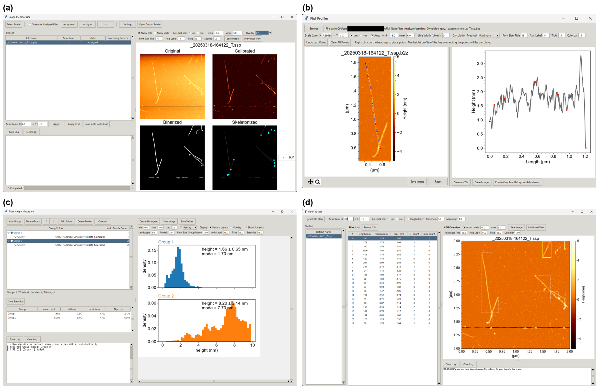
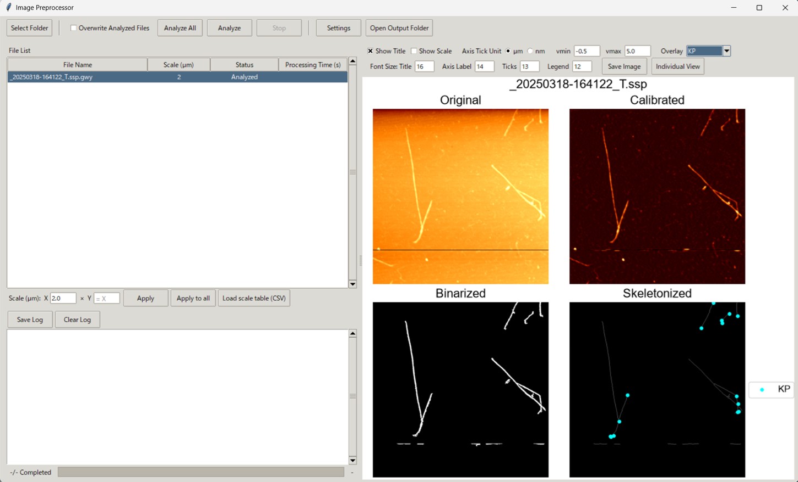
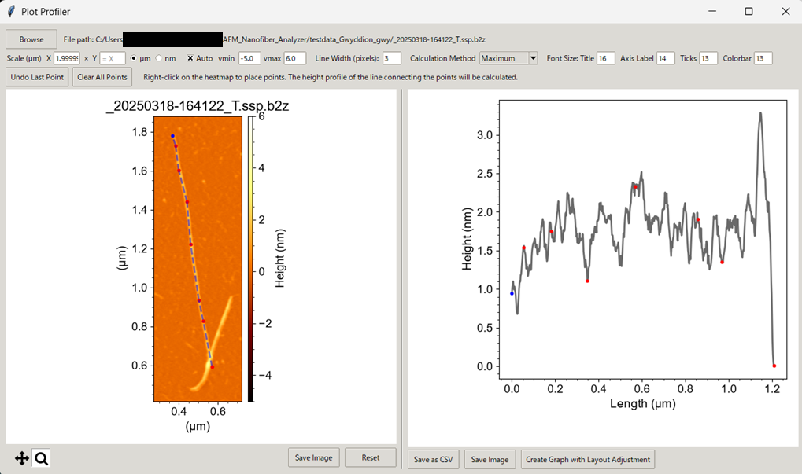
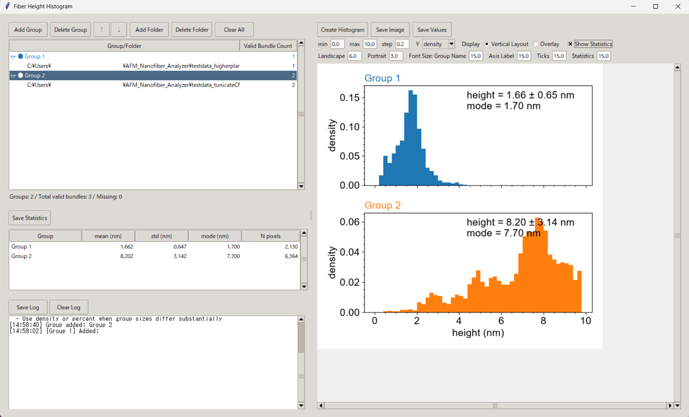
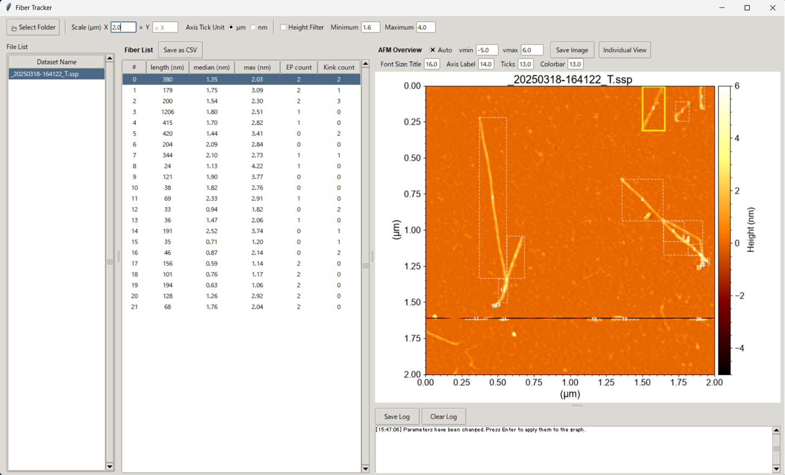

# AFM Nanofiber Analyzer

[](https://opensource.org/licenses/MIT)
[](https://www.python.org/)
[](https://github.com/FibrousBiomaterials/AFM_Nanofiber_Analyzer/actions/workflows/test.yml)


AFM Nanofiber Analyzer is a tkinter-based desktop toolkit for preprocessing
atomic force microscopy (AFM) height images and inspecting nanofiber morphology.
It provides a plugin launcher, a preprocessing pipeline, profile and histogram
tools, and a fiber-tracking viewer for bundle files produced by the pipeline.

It is intended for materials-science and polymer researchers — in particular
those studying cellulose and other nanofibers — who need consistent,
reproducible morphological measurements (length, height, endpoint and kink
counts, and kink angles) from large numbers of AFM scans. General-purpose scanning-probe
software is well suited to image-level visualization and leveling but does not
provide the fiber-centric skeleton tracing, kink detection, and grouped
statistical comparison of nanofiber heights that this workflow targets; AFM Nanofiber Analyzer fills
that gap with a documented, reproducible pipeline and a stable data format.

## Demo



- **(a) Image Preprocessor** runs an AFM height image through background
  calibration, segmentation, and skeletonization, showing the original,
  calibrated, binarized, and skeletonized stages with detected kink points
  overlaid.
- **(b) Plot Profiler** extracts a height profile along a line placed
  interactively on the height map.
- **(c) Fiber Height Histogram** compares the distribution of height, contour
  length, kink angle, or kink density between user-defined sample groups, per
  skeleton pixel, per unit of contour length, per fiber, or per image, and
  reports per-group statistics.
- **(d) Fiber Tracker** lists per-fiber length, median and maximum height, and
  endpoint and kink counts, and locates each fiber in the full scan.

## Installation and Usage

Before running the helper scripts, install one of the following Python
distributions:

- Python 3.10 or later from <https://www.python.org/>
- Anaconda or Miniconda from <https://www.anaconda.com/download> or
  <https://docs.conda.io/en/latest/miniconda.html>

### Recommended: use a dedicated venv

Clone the repository, move into the project root, and run the venv launcher for
your operating system. This is the recommended setup because it keeps AFM
Nanofiber Analyzer dependencies separate from packages already installed in
Anaconda or other Python environments.

```powershell
git clone https://github.com/FibrousBiomaterials/AFM_Nanofiber_Analyzer.git
cd AFM_Nanofiber_Analyzer
```

Windows:

```powershell
.\run_venv.bat
```

macOS or Linux:

```bash
chmod +x run_venv.sh
./run_venv.sh
```

`run_venv` is an idempotent launcher that handles both setup and startup. The first run creates the `.venv`,
upgrades `pip`, and installs the project in editable mode (`pip install -e .`),
so all dependencies come from `pyproject.toml` (the single source of truth) and
the `afm-analyzer` / `afm-analyzer-cli` commands are registered. It then starts
`Main.py`, and every later run detects the completed setup and launches straight
from that `.venv` without reinstalling. If `.venv` is later damaged — for
example, files are deleted by accident — the next run repairs it automatically:
a missing interpreter triggers a clean rebuild (the broken `.venv` is removed
first), and a missing setup marker triggers a reinstall. This quick check is
file-existence only, so it does not slow a healthy launch; if a subtler breakage
slips past it, delete the `.venv` folder and run the launcher again to force a
full rebuild. Developers and reviewers can reproduce
the same setup without the launcher using the editable-install commands below;
for an exact, pinned version set, install `requirements.lock.txt` instead (see
Dependencies below).

### Anaconda or Miniconda

Starting the application directly from an existing Anaconda `base` environment
is not recommended. Pre-installed binary packages such as NumPy, Matplotlib,
SciPy, and scikit-image may conflict with the versions required by this
application.

If you need to use Anaconda or Miniconda, use the conda launcher. Like
`run_venv`, it is a single, idempotent launcher: the first run creates a
dedicated prefix environment under `.conda-env/` in the project folder and
installs the package into it, and every later run launches the application from
that environment instead of modifying `base`. It self-repairs the same way as
`run_venv`: a missing env interpreter triggers a clean rebuild of `.conda-env`,
and a missing setup marker triggers a reinstall; delete the `.conda-env` folder
and rerun to force a full rebuild.

Windows:

```powershell
.\run_conda.bat
```

macOS or Linux:

```bash
chmod +x run_conda.sh
./run_conda.sh
```

### Localization

The graphical interface uses Python's `gettext` system for operational UI
strings such as menus, buttons, dialogs, status messages, and tooltips.
Translation catalogs are stored under `locale/`, and the launcher provides the
language selector. The selected catalog directory name is saved in
`.lang_preference`; English is used by default when no saved selection exists.

Scientific and reproducibility-oriented strings, including plot titles, axis
labels, CSV headers, exported result labels, data keys, and units, are kept in
English so analysis outputs remain consistent across languages.

To refresh translation catalogs after editing user-facing strings or plugin
descriptions, run:

```powershell
python prepare_translate_catalogs.py
```

This script extracts gettext messages, adds launcher descriptions from
`PLUGIN_INFO["description"]`, updates the catalogs, removes obsolete
`#~` entries, and compiles the catalogs to `.mo`. It does not fill `msgstr`
values automatically. Commit or back up catalogs first if you need to keep old
obsolete translations for reference.

Do not add `\n` in the middle of a translated sentence only to tune visual line
wrapping. Different languages wrap at different positions, so the UI should
handle wrapping. Use explicit line breaks only when the text needs a meaningful
paragraph or line break in the interface.

After editing `messages.po`, review any `#, fuzzy` entries before distribution.
Fuzzy entries are provisional Babel matches; confirm that the `msgid` and
`msgstr` meanings match and that placeholders such as `{path}`, `%s`, `%d`, and
`\n` are preserved. Remove the `#, fuzzy` line only after the translation is
confirmed. Then compile the catalogs:

```powershell
pybabel compile -d locale
```

The compiled `.mo` files are version-controlled so that fresh clones get
working translations without installing Babel. Commit the regenerated `.mo`
files together with the edited `.po` files; the test suite fails when a
`.mo` file is stale relative to its `.po` source.

When many `msgstr` values are empty, a coding assistant can draft them. Point
it at one catalog and language and constrain it, for example:

> Fill in the <language> translation for every `msgid` whose `msgstr ""` is
> empty in `locale/<Language>/LC_MESSAGES/messages.po`. Do not change `msgid`,
> comment lines, already-filled `msgstr` values, the file structure, header
> fields, or `#~` obsolete entries. An entry whose `msgstr ""` is followed by
> translated continuation lines is not empty—leave it unchanged. For `#, fuzzy`
> entries, check the meaning, placeholders (`{path}`, `%s`, `%d`), and line
> breaks, fix the `msgstr` if needed, then delete the `#, fuzzy` line. Preserve
> placeholders and any required `\n`, and match the information content of the
> `msgid`; do not insert `\n` only to tune visual wrapping. List any entries you
> were unsure about so a maintainer can confirm them in the running GUI.

Always confirm AI-drafted translations in the GUI before distribution, then
compile the catalogs as shown above.

### Manual setup from source

```powershell
git clone https://github.com/FibrousBiomaterials/AFM_Nanofiber_Analyzer.git
cd AFM_Nanofiber_Analyzer

py -3.12 -m venv .venv
.\.venv\Scripts\activate

python -m pip install -U pip
python -m pip install -r requirements.txt

python Main.py
```

### Editable install for development (pip)

The project ships a `pyproject.toml` for development installs. Installing in
editable mode declares all runtime dependencies and registers two console
commands; adding `[dev]` also installs the development tools (pytest,
pytest-xdist, Babel, and ruff):

```powershell
python -m pip install -e ".[dev]"

afm-analyzer                          # launcher GUI (same as python Main.py)
afm-analyzer-cli process data\*.txt   # batch pipeline (same as python cli.py)
```

The editable install targets development from a checkout. End-user
distribution remains the PyInstaller bundle described below.

### Build a standalone Windows bundle

For a reproducible bundle, provision the build environment from the
test-verified lock file so the shipped binary embeds the same dependency
versions the test suite passed against:

```powershell
python -m pip install -r requirements.lock.txt
```

Install PyInstaller before running the build script (it is not part of the
runtime dependencies and is not recorded in the lock file):

```powershell
python -m pip install pyinstaller
```

```powershell
python build.py
```

The build script generates a PyInstaller bundle under `dist/Main/` and copies
the plugin/resource folders needed by the launcher. Distribute the entire
`dist/Main/` folder, not only `Main.exe`.

## Dependencies

- Python 3.10 or later
- Windows is the primary target platform

Runtime dependencies are declared in `pyproject.toml`, the single source of
truth. The `run_venv` / `run_conda` launchers and the editable install resolve
them automatically, so installing dependencies by hand is not normally
necessary. `requirements.txt` is a generated convenience copy used by the
manual setup path and can be refreshed with `check.py`. PyInstaller is used
only for standalone builds and is installed separately when building a
distribution.

For an exact, reproducible environment, `requirements.lock.txt` records a
test-verified snapshot of all package versions:

```powershell
python -m pip install -r requirements.lock.txt
```

The lock file header records the Python version and operating system on which
the snapshot was tested. Use it on a matching environment; on other supported
Python versions or operating systems, install from `pyproject.toml` or the
loose `requirements.txt` so pip can select compatible wheels.

`check.py` also checks dependency consistency and re-pins the lock file; see
the Development Utilities section for its `--verify` and `--pin` modes.

## GUI Tools

### Image Preprocessor — `guis/GUI01_Image_Preprocessor.py`



Load AFM `.txt` exports or native Gwyddion `.gwy` files, run background
calibration, segmentation, skeletonization, and kink-related feature
extraction, then save a `.b2z` bundle and a parameter JSON file. Each file
carries its own physical scan size (auto-filled from the input, or set per file
by editing the X/Y cells in the file table — including paste from a spreadsheet
— via the batch scale fields, or from a CSV manifest), stored in the bundle for
reproducible length measurements.

Selecting a folder also screens every scan for feedback glitches: a lost
feedback loop displaces whole scan lines, and several analysis steps derive a
threshold from a statistic over the whole image, so one glitch band can
suppress detection across the rest of the field. The stripe-noise-rate column shows
the percentage of scan lines affected, the log lists the glitch-free scan-line
ranges, and those lines are shaded on the Original preview panel. The screening
is a diagnostic only — it changes nothing the pipeline computes.

When a scan is only partly usable, the scan-line-range column analyzes just the
ranges you enter (`473-696,709-842`); "縞ノイズで分割" fills it from the
screening and "分割を解除" collapses the entries back.
Each range becomes its own entry and its own `.b2z`, and is analyzed as its own
image, which is the point: the stages take thresholds from statistics over the
whole array, so excluding the disturbed lines changes what the rest is compared
against. The recorded scan size is scaled to the range, so a fiber measures the
same whether or not the scan was cropped. The CLI equivalent is
`cli.py process --rows`.

### Plot Profiler — `guis/GUI02_PlotProfiler.py`



Load raw, calibrated, or bundled AFM height data and interactively extract
height profiles along selected line segments. The scale defaults to the
recorded (`.b2z`), header (text/CSV), or channel-extent (`.gwy`) scan size so
profile distances are reproducible.

### Fiber Height Histogram — `guis/GUI03_Fiber_Height_Histogram.py`



Compare the distribution of one morphological quantity across user-defined
groups of inputs. The input selector takes either `bundle` — GUI01's `.b2z`
files, which support every aggregation unit — or `fiber csv`, a folder of
`_fibers.csv` files exported from the Fiber Tracker. The CSV path exists
because automatic filters cannot curate a dense network: nearly every traced
fiber there touches a crossing, so the Fiber Tracker's visual exclusion is the
only way to drop debris and scan-line artifacts, and its export is exactly the
population that survived that review. For bundle input, the same exclusions are
applied from each bundle's `_excluded.json` sidecar unless the checkbox is
cleared, and the log reports how many fibers each folder lost.

The quantity selector offers `height`, `contour length`, `straightness`,
`curvature`, `kink angle`, and `kink density` (kinks per micrometer of
contour). Height comes from the calibrated image at skeletonized pixels; the
rest come from the same per-fiber measurement `cli.py measure` and the Fiber
Tracker use, so they need a bundle with a recorded scan size.

Every quantity here describes the shape of an individual fiber. Coverage-type
quantities are deliberately absent: the specimen is a dispersion drop-cast onto
the substrate and dried, so how densely it covers the scan is set by the
dilution, the drop volume, and where in the dried droplet the scan was taken,
not by the material.

`straightness` divides the length of a digitised straight line between a
fiber's endpoints by its contour length, both measured with the same corrected
chain-code metric. That metric reports a straight digitised path as roughly 5%
shorter than its Euclidean chord, so a raw chord-over-contour ratio would read
1.055 for a straight fiber; measuring the reference line the same way puts a
straight fiber at exactly 1.0.

`curvature` is the mean turning rate along a fiber, measured over an arc window
set by the "曲率窓" entry. The window is not optional: a skeleton step is
orthogonal or diagonal only, so at the pixel scale the turning angle is
quantised to multiples of 45 degrees and the estimate becomes a constant noise
floor — against arcs of known radius, a 20 nm window returned 19.4 rad/µm
whatever the true curvature, while 100 nm and above recovered 1/R to within
about 15%. Raising it smooths the estimate but drops every fiber shorter than
the window, so the log reports how many fibers that excluded.

A separate aggregation-unit selector decides what counts as one sample:
`pixel` (one skeleton pixel), `length` (one skeleton pixel weighted by the
contour length it represents), `kink` (one kink), `fiber` (one fiber, using
the median within that fiber for height and kink angle), or `image` (one
scan, using the median of that image's fiber values). This distinction is
reported, not just applied: pooled skeleton pixels are not independent
observations — a long fiber contributes more pixels than a short one — so
the statistics table and the figure annotation give the sample count broken
down into samples, fibers, and images.

`length` exists because counting skeleton pixels equally carries two biases.
Within one image the skeleton alternates orthogonal and diagonal steps, whose
corrected chain-code lengths differ by a factor of about 1.41; across images
the pixel size follows the scan size, so a finely sampled scan contributes more
points per micrometer of fiber and dominates a pooled distribution. Weighting
each point by its step length removes both and makes the distribution
scale-invariant: it describes the fraction of observed contour length at each
height rather than the fraction of sampled points. Its sample size is reported
as a contour length in micrometers, and its raw-value CSV carries a
`weight_nm` column so the exported file reproduces the same distribution.

The plot selector offers `histogram`, `ECDF`, and `box`. The ECDF places every
group on one axes without a bin width to choose, so a difference cannot be made
to appear or disappear by rebinning; the box summarises each group from the same
quartiles the table reports, weighted ones included, which Matplotlib's own
boxplot cannot compute.

Below the statistics table, a comparison table tests every pair of groups with
a two-sided Mann-Whitney U and a two-sample Kolmogorov-Smirnov test, Holm-
corrected across all pairs, and reports Cliff's delta as an effect size that
does not grow with sample size. The tests are offered only for the `fiber` and
`image` units: skeleton pixels, length-weighted points, and several kinks from
one fiber are not independent observations, so a p-value over them would
measure how finely the images were sampled rather than whether the specimens
differ.

Each group reports median and interquartile range alongside mean, standard
deviation, and mode, because fiber morphology distributions are right-skewed
and the mode moves with the histogram bin width. Samples outside the plotted
range are reported in the log as a percentage rather than dropped silently;
the summary statistics always describe the whole sample. A group with fewer
than eight samples is flagged as one whose histogram shape cannot be read —
the normal situation for `image`, where a group holds as many samples as it
holds scans, and where the table's median and IQR are the output to read.

### Fiber Tracker — `guis/GUI04_Tracking_fiber.py`



Load `.b2z` bundles, rebuild tracked `Fiber` objects, inspect individual
fibers, export plots, and export fiber statistics to CSV. An optional
fiber-connection mode (toggle plus a settings window) reconnects skeleton
fragments split at crossings and branches into whole fibrils before
measurement. The connection and height-filter modes compose in "connect, then
filter" order: when both are on, the height filter slices each connected fibril
by its own height profile (including bridge heights), so the two are not
mutually exclusive.

Fibers can also be excluded by hand: select one, check it in the overview, and
"選択を除外" drops it from the table, the overview, and the CSV export.
"直前を取消" undoes the last exclusion, and pressing it repeatedly walks back
through them in reverse order. Changes take effect in the views at once but
reach the sidecar only when "除外を保存" is pressed, because that file is an
analysis input — GUI03 aggregates over what it says — and a mis-click should
not rewrite it on its own. Leaving a dataset with unsaved changes (selecting
another dataset, changing folders, or closing the window) offers to save,
discard, or cancel, so the choice is never made silently. This is
what makes a dense network analyzable at all — nearly every fiber there touches
a crossing, so no automatic filter can separate debris and scan-line artifacts
from real fibrils. Exclusions are written to `<stem>_excluded.json` beside the
bundle, so they survive the session, travel with the data, and can be audited or
edited outside the app. Each exclusion records an anchor pixel on the excluded
fiber's track rather than its row number, because turning fiber connection on or
off renumbers the list while the pixel keeps its meaning. "除外設定..." opens a
window listing them, where any one or all of them can be restored.

A separate isolated-fiber filter restricts the table, the overview, and the CSV
export to fibers that touch no other fiber anywhere along their path
(`lib.measure.isolated_fiber_flags`). A fiber cut where it crosses another one
has a truncated length rather than a short one, so leaving those fragments in
the population biases length statistics low. The filter selects among the
fibers already measured and triggers no reanalysis.

The isolated-fiber filter and fiber connection are mutually exclusive; turning
one on turns the other off. They answer the same problem in opposite ways:
connection reconstructs a fiber through a crossing, while this filter declines
to trust any fiber that reaches one. Running both would also be
self-defeating, because connection joins an isolated fiber to the network and
it then stops being isolated. In a dense network most fibers reach a crossing,
so a small retained count is the expected outcome rather than a detection
failure. Note that the filter tests fiber topology, not whether an object is a
fiber: a scan-line artifact touches nothing and passes it, which is what
GUI01's stripe-noise screening is for.

The AFM overview carries the same pan/zoom toolbar as the Plot Profiler, plus
a reset button, a "zoom to selection" button, and a toggle for the fiber
numbers and boxes. Zoom is what makes a dense scan legible: at full view the
per-fiber numbers overlap into noise, and they are also the largest single cost
in a redraw, so switching them off or zooming in (which draws only the numbers
inside the visible region) makes panning noticeably more responsive. Changing
vmin/vmax, a filter, or the display mode keeps the current view; switching the
tick unit or the scan size rescales the axes and resets it. Selecting a fiber
that lies outside a zoomed-in view pans to it without changing the zoom level.
Saving the overview image exports exactly the region on screen.

In the individual-fiber window, the enlarged image keeps an adjustable margin
around the tracked range (default 10 px; 0 restores the tight crop) and marks
that range with a dashed box. The tracked bounding box fits the fiber exactly,
so without a margin both ends of the fiber sit on the frame and the image
cannot show whether tracking stopped at a real end point or where the fiber
crosses a neighbor — the very distinction the two filters above are about. The
margin re-crops the same calibrated image for display only; no measured value
depends on it.

## Supported Input Formats

`lib/afm_io.py` loads text/CSV height exports and auto-detects the header
length, column count, delimiter, and encoding (UTF-8, cp932/Shift-JIS, latin-1
fallback), so no import settings are required. Two layouts are recognized
(the multi-column delimiter, comma or whitespace/tab, is auto-detected):

| Layout | Typical source | Description |
|---|---|---|
| Multi-column | Shimadzu SPM-9600 | Comma-separated values, one row per scan line. Non-square scans are supported. |
| Multi-column | Gwyddion "Export Text" | Whitespace/tab-separated matrix with a localized `# Width` / `# Height` / `# Value units` comment header. See below. |
| Single-column | Bruker NanoScope | Text header lines (e.g. `Height(nm)`) followed by one value per line. The value count must be a perfect square; the data is reshaped to `(s, s)`. |

Height arrays are returned in nanometers. Files without a recognized value-unit
header are assumed to already contain nm values; Gwyddion Export Text files
that declare a supported length unit are converted to nm. The physical scan
size is read from the input when present (Shimadzu `SizeX` / `SizeY`,
Gwyddion `# Width` / `# Height`, or native `.gwy` channel extents) and stored
in the bundle as the spatial calibration. Inputs without a recorded scan size
(e.g. bare Bruker NanoScope exports) take it from the GUI/CLI instead.

Representative inputs are bundled under `testdata_tunicateCNF/` and
`testdata_higherplantTOC/` (multi-column scans), `testdata_Bruker_txt/`
(single-column Bruker export), `testdata_Gwyddion_txt/` (Gwyddion Export
Text), and `testdata_Gwyddion_gwy/` (native `.gwy`).

These example AFM datasets were acquired experimentally by the project authors
and are included as reproducible example inputs. The authors confirm that they
have permission to redistribute these datasets.

### Other instruments via Gwyddion

Files from instruments without a layout above (Asylum Research, JPK, Park
Systems, Nanonis, Olympus, …) are supported through
[Gwyddion](http://gwyddion.net/), the free SPM toolkit that reads 100+ native
formats. There are two routes:

**Native `.gwy` files (recommended).** Gwyddion's own `.gwy` files are read
directly, with no manual export step: select a `.gwy` in GUI01 (batch folder),
GUI02 (Plot Profiler), or `cli.py process`, exactly like a text scan. A `.gwy`
container holds several channels (topography, phase, amplitude, …); the
topography/height channel is auto-selected, and you can override it by id or
title — a dropdown appears in GUI02 for multi-channel files, and `cli.py
process` accepts `--channel <id|name>`. Length-valued channels are converted
from their SI unit to nm and the scan size is read from the channel extents.
An explicitly selected non-length channel is passed through in its native
values; it is not suitable for workflows or labels that assume height in nm.
Reading `.gwy` requires the lightweight, pure-Python `gwyfile` package (a
declared dependency); it is imported lazily, so text-only workflows never
load it.

**Export Text (`.txt`).** Alternatively, in Gwyddion open the file, then
**File > Save As** and choose **"Export Text"** (a plain-text data matrix),
which this loader reads as `.txt`. Gwyddion writes the matrix in SI units
(meters) with a small comment header recording the scan size and value unit;
both are normalized automatically (heights to nm, sizes to µm). The header keys
are written in Gwyddion's UI language — English (`# Width`/`# Height`/`# Value
units`) and Japanese (`# 幅`/`# 高さ`/`# 値の単位`) are both recognized, because
keys are parsed from the value structure rather than the translated words. Keep the
informational header enabled on export so the scan size is preserved; otherwise
set it in the GUI/CLI. Bruker `.spm` binaries can likewise be exported to text
from NanoScope and read via the single-column layout above.

The background calibrator (`BGCalibrator` in `lib/bg_calibrator.py`)
implements general line-scan AFM background correction and is applied to both
formats. It was developed on Shimadzu SPM-9600 scans and was historically
named `BG_Calibrator_shimadzu`; that import path and class name remain
available through a compatibility shim.

## Analysis Pipeline


Text and CSV exports are read by `afm_io.load_afm_text()`, native Gwyddion files
by `gwy_io.load_gwy_image()`. Both feed `lib.pipeline.process_file` — the code
path shared by GUI01 and `cli.py` — which applies `BGCalibrator`, `Segmenter`,
`Skeletonizer`, and `KinkDetector` in that order and writes one
`<input_stem>.b2z` compressed TreeStore bundle and one
`<input_stem>_param.json` per input. The Plot Profiler (GUI02), Fiber Height
Histogram (GUI03), and Fiber Tracker (GUI04) then read those bundles.

The preprocessing parameters are stored in the generated
`<input_stem>_param.json` file. They cover background calibration, segmentation,
skeletonization, and kink detection settings, including options such as
background method, threshold values, branch pruning length, and kink angle
threshold.

### Command-line batch processing

The same pipeline can be run without the GUI through `cli.py`, which calls
`lib.pipeline.process_file` — the identical code path used by GUI01 — so CLI
and GUI analysis arrays and parameters match for the same input and settings.
Run-specific provenance such as `created_utc` naturally differs. This supports
scripted batch runs and reproducible analyses.

```powershell
# Print the default analysis parameters as an editable JSON template.
python cli.py show-params > my_param.json

# Process files with default or customized parameters.
python cli.py process testdata_tunicateCNF\*.txt
python cli.py process scan.txt --params my_param.json --output-dir results --overwrite
```

`process` writes one `.b2z` bundle and one `_param.json` per input, next to
the input file unless `--output-dir` is given. Inputs whose outputs already
exist are skipped unless `--overwrite` is passed. `--save-original` embeds the
raw height image in the bundle under the `original` key. With `--strict`,
unknown keys in the `--params` file are an error instead of being ignored,
which catches typos that would otherwise silently fall back to defaults.
`--format` forces the input text layout (`multi-column` or `single-column`)
when auto-detection would lock onto a numeric header block; the resolved
layout is always recorded in the bundle metadata (`input_format`) for audit.
`--scale-um` records the physical scan size (X / width, in micrometers) in the
bundle, overriding the value read from the instrument header; when omitted, the
header scan size is used if present, otherwise no scan size is stored. It is
applied to both axes unless `--scale-y-um` records a different Y (height) size
for a rectangular scan. Because the scan size travels per file, a folder mixing
scans of different sizes is processed correctly without one batch-wide value.

### Validating bundles

The `.b2z` contract (required keys, array shapes, mask values, kink-angle
units, format version) is defined in code by `lib/bundle_schema.py`. The
pipeline validates every bundle before saving and the measurement layer
validates at load time; `validate` runs the same checks on demand:

```powershell
python cli.py validate results\*.b2z
```

Each bundle is reported as `OK` (with format version, image size, kink count,
and provenance status) or `INVALID` with the specific contract violations.
The exit code is non-zero when any bundle fails, so the command can guard
scripted workflows.

### Command-line fiber measurement

The per-fiber measurements shown by GUI04 are available through `measure`, and
the skeleton-pixel heights used by GUI03 are available through `heights`.
Both commands use `lib.measure`, the same analysis layer as the GUIs. A
complete, unfiltered GUI04 export uses the same CSV writer as `measure` and is
byte-identical for the same bundle and scale; an active GUI04 height filter
intentionally exports only the filtered fiber portions.

```powershell
# Per-fiber statistics (length, height median/max, endpoints, kinks).
# --scale-um is optional: when omitted, the scan size recorded in each bundle
# is used. Pass it explicitly for older bundles that have no recorded scan size.
# The pixel size is resolved per axis, so add --scale-y-um for rectangular scans.
python cli.py measure results\*.b2z
python cli.py measure results\*.b2z --scale-um 2.0
python cli.py measure results --scale-um 2.0 --output-dir stats
python cli.py measure results\*.b2z --scale-um 5.0 --scale-y-um 2.5

# Skeleton-pixel heights (the data behind the GUI03 height histogram).
python cli.py heights results --output heights.csv
```

`measure` writes one `<stem>_fibers.csv` per bundle with columns `index`,
`length_nm`, `height_median_nm`, `height_max_nm`, `ep_count`, `kink_count`,
and `kink_angles_deg` (semicolon-separated degrees). `heights` prints a
per-bundle summary and optionally writes a long-format CSV (`bundle`,
`height_nm`) for regrouping and re-binning in external tools. Folder
arguments expand to all bundles directly inside the folder.

### Running tests

The test suite uses pytest and runs in parallel through pytest-xdist
(`pyproject.toml` sets `-n auto`), so both packages are required — the
editable `[dev]` install above provides them. Unit tests run on small
synthetic inputs; the integration and strict-regression tests process bundled
real scans and compare their outputs against recorded baseline values.

```powershell
python -m pip install pytest pytest-xdist
python -m pytest tests/
python -m pytest tests/ -m "not slow"   # skip the real-scan integration test
```

The GUI tests build each plugin's window and drive GUI01 through a full batch
run, so they need a display. On Windows and on any desktop session they run as
part of the suite above; on a headless machine they skip themselves. CI runs
them on Linux under a virtual framebuffer:

```bash
xvfb-run -a python -m pytest tests/
```

### API documentation

The modules in `lib/` are documented with Sphinx, which renders their
docstrings into an API reference. The published version is built from `main` by
`.github/workflows/docs.yml` and served from GitHub Pages.

To build it locally, install the `docs` extra and run Sphinx **from the `docs/`
directory** — the working directory matters, because `docs/docutils.conf` is
what allows inline markup to sit next to Japanese text in the bilingual
docstrings:

```powershell
python -m pip install -e ".[docs]"
cd docs
python -m sphinx -b html . _build/html
```

The entry point is then `docs/_build/html/index.html`.

## Data Format

The current analysis output is a single `.b2z` bundle per input file. Bundles
are written by `lib/blosc2_io.py` using `blosc2.TreeStore`. The layout is
documented below so the bundles can be read without this project's code, and
`cli.py export` converts them to standard formats (see the end of this
section).

GUI01 writes these array keys:

| Key | Shape | Content |
|---|---|---|
| `calibrated` | `(H, W)` | Background-corrected AFM height image, floating point, in nm. |
| `binarized` | `(H, W)` | Binary nanofiber mask (nonzero = fiber). |
| `skeletonized` | `(H, W)` | Skeletonized fiber image (nonzero = centerline). |
| `bp` | `(H, W)` | Branch-point mask on the skeleton (nonzero = branch point). |
| `ep` | `(H, W)` | Endpoint mask on the skeleton (nonzero = endpoint). |
| `kp` | `(2, N)` | Kink-point pixel coordinates; see the convention below. |
| `dp` | `(2, M)` | Decomposition-point pixel coordinates; see the convention below. |
| `ka` | `(N,)` | Kink interior angles in radians, one per `kp` column. |
| `original` | `(H+1, W+1)` | Raw height image in nm; present only when saving the original was requested. |

All image-like arrays in one bundle share the same `(H, W)` shape. The
background calibrator trims one pixel per axis, so `H` and `W` are one less
than the raw input size (and one less than `original` when present).

Coordinate convention: `kp[0]` and `dp[0]` hold x (column) indices, and
`kp[1]` and `dp[1]` hold y (row) indices — 0-based pixel positions in the
`calibrated` image. For example, `calibrated[kp[1][i], kp[0][i]]` is the
height at the i-th kink.

Each bundle also stores root metadata (blosc2 `vlmeta`):

| Key | Content |
|---|---|
| `params` | Analysis-parameter dictionary, identical to `<input_stem>_param.json`. |
| `version` | Bundle format version (currently `"1.0"`). |
| `software_version` | Application release that wrote the bundle. |
| `input_file` | Base name of the processed input file. |
| `input_sha256` | SHA-256 digest of the input file contents. |
| `created_utc` | Processing time as an ISO 8601 UTC timestamp. |
| `input_format` | Input interpretation. Text inputs record `kind`, `skiprows`, `n_cols`, and `encoding`; native `.gwy` inputs record `kind="gwy"` plus the selected channel id, title, and value-axis unit. |
| `spatial_calibration` | Physical scan size: `scan_size_x_um`, `scan_size_y_um`, and `source` (`input_header`, `manifest`, or `manual`). Present only when the scan size is known. |

The provenance keys (`software_version`, `input_file`, `input_sha256`,
`created_utc`, `input_format`, `spatial_calibration`) are optional: bundles
written by older releases lack them, and readers must not require them. When
`spatial_calibration` is present, `measure` and GUI04 default the scale to its
recorded value, so fiber lengths are reproducible from the bundle alone.

GUI01 also writes `<input_stem>_param.json` for analysis parameters. The raw
AFM image is not duplicated in the bundle by default because it can be
reloaded from the source input file.

### Exporting bundles to standard formats

`.b2z` is a project-specific container. To use analysis results outside this
project, export bundles to standard formats:

```powershell
python cli.py export results\*.b2z                # one .npz archive per bundle
python cli.py export results\*.b2z --format csv   # one CSV file per array key
```

Both formats are accompanied by a `<stem>_meta.json` sidecar holding the
bundle metadata. NumPy `.npz` archives can be read with standard tooling from
Python, MATLAB, R, and Julia.

## Architecture

The application separates GUI plugins from the reusable modules they call:

- `Main.py` launches GUI plugins discovered in `guis/`.
- `guis/` contains the user-facing tkinter tools.
- `lib/` contains AFM I/O, background calibration, segmentation,
  skeleton cleanup, kink detection, fiber containers, bundle I/O, translation,
  and shared UI helpers.

GUI01 writes one compressed `.b2z` bundle per analyzed input file. Downstream
GUIs read those bundles directly.

## Selected Directory Structure

```text
AFM_Nanofiber_Analyzer/
|-- Main.py
|-- cli.py
|-- babel.cfg
|-- build.py
|-- check.py
|-- prepare_translate_catalogs.py
|-- pyproject.toml
|-- requirements.txt
|-- requirements.lock.txt
|-- run_venv.bat
|-- run_conda.bat
|-- run_venv.sh
|-- run_conda.sh
|-- guis/
|   |-- GUI01_Image_Preprocessor.py
|   |-- GUI02_PlotProfiler.py
|   |-- GUI03_Fiber_Height_Histogram.py
|   |-- GUI04_Tracking_fiber.py
|   `-- __init__.py
|-- lib/
|   |-- afm_io.py
|   |-- bg_calibrator.py
|   |-- bg_calibrator_shimadzu.py
|   |-- blosc2_io.py
|   |-- bundle_schema.py
|   |-- fiber.py
|   |-- fiber_tracking_image.py
|   |-- gwy_io.py
|   |-- imp_tools.py
|   |-- kink_detector.py
|   |-- measure.py
|   |-- pipeline.py
|   |-- processed_image.py
|   |-- segmenter.py
|   |-- skeletonizer.py
|   |-- translator.py
|   |-- ui_tools.py
|   `-- __init__.py
|-- tests/
|-- locale/
|   |-- English/
|   |   `-- LC_MESSAGES/
|   |-- Japanese/
|   |   `-- LC_MESSAGES/
|   `-- Chinese/
|       `-- LC_MESSAGES/
|-- assets/
|   `-- afm_symbol.png
|-- figures/
|   |-- gui01.png
|   |-- gui02.png
|   |-- gui03.png
|   |-- gui04.png
|   |-- guis.png
|   `-- pipeline.png
|-- README.md
`-- README.ja.md
```

Windows `.bat` helper scripts are intentionally kept ASCII-only. Japanese
comments in UTF-8 batch files can be misread by `cmd.exe` under the system code
page and executed as garbled commands, so Japanese maintenance notes belong in
Markdown documentation such as this README's Japanese counterpart, `README.ja.md`.

## Core Modules

| Module | Main contents |
|---|---|
| `lib/afm_io.py` | Text/CSV AFM loader with automatic header, column, and encoding detection, explicit format override, and layout-consistency verification. |
| `lib/bg_calibrator.py` | `BGCalibrator`, with `trendfill`, `tophat`, and `spline1d` background methods (`inpaint` is the retired name for `trendfill` and is still accepted in saved parameter files; `spline2d` was removed after 1.0.0). |
| `lib/bg_calibrator_shimadzu.py` | Compatibility shim keeping the historical `BG_Calibrator_shimadzu` name importable. |
| `lib/blosc2_io.py` | Blosc2 array storage and `.b2z` TreeStore bundle helpers. |
| `lib/bundle_schema.py` | Executable `.b2z` contract: required keys, array shapes, value ranges, units, coordinate convention, and format version, with `validate_bundle` enforcing them at write and load time. |
| `lib/fiber.py` | Immutable `Fiber` dataclass for fiber geometry, height profile, kink indices, and endpoint indices. |
| `lib/fiber_connector.py` | `connect_fiber_fragments` and `ConnectParams`: reconnect skeleton fragments split at crossings/branches into whole fibrils, used by GUI04's optional fiber-connection mode. |
| `lib/group_compare.py` | Between-group comparison for GUI03: Mann-Whitney U and two-sample KS with Holm correction over all pairs, plus Cliff's delta as an effect size that does not grow with sample size. |
| `lib/fiber_selection.py` | Manual fiber exclusions stored in `<stem>_excluded.json` beside the bundle: written by GUI04, applied by `lib/measure.py`. An exclusion is an anchor pixel on the excluded fiber's track rather than a list index, so it keeps its meaning when fiber connection renumbers the list. |
| `lib/fiber_tracking_image.py` | `FiberTrackingImage`, used by GUI04 to rebuild and track fibers from GUI01 bundle outputs. |
| `lib/gwy_io.py` | Lazy-loading reader for native, multi-channel Gwyddion `.gwy` files, including channel selection, length-channel conversion to nm, and scan-size extraction. |
| `lib/imp_tools.py` | Skeleton morphology helpers, endpoint/branch-point detection, line tracing, and path-distance conversion. |
| `lib/kink_detector.py` | `KinkDetector`, which detects kink points from tracked skeleton components. |
| `lib/measure.py` | GUI-independent fiber measurement on `.b2z` bundles: `measure_bundle`, per-fiber `FiberStats`, `collect_fiber_stats` (per-fiber statistics over many bundles), `collect_skeleton_height_profiles` (tracked heights with the contour length each point represents), `isolated_fiber_flags` (which fibers touch no other fiber), skeleton-height collection, and the CSV writers shared by GUI03/GUI04 and `cli.py`. |
| `lib/pipeline.py` | `ProcParams` parameter schema, stage construction, and `process_file`, the GUI-independent pipeline driver shared by GUI01 and `cli.py`; the `.b2z` contract itself lives in `lib/bundle_schema.py`. |
| `lib/processed_image.py` | `ProcessedImage`, the container passed through the GUI01 preprocessing pipeline. |
| `lib/segmenter.py` | `Segmenter`, which builds binary nanofiber masks from calibrated AFM images. |
| `lib/skeletonizer.py` | `Skeletonizer`, which thins segmented masks, prunes branches, and labels skeleton components. |
| `lib/translator.py` | gettext language selection helpers. |
| `lib/ui_tools.py` | Shared tkinter, matplotlib, logging, dialog, and export helpers used by the GUI plugins. |

## Adding a GUI Plugin

1. Add a Python file under `guis/`.
2. Define a literal `PLUGIN_INFO` dictionary near the top of the file.
3. Define a typed `main() -> None` entry point.

Example:

```python
PLUGIN_INFO = {
    "name": "My Tool",
    "description": "Short launcher-facing description.",
}


class App(tk.Tk):
    ...


def main() -> None:
    app = App()
    app.mainloop()


if __name__ == "__main__":
    main()
```

`Main.py` discovers plugin files automatically. `PLUGIN_INFO` values must remain
plain literals because the launcher reads them with `ast.literal_eval()`.
Plugin names are shown as fixed English strings. Plugin descriptions are also
plain literals in the plugin file, but `Main.py` passes them through gettext
after AST parsing so they can be translated through the locale catalogs.
Do not insert `\n` in `PLUGIN_INFO["description"]` only to tune launcher line
wrapping. Keep the description as natural text; the launcher UI is responsible
for wrapping it. Splitting the Python string literal across source lines is fine
as long as it does not add an actual newline to the value.
When changing `PLUGIN_INFO["description"]`, refresh the translation catalogs so
the corresponding `msgid` is available to translators.

`PLUGIN_INFO` may also define an optional numeric `order` key. The launcher
sorts buttons by this value (smaller first); plugins without `order` appear
after the ordered ones, in filename order. Unknown `PLUGIN_INFO` keys are
ignored for forward compatibility. The plugin contract — a literal
`PLUGIN_INFO` with non-empty `name` and `description` strings, a top-level
`main()`, an `if __name__ == "__main__":` guard, and no GUI launch at import
time — is enforced by `tests/test_plugins.py`, so a violating plugin fails the
test suite instead of degrading silently in the launcher.

## Development Utilities

- `check.py` scans Python imports and writes `requirements.txt`; `--verify`
  reports drift between code imports, `pyproject.toml`, and the installed
  environment, and `--pin` regenerates `requirements.lock.txt` after the
  consistency checks and the test suite pass.

  ```powershell
  python check.py            # regenerate the loose requirements.txt
  python check.py --verify   # CI-style check: code imports vs pyproject vs environment
  python check.py --pin      # re-lock requirements.lock.txt after all checks and tests pass
  ```

  `--verify` exits nonzero when an import is missing from `pyproject.toml`
  dependencies (or vice versa), when a scanned dependency is not installed, or
  when `pip check` reports version conflicts. `--pin` runs those same checks
  plus the pytest suite, and rewrites `requirements.lock.txt` only when
  everything passes, so the lock file always records a version set that the
  tests have actually validated.
- `build.py` verifies imports, collects PyInstaller materials, writes
  `Main.auto.spec`, runs PyInstaller, and copies project resource folders.
- `prepare_translate_catalogs.py` refreshes gettext catalogs, extracts plugin
  descriptions, and removes obsolete translation entries.

## Known Limitations

- Text/CSV values without a recognized value-unit header are assumed to be
  nanometers. Gwyddion Export Text files with a supported length-unit header
  are converted automatically; other unitless exports must be converted before
  loading.
- Single-column (Bruker NanoScope) exports must contain a perfect-square number
  of height values, because the data is reshaped to a square `(s, s)` image.
- Length measurements require a physical scan size from the input metadata or
  the GUI/CLI. GUI01 requires one before processing; `cli.py measure` fails
  clearly if neither the bundle nor `--scale-um` supplies it. GUI02 and GUI04
  keep their current editable scale for older inputs that lack recorded
  calibration, so users must verify or replace that value.
- The background calibration and default parameters were developed and tuned on
  Shimadzu SPM-9600 scans. Other instruments are supported, but may need
  parameter adjustment for good segmentation and skeletonization.
- The graphical tools require a working Tk installation and are primarily
  developed and tested on Windows; the CLI and library are platform-independent.
- The `.b2z` bundle is a project-specific container. Use `cli.py export` to read
  results in other environments (NumPy `.npz` or CSV).

## Getting Help and Support

- **Bug reports and feature requests:** open an issue on the
  [issue tracker](https://github.com/FibrousBiomaterials/AFM_Nanofiber_Analyzer/issues).
- **Questions and usage help:** see
  [CONTRIBUTING.md](CONTRIBUTING.md#getting-help-and-support) for where to ask.
- When sharing a problem, please avoid attaching unpublished research data to
  public issues; a description of the file format is usually enough to
  reproduce loading problems.

## Citation

If you use this software in your research, please cite it as:

```bibtex
@software{afm_nanofiber_analyzer,
  author    = {Kiyoto, Shingo and Ito, Tomoki and Mayumi, Keita and Kobayashi, Kayoko},
  title     = {AFM Nanofiber Analyzer},
  year      = {2026},
  version   = {1.0.0},
  url       = {https://github.com/FibrousBiomaterials/AFM_Nanofiber_Analyzer}
}
```

### Related publications

The precursor scripts that this toolkit packages and extends were used in the
following studies by the authors, which illustrate the AFM-based nanofiber
analyses it supports:

- Ito, T., Daicho, K., Fujisawa, S., Saito, T., & Kobayashi, K. (2022).
  Atomic-scale dents on cellulose nanofibers: the origin of diverse defects in
  sustainable fibrillar materials. *Nanoscale Horizons*, 7, 1186–1191.
  <https://doi.org/10.1039/D2NH00355D>
- Ito, T., Daicho, K., Fujisawa, S., Saito, T., & Kobayashi, K. (2025).
  Defectless and uniform single-crystallite dispersions of sustainable wood
  nanocellulose with a regulated right-handed twist periodicity.
  *Nano Letters*, 25, 6085–6091.
  <https://doi.org/10.1021/acs.nanolett.4c06483>
- Mayumi, K., Ito, T., Kiyoto, S., Wada, M., & Kobayashi, K. (2026).
  Cross-sectional dimensions of tunicate nanocelluloses: broad size
  distribution and their origins. *Cellulose*, 33, 3903–3914.
  <https://doi.org/10.1007/s10570-026-07059-3>

## Authors

| Name | Contributions |
|---|---|
| Shingo Kiyoto | Packaging, Release preparation, Documentation, Feature implementation, Validation |
| Tomoki Ito | Core implementation (lead) |
| Keita Mayumi | Feature implementation, Validation |
| Kayoko Kobayashi | Conceptualization, Software initial implementation |

The original core codebase was implemented by Tomoki Ito, and the current
software builds upon it.

## License

This project is licensed under the MIT License. See [LICENSE](LICENSE) for
details.

The overview artwork in `assets/afm_symbol.png` was generated with ChatGPT
(OpenAI).

## Acknowledgements

The background calibration workflow includes methods developed for Shimadzu
SPM-9600 AFM data. Related AFM image-processing work is available at
<https://github.com/terio0819/Image-processing-of-AFM-image>.
