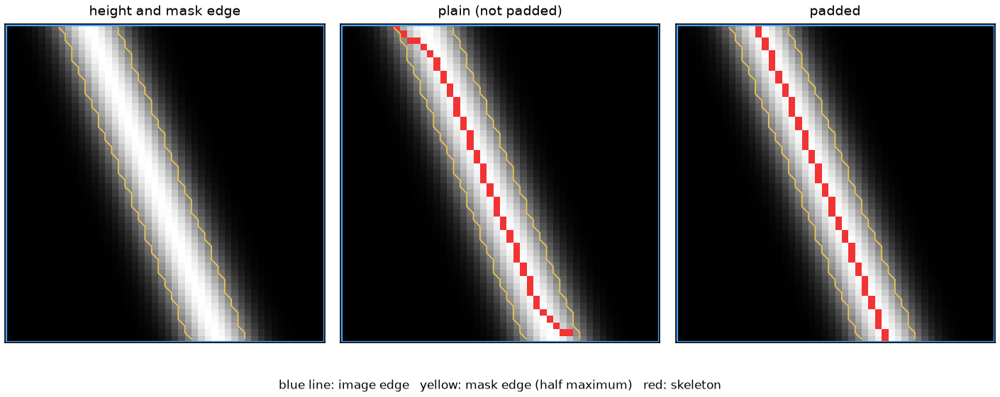
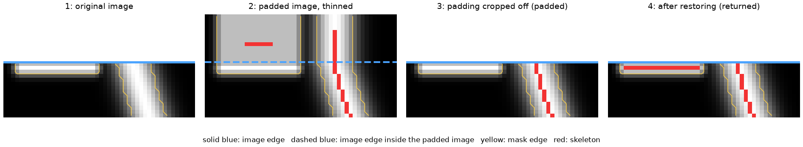
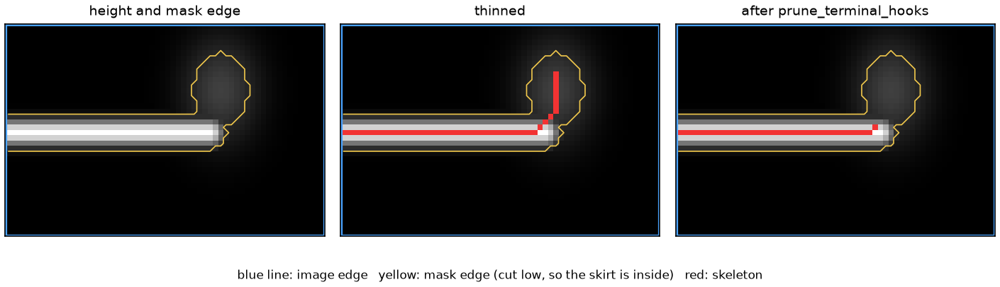
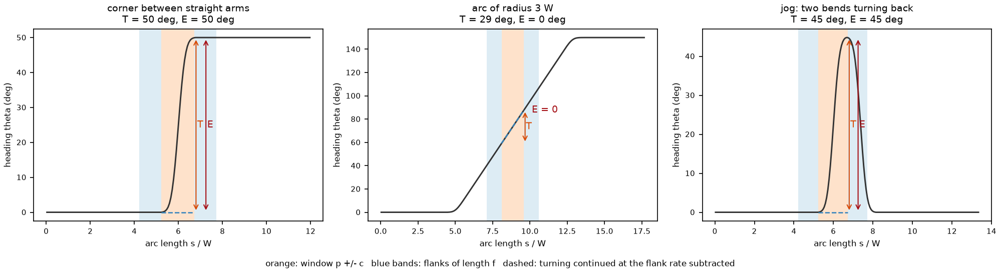
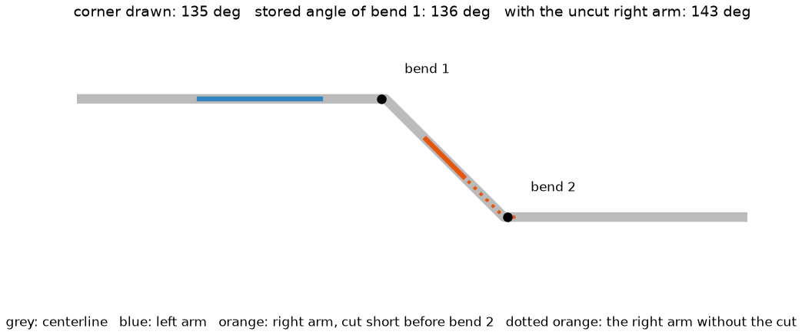

# Analysis algorithms

This page explains what the four preprocessing stages actually do, and where in
the source each step lives. It is written for people who need to justify a
number in a figure caption: which decisions the software made on their behalf,
on what evidence, and which parameter changes each decision.

On this page, **preprocessing** means everything from the AFM height image to
the extracted fibers and their judged kinks (sharp bends of a fiber).
**Measurement** — counting fiber lengths, heights and so on — is done separately
from the preprocessing results (§5).

The API reference (built by Sphinx from `docs/api.rst`) documents each function's contract. This page documents the
reasoning that connects them.

This page reports no result on particular data. What the stages did on the
bundled scans and on synthetic data, and which results several defaults were
chosen by, are collected in [Evaluation on particular data](validation.md).

## How to read the code references

This section is for readers who check this page against the source code. If you
do not read the code, skip to "Conventions used throughout".

Code is referenced **by symbol name**, never by line number, because line
numbers go stale on the first unrelated edit. A reference such as
`Segmenter._binaryzation` means the method of that name in `lib/segmenter.py`;
`bg_calibrator.BG_METHOD_NAMES` means the module-level constant. Every symbol
named on this page is checked against the source by
`tests/test_algorithm_docs.py` on every run of the test suite, so a rename or
removal fails the build rather than silently leaving this page wrong.

Each computation is also shown **with the code that performs it**. The one exception
is the placement of the centerline (the line drawn along a fiber's height
ridge) in §4.2: the same code is quoted in
[GUI04 fiber measurements](gui04_measurements.md) (GUI04 is the window that
measures and inspects fibers one at a time) §2, so only the entry function is
quoted here. Every code block starts with a header naming where it comes from:

```text
# source: lib/segmenter.py::Segmenter._binaryzation
```

That is the file and the function, method (`Class.method`), or module constant
the code belongs to; a header may list several symbols of one file, separated by
commas. A line holding only `...` marks omitted code, and comments, blank rows
and the method's indentation are left out. Every excerpt is compared, line for
line, with the symbol it names (`scripts/doc_excerpts.py`, run by
`tests/test_algorithm_docs.py` and by the pre-commit hook, the check that runs
automatically just before a commit), and the English and
Japanese pages must quote identical code, so an excerpt cannot silently differ
from what the software runs.

The same test guards the reverse direction: it hashes the algorithm modules —
the four stages and `lib/centerline.py`, which places the centerline kinks are
judged on — with comments and docstrings stripped, so any change to what the
code computes fails until the recorded hashes are refreshed. The test checks
only that the code matches the record; it cannot tell whether this page was
reread. Rereading and correcting the affected sections before refreshing the
record is required by the project's development rules (`AGENTS.md`).

## Conventions used throughout

| Quantity | Unit | Notes |
|---|---|---|
| Height | nanometres (nm) | The loader converts to nm; every height threshold below is an absolute nm value on the **background-corrected** image, where the substrate sits at 0<!--n:definition--> nm. |
| In-plane distance | pixels (px) in the stages, physical lengths (nm or µm) in the results | The stages are deliberately pixel-based, and the pixel size enters only at measurement time. The exception is ridge recovery (recovering missed fibers, §2.6, off by default), whose settings are in nm. The same pixel setting is a different physical length at a different scan size (worked example in §5). |
| Angles | radians inside kink detection, degrees in the parameter file | `pipeline.build_stages` converts `kinkangle_deg` to radians when it constructs `KinkDetector`. |
| Array indexing (for code readers) | `image[row, column]`, i.e. `[y, x]` | Several helpers return `np.where` output, where the first array is the row index. |

**The analysis image is one pixel smaller than the raw scan on each axis, and
its pixel indices are shifted by one.** Background correction (§1) has three
methods (`trendfill`, `tophat`, `spline1d`), and each subtracts the background
from `original[1:, 1:]`, the raw scan with its first row and first column cut
off. `trendfill` and `spline1d` build the background from differences between
neighbouring pixels (§1.3). Each difference is taken as "right (lower) pixel
minus left (upper) pixel" and placed at the right (lower) pixel, so only the
first row and column have no difference. `tophat` crops to the same shape so
that the later stages receive the same array size. Every later stage works on
that cropped array, so pixel $(r, c)$ of the analysis is pixel $(r+1, c+1)$ of
the raw scan. Point coordinates stored in the bundle (the `.b2z` file holding
the analysis results; see "Parameters" below), such as kink positions, are
coordinates of this cropped array. The per-fiber measurement CSV holds no pixel
coordinates, and lengths take the pixel size from the raw scan's pixel count
(the bundle image size plus 1<!--n:definition-->), so cutting off one row and one column does not
affect a length (`measure.measure_bundle`).

**Parameters.** Every user-settable value below is a field of
`pipeline.ProcParams`, saved beside each bundle (the `.b2z` file holding the
analysis results) as `<input_stem>_param.json`, where `<input_stem>` is the input
file name without its extension. The same values are also written into the bundle itself as provenance (§4.5).
They are every setting a user can change, but reproducing an analysis also
needs the software version (§6), because internal constants such as the hook
apex angle (§3.6) are not fields and are fixed by the version. Values quoted
as "default" are the `ProcParams` defaults, which are what the GUI and CLI
start from — not the constructor defaults of the stage classes, which differ in
places and apply only when a class is built directly in a script.

## The pipeline in one view

Preprocessing has four stages:

1. **Background correction** (§1): subtract the sample tilt and the scanner's
   bowing, so the substrate sits at 0<!--n:definition--> nm everywhere.
2. **Binarization** (§2): decide for every pixel whether it is fiber or not, and
   build a black-and-white image marking the fiber pixels, the **mask**.
3. **Skeletonization** (§3): thin the fibers of the mask to lines one pixel
   wide, the **skeleton**.
4. **Kink detection** (§4): find where a fiber bends sharply at one place, a
   **kink**.

```text
raw AFM text / CSV  ->  afm_io.load_afm_text()      \
Gwyddion .gwy       ->  gwy_io.load_gwy_image()     /  -> height array (nm)
                                                        |
                        ProcessedImage.original_image  <-+
                                |
   1. BGCalibrator   ->  calibrated_image   (nm, substrate at 0)
   2. Segmenter      ->  binarized_image    (black-and-white fiber mask)
   3. Skeletonizer   ->  skeleton_image     (1 px wide skeleton) + ep / bp
   4. KinkDetector   ->  kink points and angles per skeleton component,
                         judged on its centerline (§4.2)
                                |
                        .b2z bundle + _param.json
```

The names on the right of the diagram are the attributes of `ProcessedImage`
that each stage writes: `original_image` is the loaded height image,
`calibrated_image` the background-corrected height image, `binarized_image` the
mask and `skeleton_image` the skeleton. The "input" and "output" lines of the
sections below use these names. `ep` is the map of endpoints (where a line ends)
and `bp` the map of branch points (where a line forks); see §3.8.

`pipeline.process_file` runs exactly this sequence, and both GUI01 (the
preprocessing window) and `cli.py process` (the command-line preprocessing
command) call it, so the two entry points cannot diverge. The stage
objects are built once by `pipeline.build_stages`.

Each stage reads what the previous one wrote and fails loudly at the boundary
if it is missing — `Segmenter.__call__` raises if `calibrated_image` is `None`
rather than failing somewhere inside OpenCV.

---

## 1. Background correction

**Code:** `lib/bg_calibrator.py` — `BGCalibrator.__call__`, dispatching to
`_call_trendfill`, `_call_tophat`, or `_call_spline1d`.
**Reads:** `original_image`. **Writes:** `calibrated_image`.

The background can be estimated in three ways (`trendfill`, `tophat`, `spline1d`),
chosen with the parameter `bg_method` (default `trendfill`).
`BGCalibrator.__call__` itself only dispatches to the chosen method:

```python
# source: lib/bg_calibrator.py::BGCalibrator.__call__
if self.bg_method == 'tophat':
    self._call_tophat(image)
elif self.bg_method == 'spline1d':
    self._call_spline1d(image)
else:
    self._call_trendfill(image)
```

### 1.1 The problem being solved

A raw AFM scan is not a height map of the specimen sitting on a flat plane. It
can carry the sample tilt and the scanner's bowl distortion.

Two consequences follow, and they set the design of this whole stage:

1. Every later threshold is an **absolute height in nm** above the substrate
   (`global_threshold` and `low_threshold` of binarization, `bp_height` of
   skeletonization, and so on); binarization (§2.1), for example, takes pixels
   higher than `global_threshold` as fiber candidates. They are only
   meaningful if the substrate has been brought to 0<!--n:definition--> nm everywhere: on a tilted
   image the same threshold is too low where the substrate is high and too high
   where it is low.
2. Any error of a background estimate that cannot reproduce that tilt or
   distortion becomes an error of the calibrated height itself and enters the
   later threshold tests.

### 1.2 Processing shared by the three methods

The methods estimate the background in different ways, which §1.3–§1.5 explain
one method at a time. This section covers only what every method uses.

**Savitzky–Golay smoothing.** The Savitzky–Golay filter smooths data by fitting
a polynomial within a small window slid along it. Every method smooths its
estimated background with this filter. The window is `savgol_window` pixels
wide (default 31<!--c:lib/pipeline.py::ProcParams.savgol_window-->; on an image 1024<!--n:example--> pixels square, about 3<!--x:31 / 1024 * 100--> % of its
width), and the polynomial fitted in the window has degree `savgol_polyorder`
(default 1<!--c:lib/pipeline.py::ProcParams.savgol_polyorder-->, a straight line). It runs along X (along the rows) only and does
not smooth between rows (along Y). In the code, `signal.savgol_filter` is called
with its default axis, the image's last axis, which runs along the rows.

It runs along X only so that each scan line (row) keeps its own level in the
background. The height of a row can be offset a little from its neighbours, by
drift during the scan and the like (see why §1.3 fits X and Y separately).
Smoothing within each row leaves that offset in the row's background level, so
it is subtracted with the background. Smoothing across rows would mix in the
neighbouring rows' levels, leave the offset out of the background, and show it
as horizontal stripes in the corrected image (compared with smoothing along
both axes in [Evaluation on particular data](validation.md) §1.7).

**The final median filter (optional).** Every method can apply a 3<!--n:literal in the quoted code-->×3<!--n:literal in the quoted code--> median
filter to the background-subtracted image, enabled by `apply_median` (default
off). It suppresses impulse-like residual noise at the cost of blunting the
sharpest height features.

**Fitting the trend.** The trend is a smooth surface describing the slow tilt
and bowing of the whole image. Every method subtracts it from the image before
estimating the background and adds it back afterwards. The restored background
(trend included) is finally subtracted from the original image, so the tilt and
bowing are removed in the end as well. The trend is taken out first so that the
background estimate is not disturbed by the tilt. Each method estimates the
background differently: `trendfill` fills the fiber pixels with the values of
the surrounding background (the fill, §1.3), `tophat` traces the image from
below with a disk larger than the fibers (the opening, §1.4), and `spline1d`
joins the background points of each row or column with a smooth curve (§1.5).
Why the tilt gets in the way is explained in each of those sections. The
fitting is done by
`BGCalibrator._fit_trend_surface`.

`_fit_trend_surface` fits a **second-order** surface, not a plane, because real
scans can be bowl-shaped as well as tilted (§1.1). Coordinates are
normalised to $[-1, 1]$ before the quadratic terms are formed, which keeps the
design matrix well-conditioned. If the background pixels are degenerate — all
on one row, say — `numpy.linalg.lstsq` would silently return a rank-deficient
solution, so the rank is checked explicitly and the fit falls back from
quadratic to plane to the mean background level.

With the coordinates normalised to $x_n, y_n \in [-1, 1]$, the fitted surface
is

$$
T(x, y) = a\,x_n^2 + b\,y_n^2 + c\,x_n y_n + d\,x_n + e\,y_n + g
$$

solved by least squares over the background pixels only (`valid_mask` in the
code; which pixels count as background differs by method, §1.3–§1.5):

```python
# source: lib/bg_calibrator.py::BGCalibrator._fit_trend_surface
h, w = image.shape
y_grid, x_grid = np.mgrid[0:h, 0:w]
x_n = x_grid / max(w - 1, 1) * 2.0 - 1.0
y_n = y_grid / max(h - 1, 1) * 2.0 - 1.0
ones = np.ones_like(x_n)
z = image[valid_mask]
for terms in (
    (x_n * x_n, y_n * y_n, x_n * y_n, x_n, y_n, ones),
    (x_n, y_n, ones),
):
    design = np.column_stack([t[valid_mask] for t in terms])
    coef, _residuals, rank, _singular = np.linalg.lstsq(design, z, rcond=None)
    if rank == design.shape[1]:
        return sum(c * t for c, t in zip(coef, terms))
return np.full(image.shape, float(np.mean(z)), dtype=np.float64)
```

### 1.3 `trendfill` — the default method

Named for what it does: subtract the trend, fill the holes. A parameter file
that records the retired spelling `inpaint` keeps running, because
`bg_calibrator.BG_METHOD_ALIASES` translates it to the current name.

This method first finds and marks the fiber pixels and leaves them out of the
background candidates. This marked image is also called a "fiber mask", but it is
not the mask built by binarization in §2: it is used only to estimate the
background.

`_call_trendfill` makes these calls:

```python
# source: lib/bg_calibrator.py::BGCalibrator._call_trendfill
self._detect_fiber_mask(image.original_image)
self.bg_only, self.bg_sm = self._bg_generate(image.original_image, self.tri_difx_fill, self.tri_dify_fill)
...
calibrated_image = self._bg_calibrate(image.original_image, self.bg_sm)
if self.apply_median:
    calibrated_image = cv2.medianBlur(calibrated_image.astype(np.float32), ksize=3)
image.calibrated_image = calibrated_image
```

Where each line is explained:

| Line | Explained in |
|---|---|
| `_detect_fiber_mask(...)` | Step 1<!--n:label--> (finding the fiber pixels) |
| `_bg_generate(...)` | Step 2<!--n:label--> (cleaning and dilating the mask) and the part of Step 3<!--n:label--> that builds the background (detrend, fill, smooth, retrend) |
| `...` (omitted lines) | Sets the other methods' intermediates `bg_open` and `bg_spline1d` to `None`, so values left by an earlier run of another method cannot be read by mistake (the same reason as at the end of §1.4) |
| `_bg_calibrate(...)` | The end of Step 3<!--n:label--> (subtracting the background from the original) |
| `if self.apply_median:` onward | "The final median filter (optional)" in §1.2 |

#### Step 1 — Find the fiber pixels from gradient statistics

`BGCalibrator._detect_fiber_mask` runs four helpers in sequence.

```python
# source: lib/bg_calibrator.py::BGCalibrator._detect_fiber_mask
self.dif_x, self.dif_y = self._difXY(original)
self.histx, self.histy, self.outx, self.outy = self._bg_fit(self.dif_x, self.dif_y)
self.tri_difx, self.tri_dify = self._dif_sep(self.dif_x, self.dif_y, self.outx, self.outy)
self.tri_difx_fill, self.tri_dify_fill = self._extract_fiber(self.tri_difx, self.tri_dify)
```

`_difXY` takes first differences along each axis, $\Delta_x$ and $\Delta_y$.
Large absolute differences mark edges, which on this specimen means fiber
flanks.

```python
# source: lib/bg_calibrator.py::BGCalibrator._difXY
dif_x = image[:, 1:] - image[:, 0:-1]
dif_y = image[1:, :] - image[0:-1, :]
return dif_x, dif_y
```

`_bg_fit` histograms each difference image into 150<!--c:lib/bg_calibrator.py::BGCalibrator._bg_fit(bin_n)--> bins, counting how often
each difference value occurs. Most of the image is flat substrate, so most
neighbouring-pixel differences are small, noise-sized values that pile up into a
tall peak near zero. Where a step crosses a fiber flank the difference is large,
so those values appear, sparsely, in the tails on either side of the peak. A
**Gaussian plus a linear baseline** (a sloped base under the peak) is fitted to
this peak with the curve-fitting library `lmfit` to find its centre and width. Knowing the shape of the peak gives a yardstick for
telling a difference too large for substrate noise (the next step, `_dif_sep`).

X and Y are fitted independently because the noise differs
between the two directions. An AFM measures one row at a time by moving the tip
back and forth along a scan line (the fast-scan axis), and builds the image by
advancing the scan line one at a time (the slow-scan axis). In the image the row
direction (X) is usually the fast-scan axis and the column direction (Y) the
slow-scan axis. Pixels adjacent in Y are measured one scan-line time apart, so
their difference also carries the line-to-line height offsets that drift during
the scan produces.

The Gaussian's centre and width start from the median of the differences and
a robust width (the interquartile range divided by 1.349<!--n:literal in the quoted code-->). For a normal
distribution the interquartile range is 1.349<!--n:literal in the quoted code--> standard deviations, so the
quotient estimates the standard deviation. The Y fit is the same code on
`dif_y`:

```python
# source: lib/bg_calibrator.py::BGCalibrator._bg_fit
histx = np.histogram(np.ravel(dif_x), bins=bin_n)
...
h_arrayx = (histx[1][1:] + histx[1][:-1]) / 2
...
bg = PolynomialModel(prefix='bg_', degree=1)
pV1 = GaussianModel(prefix='pv1_')
model = pV1 + bg
pars_x = model.make_params()
pars_x['bg_c0'].set(0)
pars_x['bg_c1'].set(0)
pars_x['pv1_amplitude'].set(dif_x.size / 10)
pars_x['pv1_center'].set(np.median(dif_x))
pars_x['pv1_sigma'].set((np.percentile(dif_x, 75) - np.percentile(dif_x, 25)) / 1.349)
outx = model.fit(histx[0], pars_x, x=h_arrayx)
```

`_dif_sep` converts each difference image into a **ternary map** using the
fitted centre $\mu$ and width $\sigma$:

$$
\text{tri} = \begin{cases}
+1 & \Delta > \mu + \kappa\sigma \\
0 & \text{otherwise} \\
-1 & \Delta < \mu - \kappa\sigma
\end{cases}
$$

where $\kappa$ is `threshold_factor` (default 2.0<!--c:lib/pipeline.py::ProcParams.threshold_factor-->). So $\pm 1$ marks "this step is
too large to be substrate noise", calibrated per image rather than by a fixed
nm value. $\Delta$ is the height of the right (lower) pixel minus that of the
left (upper) one, so $+1$ is a step that rises when read from left to right (top
to bottom) and $-1$ one that falls; they are called a rise and a fall below.

The Y map is built the same way from the Y fit.

```python
# source: lib/bg_calibrator.py::BGCalibrator._dif_sep
outx_min = outx.best_values['pv1_center'] - self.threshold_factor * outx.best_values['pv1_sigma']
outx_max = outx.best_values['pv1_center'] + self.threshold_factor * outx.best_values['pv1_sigma']
...
tri_difx = np.where(dif_x < outx_min, -1, 0) + np.where(dif_x > outx_max, 1, 0)
```

`_extract_fiber` then scans each row (for X) and each column (for Y) and
run-length encodes the ternary map, looking for two sign patterns that a ridge
crossing the scan line produces. Both are peaks starting with a rise (+1<!--n:label-->); a
valley (−1<!--n:label--> followed by +1<!--n:label-->) is not searched for. Every row of the X map
and every column of the Y map is scanned, so a fiber crossing the image edge is
marked right up to the edge.

- **Pattern 1<!--n:label--> — `[+1, 0, -1]`**: up the flank, flat over the crest, down the
  far flank. Accepted when the flat run is shorter than `fiber_detect_factor`
  (default 10<!--c:lib/pipeline.py::ProcParams.fiber_detect_factor--> pixels), i.e. the crest is narrow enough to be a fiber.
- **Pattern 2<!--n:label--> — `[+1, -1]`**: a sharp ridge with no resolved flat crest.
  Accepted when the span exceeds `noise_detect_factor` (default 10<!--c:lib/pipeline.py::ProcParams.noise_detect_factor--> pixels); this
  condition rejects short steps, spans of 10<!--c:lib/pipeline.py::ProcParams.noise_detect_factor--> pixels or less by default, as
  noise.

Pattern 1<!--n:label--> has no lower bound on length like that of pattern 2<!--n:label-->, so it also fires
on small noise steps; the small marks it leaves are removed in Step 2<!--n:label--> as
components of small area. Conversely, an object whose flat crest is
`fiber_detect_factor` pixels or longer (a thick fiber with a wide crest, or a
large flat-topped particle) matches neither pattern, receives no mark and stays
among the background candidates. Its height then enters the background
estimate, is subtracted along with the background, and the object comes out
too low after correction. Despite "factor" in their names,
`fiber_detect_factor` and `noise_detect_factor` are both lengths counted in
pixels.

The pixels from the start of the rising run to the end of the falling run are
marked as fiber, except the last pixel of the falling run (the marked range
stops before `arg_arr[vi + 3] - 1` for pattern 1<!--n:label--> and before
`arg_arr[vi + 2] - 1` for pattern 2<!--n:label-->).
The X and Y results are combined by union in the next step.

In the code, `l_arr` holds the value of each run and `arg_arr` the index where
it starts. Pattern 1<!--n:label--> is accepted when the zero run is shorter than
`fiber_detect_factor`, and pattern 2<!--n:label--> when the distance from the start of the +1<!--n:label-->
run to the start of the run after the −1<!--n:label--> run exceeds `noise_detect_factor`. The
Y pass is the same code with rows and columns swapped:

```python
# source: lib/bg_calibrator.py::BGCalibrator._extract_fiber
tri_difx_fill = np.zeros(tri_difx.shape)
for j in range(tri_difx.shape[0]):
    row = tri_difx[j, :]
    change_pos = np.where(np.diff(row) != 0)[0]
    l_arr = np.empty(len(change_pos) + 1, dtype=row.dtype)
    l_arr[0] = row[0]
    l_arr[1:] = row[change_pos + 1]
    arg_arr = np.empty(len(change_pos) + 1, dtype=np.intp)
    arg_arr[0] = 0
    arg_arr[1:] = change_pos + 1
    n = len(l_arr)
    if n < 4:
        continue
    mask1 = (l_arr[:-3] == 1) & (l_arr[1:-2] == 0) & (l_arr[2:-1] == -1)
    gap1_ok = (arg_arr[2:-1] - arg_arr[1:-2]) < self.fiber_detect_factor
    for vi in np.where(mask1 & gap1_ok)[0]:
        tri_difx_fill[j, arg_arr[vi]:arg_arr[vi + 3] - 1] = 1
    mask2 = (l_arr[:-3] == 1) & (l_arr[1:-2] == -1)
    gap2_ok = (arg_arr[2:-1] - arg_arr[:-3]) > self.noise_detect_factor
    for vi in np.where(mask2 & gap2_ok)[0]:
        tri_difx_fill[j, arg_arr[vi]:arg_arr[vi + 2] - 1] = 1
```

#### Step 2 — Clean and dilate the mask

In `_bg_generate`, two corrections are applied before the mask is used:

**Removing false detections from noise.** Both patterns of Step 1<!--n:label-->
(+1<!--n:label--> → 0<!--n:label--> → −1<!--n:label--> and +1<!--n:label--> → −1<!--n:label-->) also fire on noise features a few
pixels in size, which scatter densely across noisy or wide-field images. Most of
these small marks come from pattern 1<!--n:label-->. Within one row, pattern 1<!--n:label--> marks at least
2<!--x:1 + 1 + 1 - 1--> pixels (rise, flat and fall one pixel each, the last pixel left unmarked)
and pattern 2<!--n:label--> at least
`noise_detect_factor` pixels. A pattern-2<!--n:label--> mark therefore runs for at least
`noise_detect_factor` (default 10<!--c:lib/pipeline.py::ProcParams.noise_detect_factor-->) pixels within a single row, which already
gives it an area of at least `min_mask_component_area` (default 10<!--c:lib/pipeline.py::ProcParams.min_mask_component_area--> pixels,
explained next). With the two defaults, only pattern 1<!--n:label--> makes components smaller
than that; the two defaults are both 10<!--c:lib/pipeline.py::ProcParams.min_mask_component_area-->, but they are separate parameters.
Pattern 2<!--n:label--> makes them too when `noise_detect_factor` is lowered (the stage-class
constructor default is 2<!--c:lib/bg_calibrator.py::BGCalibrator.__init__(noise_detect_factor)-->). Components
smaller than `min_mask_component_area` (default 10<!--c:lib/pipeline.py::ProcParams.min_mask_component_area-->, 8<!--n:literal in the quoted code-->-connected) are dropped.
Without this, the dilation below expands each false positive into a square
$2d+1$ pixels on a side ($d$ is the dilation width `mask_dilation`, explained
next). Masked pixels are left out of the background candidates in Step 3<!--n:label-->
and filled from the surrounding background (such a masked region is called a
"hole" below). With enlarged false-positive holes scattered over the whole
image, the reconstructed background acquires a salt-and-pepper field, visible
as a tiled or cellular artefact.

**Mask dilation.** The mask is dilated by `mask_dilation` px (default 3<!--c:lib/pipeline.py::ProcParams.mask_dilation-->). Fiber
*shoulder* pixels that `_extract_fiber` does not catch still carry residual
fiber height; leaving them in the background pool biases the estimate upward
and produces over-subtraction — a dark halo — on both sides of every fiber.

The small components are removed only when dilation is on (`mask_dilation` > 0<!--n:literal in the quoted code-->)
and `min_mask_component_area` is above 1<!--n:literal in the quoted code-->: without dilation a false
positive is not enlarged, so the cleanup is skipped. `tri_difx_fill[1:, :]` and
`tri_dify_fill[:, 1:]` bring the X and Y maps onto the grid of the image with its
first row and column cut off (see the conventions) before the union. The X map
places each difference at the right pixel, so its columns already match, but its
rows are still those of the raw scan, so its first row is dropped; the Y map is
the other way round and drops its first column.

```python
# source: lib/bg_calibrator.py::BGCalibrator._bg_generate
raw_mask = (np.abs(tri_difx_fill[1:, :]) + np.abs(tri_dify_fill[:, 1:])) > 0
if self.mask_dilation > 0 and self.min_mask_component_area > 1:
    n_cc, cc_labels, cc_stats, _cc_centroids = cv2.connectedComponentsWithStats(
        raw_mask.astype(np.uint8), connectivity=8,
    )
    keep = np.zeros(n_cc, dtype=bool)
    if n_cc > 1:
        keep[1:] = cc_stats[1:, cv2.CC_STAT_AREA] >= self.min_mask_component_area
    raw_mask = keep[cc_labels]
if self.mask_dilation > 0:
    kernel = np.ones(
        (self.mask_dilation * 2 + 1, self.mask_dilation * 2 + 1),
        dtype=np.uint8,
    )
    fiber_mask = cv2.dilate(raw_mask.astype(np.uint8), kernel).astype(bool)
else:
    fiber_mask = raw_mask
```

#### Step 3 — Fill, smooth, subtract

The holes are filled from their **nearest background pixel**, found with
`scipy.ndimage.distance_transform_edt`. Because a background pixel's nearest
background pixel is itself, background pixels keep their values.

This fill copies nearby background values as they are, so inside a hole it
produces a flat surface that cannot reproduce a tilt. The trend fitted to the
background pixels only (§1.2) is therefore subtracted from the image before the
fill; on the detrended image a flat fill is harmless.

The filled surface is smoothed along X with the Savitzky–Golay filter (§1.2) and
the trend is added back. This is the background, and `_bg_calibrate` subtracts it
from the original image.

```python
# source: lib/bg_calibrator.py::BGCalibrator._bg_generate
crop = original[1:, 1:]
bg_only = np.where(~fiber_mask, crop, float('nan'))
valid_mask = ~fiber_mask
if not valid_mask.any():
    return bg_only, np.zeros_like(crop, dtype=np.float64)
bg_trend = self._fit_trend_surface(crop, valid_mask)
detrended = crop - bg_trend
nearest_idx = distance_transform_edt(
    fiber_mask, return_distances=False, return_indices=True,
)
bg_int = detrended[tuple(nearest_idx)]
bg_sm = signal.savgol_filter(
    bg_int, self.savgol_window, self.savgol_polyorder,
) + bg_trend
return bg_only, bg_sm
```

```python
# source: lib/bg_calibrator.py::BGCalibrator._bg_calibrate
height_bgcalib = original[1:, 1:] - bg_sm
return height_bgcalib
```

### 1.4 `tophat` — fast, mask-free

`_call_tophat` estimates the background as a morphological **opening** with a
disk-shaped structuring element (a `cv2.MORPH_ELLIPSE` with equal axes) of
diameter `tophat_se_size` (default 25<!--c:lib/pipeline.py::ProcParams.tophat_se_size--> px).

An opening is two steps run one after the other. It removes narrow bumps and
leaves everything else as it was. The erosion and dilation here act on height
values; they are not the dilation of the black-and-white mask in §1.3.

1. **Minimum filter (erosion).** Each pixel is replaced by the lowest value
   inside the disk around it. A peak narrower than the disk is replaced by the
   low values beside it and disappears; a wider peak only loses its rim.
2. **Maximum filter (dilation).** Each pixel is replaced by the highest value
   inside the disk around it. The rim of the wide peak comes back; the narrow
   peak removed in step 1<!--n:label--> is gone and does not.

An example on one row of values, with a window 3<!--n:example--> pixels wide:

```text
                       narrow peak (width 2)   wide peak (width 4)
original values        0 0 5 5 0 0             0 5 5 5 5 0
after minimum filter   0 0 0 0 0 0             0 0 5 5 0 0
after maximum filter   0 0 0 0 0 0             0 5 5 5 5 0
                       removed                 restored
```

Here the fibers are the peaks narrower than the disk: the opening removes them
and leaves the substrate, which is taken as the background. The disk therefore
has to be larger than the widest fiber in the image. That is the condition to
meet; 2–3<!--n:rule of thumb from the tophat_se_size docstring--> times the typical fiber width is a rule of thumb for a size
that meets it. A fiber wider than
the disk is not removed, stays in the background, and is subtracted along with
it. The residual `original - opening` is what image processing calls the white
top-hat transform.

This method builds no fiber mask, so the trend surface is fitted over every
pixel, fibers included. The opening is taken of the detrended image and smoothed
along X before the trend is restored:

```python
# source: lib/bg_calibrator.py::BGCalibrator._call_tophat
se = cv2.getStructuringElement(
    cv2.MORPH_ELLIPSE,
    (self.tophat_se_size, self.tophat_se_size),
)
bg_trend = self._fit_trend_surface(
    original, np.ones(original.shape, dtype=bool),
)
opened_detrended = cv2.morphologyEx(
    (original - bg_trend).astype(np.float32), cv2.MORPH_OPEN, se,
).astype(np.float64)
self.bg_open = opened_detrended + bg_trend
self.bg_sm = signal.savgol_filter(
    opened_detrended, self.savgol_window, self.savgol_polyorder,
) + bg_trend
calibrated_image = original[1:, 1:] - self.bg_sm[1:, 1:]
calibrated_image -= np.median(calibrated_image)
```

Where each line is explained:

| Line | Explained in |
|---|---|
| `se = ...` | Builds the disk of diameter `tophat_se_size` (the start of this section) |
| `bg_trend = ...` | Fits the trend to every pixel, fibers included ("Fitting the trend" in §1.2) |
| `opened_detrended = ...` | Opens the detrended image ("It removes the tilt (the trend) before opening" below) |
| `self.bg_open = ...` | The opening with the trend restored. Kept only so the intermediate result can be inspected while tuning; nothing after it uses it |
| `self.bg_sm = ...` | Smooths along X with the Savitzky–Golay filter and restores the trend, giving the background (§1.2) |
| `calibrated_image = ...` | Subtracts the background from the original; why the first row and column are cut off is under "Conventions used throughout" |
| `calibrated_image -= ...` | Subtracts the image median ("It re-centres by the median afterwards" below) |

Two details are not optional:

**It removes the tilt (the trend) before opening.** Within one disk radius of
the border the disk sticks out of the image and the values outside cannot be
used: the minimum filter takes its minimum from the part that remains inside,
and the maximum filter cannot restore the result. On a flat image the values
outside would equal those inside, so losing them changes nothing. On a tilted
image they differ, so the opening departs from the plane and a band is left
along the uphill edge ([Evaluation on particular data](validation.md) §1.4).
Removing the tilt first removes what this departure comes from.

**It re-centres by the median afterwards.** An opening is a *lower-envelope*
estimator: over a noisy substrate it tracks the local noise minima, so after
subtraction the substrate floats above zero by roughly the noise-envelope
depth. Subtracting the image median brings it back to 0<!--n:definition--> nm, which is what makes
`global_threshold`, `low_threshold`, and `bp_height` mean the same thing here
as under the interpolating methods, which pass through the middle of the noise.
The median is robust while fibers cover less than about half the image.

This method computes no fiber mask, so it computes none of the ridge-detection
intermediates. If the same object ran another method before, those attributes
still hold its values; they are set to `None` so a stale read fails loudly
instead of returning the wrong image.

### 1.5 `spline1d` — for line-noise-dominated scans

`_call_spline1d` reuses `trendfill`'s fiber mask, then fills each line
independently with a 1<!--n:definition-->-D B-spline (a smooth curve through the points) of degree `spline1d_degree` (default 2<!--c:lib/pipeline.py::ProcParams.spline1d_degree-->),
along the axis named by `spline1d_axis`. With `'x'` a line is one image
**row**; with `'y'` it is one **column**. Each line is filled from its own
samples only, so the filled background keeps the level specific to that line.
In the usual geometry, where the rows are the fast-scan axis, an `'x'` line is
a scan line itself, and the level it keeps is the scan-line offset (the
horizontal stripes that drift and the like produce during the scan). The offset
is part of the background, so subtracting the background removes the stripes
as well. On either axis, the
Savitzky–Golay smoothing that follows acts along X (along the rows) only, so
with `'y'` the level kept for each column is then averaged with the columns
within `savgol_window` pixels beside it. On the test inputs, `'y'` did not
remove horizontal stripes and instead left horizontal bands across the whole
image ([Evaluation on particular data](validation.md) §1.6); it has not been
checked on an image with vertical stripes.

As in `trendfill`, the trend fitted to the background pixels is subtracted
before the fill, so that the filler does not have to reproduce the sample's
tilt or distortion. The order differs from `trendfill`, though: the trend is
added back **before** the Savitzky–Golay smoothing. The difference in order has
no role in the result: the smoothing is linear, so the two orders differ only by
the trend minus its smoothed self, which on the test inputs stayed far below the
binarization threshold ([Evaluation on particular data](validation.md) §1.8).

The default axis is `'x'` (the two axes are compared on the test inputs in
[Evaluation on particular data](validation.md) §1.6). A line with fewer than `spline1d_degree` + 1<!--n:literal in the quoted code--> valid
samples (values not hidden by fibers), or a degree below 2<!--n:literal in the quoted code-->, is filled
linearly instead.

Line ends are deliberately **not extrapolated with a shape**. Beyond a line's
first or last valid sample there is background data on one side only, so any
shape a 1<!--n:definition-->-D method puts there — the spline's own extrapolation, or a linear
ramp — is fitted to that single line, its error grows with the length of the
run, and it is uncorrelated with the neighbouring lines, so each line paints its
own band. `_spline1d_fill` instead holds, across each end run, the **mean of
that line's nearest `end_window` background samples**, with `end_window` set to
`savgol_window` (default 31<!--c:lib/pipeline.py::ProcParams.savgol_window-->). With the default `'x'`, what remains specific to
one line of a detrended image is essentially its scan-line offset, which is
constant along the line, so holding a level estimates it without extrapolating
a slope (with `'y'`, the level held is that column's). Averaging many
samples keeps pixel noise out of that level. Only a line with fewer than two
valid samples is left unfilled; its pixels are filled from the nearest
background pixel in 2<!--n:definition-->-D.

```python
# source: lib/bg_calibrator.py::BGCalibrator._call_spline1d
self._detect_fiber_mask(original)
self.bg_only, _ = self._bg_generate(original, self.tri_difx_fill, self.tri_dify_fill)
...
bg_trend = self._fit_trend_surface(crop, valid_mask)
detrended = np.where(valid_mask, crop - bg_trend, float('nan'))
bg_int = self._spline1d_fill(
    detrended, axis=self.spline1d_axis, order=self.spline1d_degree,
    end_window=self.savgol_window,
)
unfilled = np.isnan(bg_int)
if unfilled.any():
    nearest_idx = distance_transform_edt(
        ~valid_mask, return_distances=False, return_indices=True,
    )
    nearest = np.where(valid_mask, crop - bg_trend, 0.0)[tuple(nearest_idx)]
    bg_int = np.where(unfilled, nearest, bg_int)
bg_int = bg_int + bg_trend
...
self.bg_sm = signal.savgol_filter(bg_int, self.savgol_window, self.savgol_polyorder)
calibrated_image = original[1:, 1:] - self.bg_sm
```

Where each line is explained:

| Line | Explained in |
|---|---|
| `_detect_fiber_mask(...)`, `_bg_generate(...)` | Build the same fiber mask as `trendfill` (§1.3, Steps 1<!--n:label--> and 2<!--n:label-->). The background `_bg_generate` builds is discarded; only which pixels are background (`bg_only`) is used |
| the first `...` (omitted lines) | Sets the other method's intermediate `bg_open` to `None`, and prepares `crop`, the image with its first row and column cut off, and `valid_mask`, which marks the background pixels. With no background pixel at all, the trend and the background are both zero everywhere |
| `bg_trend = ...`, `detrended = ...` | Fits the trend to the background pixels only and subtracts it, leaving the fiber pixels empty (NaN) (the paragraph of this section on removing the trend first) |
| `bg_int = self._spline1d_fill(...)` | Fills each line with a spline and holds a constant level at its ends (the first paragraph of this section and the paragraph on line ends; the `_spline1d_fill` code below) |
| `unfilled = ...` through the end of `if unfilled.any():` | Fills anything still empty from the nearest background pixel in 2<!--n:definition-->-D (the end of the paragraph on line ends) |
| `bg_int = bg_int + bg_trend` | Adds the trend back **before** the smoothing (the paragraph on removing the trend first) |
| the second `...` (omitted line) | Keeps the background before smoothing as the intermediate `bg_spline1d` |
| `self.bg_sm = ...` | Smooths along X with the Savitzky–Golay filter (§1.2) |
| `calibrated_image = ...` | Subtracts the background from the original ("Conventions used throughout") |

```python
# source: lib/bg_calibrator.py::BGCalibrator._spline1d_fill
if n_valid < 2:
    continue
s = pd.Series(line)
if n_valid >= order + 1 and order >= 2:
    filled = s.interpolate(method='spline', order=order,
                           limit_direction='both')
else:
    filled = s.interpolate(method='linear', limit_direction='both')
filled = filled.to_numpy(copy=True)
valid_pos = np.flatnonzero(valid)
first, last = valid_pos[0], valid_pos[-1]
k = max(1, min(end_window, n_valid))
filled[:first] = np.mean(line[valid_pos[:k]])
filled[last + 1:] = np.mean(line[valid_pos[-k:]])
```

### 1.6 Choosing a method

| `bg_method` | Use when | What it computes |
|---|---|---|
| `trendfill` (default) | General use. Excludes fibers from the background pool, so it does not eat into them. | The fiber mask from a histogram fit of the gradients (`lmfit`), the trend fit, the fill, and the smoothing. |
| `tophat` | When the fiber mask of `trendfill` does not work: for instance, when the corrected image shows dark rims along both sides of the fibers (the mask misses the fiber shoulders, §1.3 Step 2<!--n:label-->) or a tiled, cell-like mottling of the background (false detections from noise remain, §1.3 Step 2<!--n:label-->). | No fiber mask: only the trend fit, the opening, and the smoothing. |
| `spline1d` | Scans with prominent line noise (height offsets between scan lines, produced by drift during the scan or by feedback trouble). | All of `trendfill`'s mask detection and `_bg_generate`, then a one-dimensional spline per line. |

A stored parameter file that selects a method no longer available
(`spline2d`) is reported by name by `bg_calibrator.BG_METHOD_REMOVED`, and the
run stops rather than substituting a survivor — silently swapping in another
method would change the numbers a stored `_param.json` reproduces.

---

## 2. Binarization

**Code:** `lib/segmenter.py` — `Segmenter.__call__`.
**Reads:** `calibrated_image`. **Writes:** `binarized_image`.

This stage decides, for every pixel of the background-corrected height image,
whether it is fiber or not. Its result is a black-and-white image marking the
fiber pixels (the mask). It first marks pixels by height thresholds (§2.1), then
removes what is not fiber step by step (§2.2–§2.5); optionally it recovers
missed fibers (§2.6), and finally it fills small gaps (§2.7).

The stage is a chain of filters. Each one is a separate method so its output
can be inspected while tuning:

| Order | Step | Function | Section |
|---|---|---|---|
| 1<!--n:label--> | Mark pixels by height thresholds | `_binaryzation` | §2.1 |
| 2<!--n:label--> | Remove components that are too small | `_remove_small_fragments` | §2.2 |
| 3<!--n:label--> | Remove components that are not line-like | `_remove_nonlinear_objects` | §2.3 |
| 4<!--n:label--> | Break fragments joined by thin bridges (optional) | `_remove_connecting_fragments` | §2.4 |
| 5<!--n:label--> | Remove components that are too low | `remove_low_component` | §2.5 |
| 6<!--n:label--> | Recover missed fibers (optional) | `_recover_missed_ridges` | §2.6 |
| 7<!--n:label--> | Fill small gaps | `skimage.morphology.closing` | §2.7 |

`Segmenter.__call__` wires them in this order:

```python
# source: lib/segmenter.py::Segmenter.__call__
self.binary_image = self._binaryzation(
    image.calibrated_image, self.global_threshold, self.wsize_localbin
)
self.no_small_binary_image = self._remove_small_fragments(self.binary_image, self.area_min)
self.no_linear_binary_image = self._remove_nonlinear_objects(
    self.no_small_binary_image, self.h_length, self.h_sratio
)
if self.apply_no_connecting:
    self.no_connecting_binary_image = self._remove_connecting_fragments(
        self.no_linear_binary_image
    )
else:
    self.no_connecting_binary_image = self.no_linear_binary_image
self.no_low_binary_image = self.remove_low_component(
    image.calibrated_image, self.no_connecting_binary_image
)
self.ridge_recovered_image = self._recover_missed_ridges(
    image.calibrated_image, self.no_low_binary_image, nm_per_px,
)
recovered_union = self.no_low_binary_image | self.ridge_recovered_image
no_small_binary_image4 = closing(recovered_union).astype(bool)
image.binarized_image = no_small_binary_image4
```

### 2.1 Two thresholds, ANDed

`_binaryzation` requires a pixel to pass **both** tests:

$$
\text{mask} = (h > t_{\text{global}}) \;\wedge\; (h > t_{\text{local}}(x,y))
$$

The global threshold `global_threshold` (default 0.3<!--c:lib/pipeline.py::ProcParams.global_threshold--> nm) is an absolute height
above the substrate — this is the number that makes background correction
load-bearing. The local threshold comes from
`skimage.filters.threshold_local` over a window of `wsize_localbin` px
(default 17<!--c:lib/pipeline.py::ProcParams.wsize_localbin-->): a weighted mean of the pixel's surroundings, so it changes
from place to place.

Requiring both is deliberate: the local test alone would promote noise in an
empty region (where it only has noise to compare against), which the global
test removes. Because the two are ANDed, the local test can only remove pixels
that passed the global test, never add one: what survives is higher than the
global threshold above the substrate and higher than the weighted mean of its
surroundings.

The local test is there to narrow the mask to the upper part of each fiber's
cross-section. A fiber's cross-section is a hill, so a pixel low on its flank lies
below the weighted mean of a window that also covers the crest, and is dropped.
With the global test alone the mask reaches down the flanks. Two fibers running
close together then join through their flanks into one component, and the
skeleton runs between them; background texture that touches a flank joins the
fiber's mask and leaves a side branch on the skeleton. Trimming the flanks
separates both. How much this changes the masks of the bundled scans is shown in
[Evaluation on particular data](validation.md) §2.4.

`skimage.filters.threshold_local` is called with its defaults, so the local threshold is a
Gaussian-weighted mean over the window, and a pixel is compared with that mean
directly, with nothing added to it (an offset of 0<!--n:library default (skimage.filters.threshold_local offset)-->):

```python
# source: lib/segmenter.py::Segmenter._binaryzation
binary_global = image > global_threshold
local_threshold = threshold_local(image, wsize_localbin)
binary_local = image > local_threshold
binary_final = binary_global & binary_local
return binary_final
```

### 2.2 Area filter

`_remove_small_fragments` drops 8<!--n:literal in the quoted code-->-connected components with area
$\le$ `area_min` (default 100<!--c:lib/pipeline.py::ProcParams.area_min--> pixels) and then applies a 3<!--n:literal in the quoted code-->×3<!--n:literal in the quoted code--> median blur, which
removes isolated single pixels and smooths ragged component edges.

```python
# source: lib/segmenter.py::Segmenter._remove_small_fragments
out_binary_image = binary_image.copy()
n_labels, label_image, stats, centers = cv2.connectedComponentsWithStats(
    np.uint8(out_binary_image), 8
)
areas = stats[:, cv2.CC_STAT_AREA]
small_labels = np.where(areas <= area_min)[0]
mask_remove = np.isin(label_image, small_labels)
out_binary_image[mask_remove] = 0
out_binary_image = cv2.medianBlur(out_binary_image.astype(np.float32), ksize=3)
return out_binary_image.astype(bool)
```

### 2.3 Linearity filter

`_remove_nonlinear_objects` asks whether a component looks like a *line*.
Fibers do; contamination particles and tip artefacts do not.

- Components with an area of 1000<!--n:literal in the quoted code--> pixels or more are kept without testing. This
  saves time: cropping a large component and running the Hough transform on it is
  slow. On the test inputs, testing the large components would have removed none
  of them, so skipping the test did not change the result
  ([Evaluation on particular data](validation.md) §2.6). A large non-linear
  object, such as a big contamination blob, is still kept untested.
- Components whose bounding box is smaller than `h_length` (default 20<!--c:lib/pipeline.py::ProcParams.h_length--> px) in
  both dimensions are removed: they cannot contain a line of the required
  length (`h_length` has a second role in the next item, explained at the end
  of this section).
- Otherwise the component's bounding box is Canny-edged (Canny's method is the
  standard way to extract an image's edges) and run through a Hough line
  transform. The Hough transform describes a straight line by two numbers, its
  distance from the origin and the angle of its tilt, and counts, for every
  candidate straight line, the
  edge points lying on it; that count is the line's "votes", and a line with
  many votes (a Hough peak) has many of the outline's points on it. Every line
  with at least `h_length` votes is taken, and their votes are summed. The
  score is

  $$
  s_{\text{ratio}} = \frac{\sum \text{Hough peak accumulator votes}}{\sum \text{edge pixels}}
  $$

  which grows the more the outline follows long straight lines. It is not a
  fraction: one outline point votes for many lines at slightly different angles
  and offsets, so the summed votes can exceed the number of outline pixels and
  $s_{\text{ratio}} > 1$ can occur. A component is removed when $s_{\text{ratio}} <$ `h_sratio`
  (default 0.5<!--c:lib/pipeline.py::ProcParams.h_sratio-->). (The code also requires a pixel count below 1000<!--n:literal in the quoted code-->,
  but the first item has already set aside components of 1000<!--n:literal in the quoted code--> pixels or more,
  so this does not change the result.)

The edge map is built from the component's own pixels
(`label_image[bbox] == i`), not from the whole mask inside the bounding box. A
bounding box is axis-aligned, so a diagonal fiber's box is large and mostly
empty and neighbouring objects land inside it often; cropping the whole mask
let their outlines enter both sides of the $s_{\text{ratio}}$ fraction, and a
component's verdict could turn on what happened to lie near it.

The crop is the bounding box itself, with no margin around it.
`skimage.feature.canny` does not mark the outermost pixels of an image as edges,
so the parts of a component's border that lie on the sides of its bounding box
are not counted as outline. A band running straight along the rows or columns
has both of its long borders on the sides of the box; no long line is then
found, $s_{\text{ratio}} = 0$, and the band is removed although it is
straight, if its area is below 1000<!--n:literal in the quoted code--> pixels. This runs against the filter's purpose,
which is to keep line-like shapes. Short fiber pieces running close to the rows
or columns, whose border lies largely on the sides of the box, are the most
likely to be removed, so what survives can be biased by fiber orientation. Bent
or kinked fiber pieces, whose outline does not follow long straight lines, also
score low and can be removed when their area is below 1000<!--n:literal in the quoted code--> pixels. What the
filter removed on the test inputs, real fiber pieces included, is shown in
[Evaluation on particular data](validation.md) §2.5. An analysis that counts
short fiber pieces should keep this in mind.

```python
# source: lib/segmenter.py::Segmenter._remove_nonlinear_objects
for i in range(1, n_labels):
    left, top, width, height, area = stats[i]
    if area >= 1000:
        continue
    if max(width, height) < h_length:
        out_binary_image[label_image == i] = 0
        continue
    target = label_image[
        top : top + height, left : left + width
    ] == i
    target_edge = canny(target, sigma=0, low_threshold=0, high_threshold=1)
    h, theta, d = hough_line(target_edge)
    accums, _, _ = hough_line_peaks(
        h, theta, d,
        min_distance=max(1, linegap),
        min_angle=1,
        threshold=h_length,
    )
    if len(accums) > 0:
        total_length = float(np.sum(accums))
    else:
        total_length = 0.0
    s_ratio = total_length / (np.sum(target_edge) + _DENOM_EPS)
    self.h_sratio_list.append(s_ratio)
    if s_ratio < h_sratio and np.sum(target) < 1000:
        out_binary_image[label_image == i] = 0
```

One further detail: `h_length` plays two roles in this function. In the
bounding-box test above it is a length in pixels, but it is also passed as the
Hough peak `threshold` argument, where it acts as a minimum vote count (a proxy
for line length).

`linegap` in the code is an argument of this function with a default of 1<!--c:lib/segmenter.py::Segmenter._remove_nonlinear_objects(linegap)-->
(`Segmenter.__call__` does not pass it, so the default always applies). In
`skimage.transform.hough_line_peaks`, the argument min_distance is how far
apart, in steps of the distance from the origin, two picked lines must be, and
min_angle how far apart in steps of the angle. Both are one step, so lines
differing only slightly in position or tilt are picked as separate peaks; this
is also why $s_{\text{ratio}} > 1$ can occur.

### 2.4 Weak-connection cleanup (off by default)

`_remove_connecting_fragments` erodes the mask (by one pixel up, down, left and
right, the default of `skimage.morphology.binary_erosion`), drops components at or below
`area_min_connecting` pixels (default 3<!--c:lib/pipeline.py::ProcParams.area_min_connecting-->), dilates back, and applies a closing (§2.7). The intent is
to break fragments joined by a one-pixel-wide bridge. It runs only when
`apply_no_connecting` is true, which is **not** the default.

```python
# source: lib/segmenter.py::Segmenter._remove_connecting_fragments
out_binary_image = binary_image.copy()
out_binary_image = binary_erosion(out_binary_image)
n_labels, label_image, stats, centers = cv2.connectedComponentsWithStats(
    np.uint8(out_binary_image), 8
)
for i in range(1, n_labels):
    *_, area = stats[i]
    if area <= self.area_min_connecting:
        out_binary_image[label_image == i] = 0
out_binary_image = binary_dilation(out_binary_image)
out_binary_image = closing(out_binary_image).astype(bool)
return out_binary_image
```

### 2.5 Height filter

`remove_low_component` removes any component whose **maximum** height over the
calibrated image is below `low_threshold` (default 1.8<!--c:lib/pipeline.py::ProcParams.low_threshold--> nm). Using the maximum
rather than the mean is what lets a genuine thin fiber survive while a broad
low smear is discarded.

```python
# source: lib/segmenter.py::Segmenter.remove_low_component
labels = np.arange(1, n_labels)
max_heights = ndi_maximum(height_image, labels=label_image, index=labels)
low_labels = labels[np.asarray(max_heights) < self.low_threshold]
if low_labels.size > 0:
    out_binary_image[np.isin(label_image, low_labels)] = 0
return out_binary_image
```

### 2.6 Ridge recovery (off by default)

`_recover_missed_ridges` is a second pass aimed at fibers the thresholding
chain missed *entirely*. A ridge is an elongated raised structure, like a
mountain ridge; here it means a fiber. It runs only when `ridge_recovery` is
true (off by default), and only when the pixel size (how many nm one pixel is)
is known, because its settings are physical lengths. The pixel size is known
when the scan size is recorded, for example in the input file.

1. A **Frangi** filter (a filter that emphasizes elongated structures such as
   blood vessels) runs at several scales (the thickness of structure looked
   for): five scales geometrically spaced between `ridge_min_width_nm` and
   `ridge_max_width_nm` converted to pixels. Working in physical units means
   one setting describes the same structure at any scan resolution.
2. The response is thresholded by **hysteresis** (keeping the parts above a high
   threshold and the parts connected to them above a low threshold), with the
   high level from
   Otsu's method (the level at which the histogram splits into the two most
   clearly separated groups) and the low level from the triangle method (draw
   a line from the histogram's peak to the end of the distribution and take
   the level where the histogram lies farthest from that line). The code uses
   `skimage.filters.threshold_otsu` and `skimage.filters.threshold_triangle`.
3. The pixels already accepted as fiber are removed **before** the rest is split
   into connected components. A long fiber that touches an already-found fiber
   at one point is then still recovered. Taking instead only the candidate
   components that do not touch the existing mask at all would discard such a
   fiber whole — and the longer a fiber, the more likely it touches.
4. Surviving components are kept when their skeleton's pixel count times the
   pixel size reaches `ridge_min_length_nm` (default 100<!--c:lib/pipeline.py::ProcParams.ridge_min_length_nm--> nm).

The scale range of the Frangi filter defaults to `ridge_min_width_nm` = 3.0<!--c:lib/pipeline.py::ProcParams.ridge_min_width_nm--> nm
and `ridge_max_width_nm` = 20.0<!--c:lib/pipeline.py::ProcParams.ridge_max_width_nm--> nm.

It is off by default so that re-analysing with an older parameter file does not
change the numbers. A field missing from a parameter file is filled with the
`ProcParams` default when the file is loaded (`pipeline.merge_params_dict`). A
file written before this feature existed has no `ridge_recovery` field, so an
enabled default would add a step that did not exist when the file was written.
When on, the Frangi filter dominates the cost of this stage.

In the code, the smallest scale is never below 0.6<!--n:literal in the quoted code--> px and the largest is at
least 1.5<!--n:literal in the quoted code--> times the smallest, and when the triangle level is not below the Otsu
level the low level falls back to 0.3<!--n:literal in the quoted code--> of the high one:

```python
# source: lib/segmenter.py::Segmenter._recover_missed_ridges
if not self.ridge_recovery or not nm_per_px or nm_per_px <= 0:
    return empty
lo = max(0.6, self.ridge_min_width_nm / nm_per_px)
hi = max(lo * 1.5, self.ridge_max_width_nm / nm_per_px)
sigmas = np.geomspace(lo, hi, 5)
response = np.nan_to_num(
    frangi(calibrated_image, sigmas=sigmas, black_ridges=False)
)
if not np.any(response > 0):
    return empty
try:
    high = threshold_otsu(response)
    low = threshold_triangle(response)
except ValueError:
    return empty
if not low < high:
    low = high * 0.3
candidate = apply_hysteresis_threshold(response, low, high)
outside = candidate & ~binary_image.astype(bool)
if not outside.any():
    return empty
n_labels, labels = cv2.connectedComponents(outside.astype(np.uint8), connectivity=8)
keep = [
    label for label in range(1, n_labels)
    if skeletonize(labels == label).sum() * nm_per_px >= self.ridge_min_length_nm
]
if not keep:
    return empty
return np.isin(labels, keep)
```

### 2.7 Fill gaps with a closing

Finally a closing is applied to the mask. A closing is the opening of §1.4 in
the opposite order: the maximum filter (dilation) first, then the minimum
filter (erosion). The mask is thickened and then thinned by the same amount, so
only the small gaps and notches that closed up while it was thick stay filled.
It is `skimage.morphology.closing` with that function's default footprint, a
3<!--n:library default (skimage closing footprint)-->×3<!--n:library default (skimage closing footprint)--> pixel cross.

Ridge recovery (§2.6) runs *before* the closing deliberately. A recovered
segment can end right next to an existing component; this way the closing
bridges it into that component rather than leaving it as a separate short
fiber.

---

## 3. Skeletonization

**Code:** `lib/skeletonizer.py` (with `lib/imp_tools.py` for the morphology).
**Reads:** `binarized_image`, `calibrated_image`.
**Writes:** `skeleton_image` (the skeleton), `ep` (the map of endpoints), `bp` (the
map of branch points; §3.8 says how endpoints and branch points are told), and the skeleton split into connected components
(`label_image`, each pixel's component number; `nLabels`, the number of
components including the background; `data`, each component's bounding box and
pixel count; the output of `cv2.connectedComponentsWithStats`).

The goal is a one-pixel-wide line, the skeleton, per fiber. The difficulty is that
thinning is faithful to the *mask*, and the mask has defects — interior holes
(background regions enclosed by the mask), width bumps, low skirts at fiber
tips. Each defect becomes a branch or a loop on the skeleton, and because kink
detection (§4.1) cuts the skeleton at every branch point before tracing each
line, an artefact branch point does not merely add noise: it **splits a
real fiber into fragments**. Most of this stage exists to remove artefacts that
would cause that split.

`Skeletonizer.__call__` runs the following, in order.

```python
# source: lib/skeletonizer.py::Skeletonizer.__call__
init_skeleton_image = thin_ignoring_image_border(image.binarized_image)
...
self.set_low_bp_coor(image.calibrated_image, init_skeleton_image, self.bp_height)
self.get_close_eps()
nobranch_image = self.prune_branches(init_skeleton_image)
...
nobranch_skeleton_image = skeletonize(nobranch_image).astype(np.uint8)
...
cleaned_skeleton_image = collapse_skeleton_loops(
    nobranch_skeleton_image, self.max_loop_area, image.calibrated_image
)
cleaned_skeleton_image = prune_short_spurs(
    cleaned_skeleton_image, self.spur_length
)
cleaned_skeleton_image = prune_terminal_hooks(
    cleaned_skeleton_image, image.calibrated_image
)
cleaned_skeleton_image = prune_short_spurs(
    cleaned_skeleton_image, self.spur_length
)
...
nosmall_skeleton_image = self.remove_small_and_ring(cleaned_skeleton_image)
...
image.skeleton_image = nosmall_skeleton_image
...
image.ep = imp_tools.endPoints(nosmall_skeleton_image)
image.bp = imp_tools.branchedPoints(nosmall_skeleton_image)
```

The sections below follow this code in order. Where each line is explained:

| Line | Explained in |
|---|---|
| `thin_ignoring_image_border(...)` | §3.1 (the thinning it calls is explained in §3.2) |
| `set_low_bp_coor(...)`, `get_close_eps()`, `prune_branches(...)` | §3.3 |
| `skeletonize(nobranch_image)` | The end of §3.3 (re-thinning after pruning) |
| `collapse_skeleton_loops(...)` | §3.4 |
| `prune_short_spurs(...)` | §3.5; run again after `prune_terminal_hooks`, end of §3.6 |
| `prune_terminal_hooks(...)` | §3.6 |
| `remove_small_and_ring(...)` | §3.7 |
| `imp_tools.endPoints(...)`, `imp_tools.branchedPoints(...)` | §3.8 |
| `...` (omitted lines) | Keep the intermediate images as attributes (for inspection while tuning; `get_close_eps` reads the initial skeleton from there), and label the final skeleton's connected components into `label_image`, `nLabels` and `data` |

### 3.1 The initial thinning — without letting the image border cut fibers

The initial skeleton comes from `thin_ignoring_image_border`. The code runs in
this order:

1. Thin the mask as it is, and call the result `plain`.
2. If the pad width `pad` (`DEFAULT_BORDER_PAD` = 12<!--c:lib/skeletonizer.py::DEFAULT_BORDER_PAD--> px; a fixed value, not a
   parameter the user changes) is 0<!--n:literal in the quoted code--> or less, return `plain`.
3. Pad the image by repeating its outermost pixel values `pad` pixels outward
   (`np.pad` with `mode='edge'`), thin it, crop the padding off again, and call
   the result `padded`.
4. Find each connected component that has a skeleton in `plain` but none in
   `padded`, and give only that component its `plain` result back. Everything
   else keeps the `padded` result.

**Why pad the image.** `skimage.morphology.thin` treats everything outside the
image as background (§3.2), so it thins a fiber cut off by the image edge as a
fiber that ends there. The thinned line runs through the middle of the shape,
so at an end it bends to follow the shape of the end: at an obliquely cut end it
bends toward a corner (`plain` in Figure 1<!--n:label-->). The fiber actually continues outside
the image, so this bend is not a real kink. Repeating the edge pixel values
outward makes the fiber continue past the edge, and the line then reaches the
edge without bending (`padded` in Figure 1<!--n:label-->).



Figure 1<!--n:label-->: a synthetic height image of a fiber that crosses the whole image at an
angle and leaves through the top and the bottom edge (the whole image is shown;
the blue line is the image edge). From the left: the height and the mask edge
("height and mask edge"), the result thinned without padding (`plain`), and the
result thinned with padding (`padded`). Yellow is the mask edge, red the
skeleton. For illustration, the mask in this figure is the pixels higher than
half the fiber height (the real binarization uses the thresholds of §2). In
`plain` both ends of the line bend toward a corner
of the cut (the left corner at the top, the right corner at the bottom); in
`padded` both run straight along the crest to the edge. Drawn by
`scripts/make_doc_figures.py` with the same computation as
`thin_ignoring_image_border`.

**The side effect of padding.** A narrow fiber lying along the image edge
(left in panel 1<!--n:label--> of Figure 2<!--n:label-->) gets thicker outward when the edge pixels are
repeated. The thinned line runs through the middle of the thickened blob, so it
lands outside the original image, in the padding (panel 2<!--n:label-->). Cropping the
padding off removes that line (panel 3<!--n:label-->).

**What the restoring step does.** The last step returns only a component whose line disappeared like
this to the result thinned without padding (`plain`) (panel 4<!--n:label-->). It restores
per component rather than the whole image so that a fiber crossing the edge
keeps the padded result (`padded`). This way the line of a fiber crossing the
edge does not bend, and the line of a fiber along the edge does not disappear.

**When it does not restore.** A blob along the edge thick enough to keep a line
after padding is not restored. Its line then differs in shape from the
unpadded one, and the difference may reach farther from the edge than the
padding width. On the bundled scans the skeleton beyond the padding width was
the same with and without padding ([Evaluation on particular data](validation.md)
§3.1).



Figure 2<!--n:label-->: a synthetic height image of a narrow fiber lying along the top edge
(left) and a fiber crossing it (right); only the top of the image is shown, and
the image edge (blue) is at the same height in all four panels. Panel 1<!--n:label--> is the
image before padding. Panel 2<!--n:label--> is the padded image, with its top padding,
thinned before the padding is cropped off; the dashed line is the original image
edge. The padding looks like a uniform grey rectangle because the top row of the
original image (the upper flank of the fiber along the edge, of medium height) is
repeated upward unchanged; the figure pads the height image in the same way as
the mask. The line of the fiber along the edge lies in the padding. The line of
the crossing fiber shortens a little at the outer end of the padding, as
thinning does at any end. Panel 3<!--n:label--> is
the result with the padding cropped off (`padded`): that line is gone. Panel 4<!--n:label-->
is what `thin_ignoring_image_border` returns: only the fiber along the edge is
back to `plain`, and the crossing fiber keeps the straight `padded` line.
Yellow is the mask edge, red the skeleton. As in Figure 1<!--n:label-->, the mask is the
pixels higher than half the fiber height, for illustration.

```python
# source: lib/skeletonizer.py::thin_ignoring_image_border
mask = (np.asarray(binary_image) > 0).astype(np.uint8)
plain = thin(mask).astype(np.uint8)
if pad <= 0:
    return plain
extended = np.pad(mask, pad, mode='edge')
padded = thin(extended).astype(np.uint8)[pad:-pad, pad:-pad]
n_labels, labels = cv2.connectedComponents(mask)
plain_counts = np.bincount(labels[plain > 0], minlength=n_labels)
padded_counts = np.bincount(labels[padded > 0], minlength=n_labels)
lost = np.nonzero((plain_counts > 0) & (padded_counts == 0))[0]
lost = lost[lost != 0]
if lost.size:
    padded = np.where(np.isin(labels, lost), plain, padded).astype(np.uint8)
return padded
```

### 3.2 How thinning works

Thinning turns the binarized mask into a line one pixel wide by **peeling the
mask from its boundary, one layer of pixels at a time**, until nothing more can
be removed. It sees only which pixels are fiber and which are background; the
heights are never read.

`skimage.morphology.thin` implements the parallel thinning of Guo and Hall
(1989<!--n:citation-->, *Comm. ACM* 32<!--n:citation-->(3<!--n:citation-->), 359–373<!--n:citation-->). A fiber pixel $P$ is judged from its eight
neighbours $x_1, \dots, x_8$, numbered counterclockwise from the east, with
$x_i = 1$ for fiber and $0$ for background:

```text
x4  x3  x2        NW  N   NE
x5  P   x1        W   P   E
x6  x7  x8        SW  S   SE
```

$P$ is deleted when all three of the following conditions hold (indices wrap,
so $x_9 = x_1$).

**G1 — deleting $P$ leaves the connectivity unchanged.**

$$
X_H(P) = \sum_{k=1}^{4} b_k = 1, \qquad
b_k = \begin{cases}
1 & x_{2k-1} = 0 \text{ and } (x_{2k} = 1 \text{ or } x_{2k+1} = 1) \\
0 & \text{otherwise}
\end{cases}
$$

$X_H$ counts the separate runs of fiber among the neighbours. With exactly one
run, the neighbours stay connected to each other without $P$, so removing it
neither splits a component nor changes its number of holes. A pixel with no
background edge neighbour has $X_H = 0$ and is never deleted, so only boundary
pixels go.

**G2 — $P$ is neither the end of a line nor the bottom of a notch.**

$$
2 \le \min(N_1, N_2) \le 3, \qquad
N_1 = \sum_{k=1}^{4} (x_{2k-1} \lor x_{2k}), \qquad
N_2 = \sum_{k=1}^{4} (x_{2k} \lor x_{2k+1})
$$

$N_1$ and $N_2$ split the 8<!--n:definition--> neighbours into 4<!--n:count--> pairs of adjacent pixels and count
the pairs that hold a fiber pixel. $N_1$ uses the pairs (E, NE) (N, NW) (W, SW)
(S, SE); $N_2$ shifts the split by one pixel, (NE, N) (NW, W) (SW, S) (SE, E).
Roughly, they count the directions around $P$ that the fiber occupies.
The end pixel of a line has a single neighbour, so $\min(N_1, N_2) = 1$ and it
is kept; that is why a line that is already one pixel wide is not shortened.
The upper bound keeps a pixel whose only background neighbour is a single edge
neighbour, such as the innermost pixel of a one-pixel-wide groove running into
the mask from its boundary.

**G3 — $P$ lies on the side being peeled.** The first sub-iteration requires
$\bigl((x_2 \lor x_3 \lor \lnot x_8) \land x_1\bigr) = 0$ and the second
$\bigl((x_6 \lor x_7 \lor \lnot x_4) \land x_5\bigr) = 0$, i.e. that the whole
bracketed expression be false. On a solid block, the first
removes the top row and the right column, and the second the left column and
the bottom row.

Every pixel of a sub-iteration is judged on the image as it stood at the start
of that sub-iteration, so its deletions happen in parallel. The two
sub-iterations alternate until a full iteration removes nothing. The judgement
uses a precomputed table that records "delete or keep" for each of the
256<!--x:2 ** 8--> possible neighbourhoods. Everything outside the image is treated as
background, so a fiber that leaves the scan is peeled at the
border as if it ended there (§3.1 pads the image to avoid this).

On a 5<!--n:example-->-pixel-wide band with a one-pixel hole and a 2<!--n:example-->-pixel bump on its upper
edge (left, `#` is fiber), `skimage.morphology.thin` returns the skeleton on the
right:

```text
mask                        thin
........................    ........................
.......#................    .......#................
.......#................    .......#................
..####################..    .......#................
..####################..    .......#......#.........
..############.#######..    ....##########.#####....
..####################..    ..............#.........
..####################..    ........................
```

The example shows the four properties of thinning that the rest of this stage
deals with:

- **The line runs midway.** Both sides are peeled one layer per iteration, so
  the line ends up midway between the two mask boundaries: on the middle row
  of the 5<!--n:example-->-pixel band. When this page says "medial axis", it means this
  line (the line midway between the mask's two boundaries), not the
  "centerline" that §4.2 places from the height. It is not the same
  as the exact medial-axis transform (`skimage.morphology.medial_axis`, not used
  here).
- **Topology is kept exactly.** Each component of the mask stays one
  component, and each hole becomes a closed loop around it (the diamond around
  the hole). §3.4 collapses such loops.
- **Every bump stays as a line.** Peeling from both sides of the bump meets in
  its middle, just as it does in the fiber itself, so the bump on the upper edge
  leaves a short line sticking out of a branch point. §3.3 and §3.5 remove
  these.
- **An end with width shortens; the end of a line one pixel wide does not.** The band shortens at each end
  until its tip is one pixel wide, and from then on G2 keeps it. A tip with a
  low, wide skirt is thinned into the skirt instead (§3.6).

Everything that uses height is added after thinning: the branch pruning of
§3.3, the loop guard of §3.4, the hook trimming of §3.6, and the centerline of
§4.2.

### 3.3 Height-gated branch pruning

This step decides whether to prune a branch by the height of its branch point.
Height is also used by the loop height guard of §3.4 and the hook pruning of
§3.6, but this is the only step that classifies branch points by height.

`set_low_bp_coor` splits the skeleton's branch points into **low** and **high**
by comparing the calibrated height against `bp_height` (default 10<!--c:lib/pipeline.py::ProcParams.bp_height--> nm). In
§3.3–§3.5 an **arm** is the line from an endpoint to a branch point (an arm chosen
for pruning is a **branch**). An arm is pruned below only when its walk reaches a
low branch point or dead-ends;
meeting a high branch point keeps it.

The split is meant to keep the arms that meet a crossing. Where two fibers cross,
one lies on the other and their heights add up, so the branch point there stands
higher than either fiber. Whether the split works therefore depends on how high
the fibers are: when they are well below `bp_height`, every branch point,
crossings included, is low, and the split does nothing. Also, the spur pruning
of §3.5 removes spurs up to `spur_length` (default 12<!--c:lib/pipeline.py::ProcParams.spur_length--> px) whatever their
height, and the arms this step looks at are also at most `branch_length`
(default 12<!--c:lib/pipeline.py::ProcParams.branch_length--> px) long, so an arm kept here because it meets a high branch
point can still be removed in §3.5. On the bundled scans the final skeleton
therefore changes little whether this step runs or not
([Evaluation on particular data](validation.md) §3.2; with the spur pruning
switched off, this step does make a difference).

```python
# source: lib/skeletonizer.py::Skeletonizer.set_low_bp_coor
all_bps = imp_tools.branchedPoints(init_skeleton_image)
low_bp_coor = np.where(all_bps & (calibrated_image < bp_height))
high_bp_coor = np.where(all_bps & (calibrated_image >= bp_height))
```

`get_close_eps` then finds endpoints within `branch_length` px (default 12<!--c:lib/pipeline.py::ProcParams.branch_length-->) of
a low branch point — only those can plausibly be short spurious branches.

"Within" means inside a square about $2k$ pixels on a side centred on each low
branch point (about $k$ pixels up, down, left and right; $k$ = `branch_length`).
The code builds it by applying `scipy.ndimage.maximum_filter` (a filter taking
the largest value in a $2k$-pixel square) to the map of low branch points:

```python
# source: lib/skeletonizer.py::Skeletonizer.get_close_eps
all_eps_image = imp_tools.endPoints(self._init_skeleton_image)
_low_bps_image = np.zeros_like(self._init_skeleton_image, dtype=np.uint8)
_low_bps_image[self._coor_low_bps] = 1
k = self.branch_length
dilated_low_bps = maximum_filter(
    _low_bps_image.astype(float), size=2 * k, mode='constant', cval=0, origin=0
)
close_eps = all_eps_image & (dilated_low_bps > 0).astype(np.uint8)
self._coor_close_eps = np.where(close_eps)
```

`track_branches` walks the skeleton from each such endpoint, up to
`branch_length` steps. The arm is **pruned** if the walk reaches a low branch
point, or dead-ends without reaching any branch point (an isolated short
fragment). It is **kept** if the walk touches a high branch point or exhausts
the step budget, because neither confirms a short low branch.

At each step the dead-end test comes first, then the low-branch-point test and
then the high one, each over the 3<!--n:definition-->×3<!--n:definition--> neighbourhood of the current pixel; the
pixels walked so far are recorded as the branch when the arm is pruned. In the
code below, `x` is the row index and `y` the column index:

```python
# source: lib/skeletonizer.py::Skeletonizer.track_branches
def touches(mask: np.ndarray, row: int, col: int) -> bool:
    return bool(mask[max(0, row - 1): row + 2, max(0, col - 1): col + 2].any())
starts_x, starts_y = self._coor_close_eps
bl = self.branch_length
for start_x, start_y in zip(starts_x, starts_y):
    if not (bl <= start_x <= height - bl and bl <= start_y <= width - bl):
        continue
    x, y = int(start_x), int(start_y)
    xtrack = [x]
    ytrack = [y]
    visited = {(x, y)}
    for _ in range(bl):
        next_pixels = [
            (x + dx, y + dy)
            for dx in (-1, 0, 1) for dy in (-1, 0, 1)
            if (dx, dy) != (0, 0)
            and 0 <= x + dx < height and 0 <= y + dy < width
            and skeleton[x + dx, y + dy]
            and (x + dx, y + dy) not in visited
        ]
        if not next_pixels:
            branches_coor_x += xtrack
            branches_coor_y += ytrack
            break
        if touches(image_low_bps, x, y):
            branches_coor_x += xtrack
            branches_coor_y += ytrack
            break
        if touches(image_high_bps, x, y):
            break
        x, y = next_pixels[0]
        visited.add((x, y))
        xtrack.append(x)
        ytrack.append(y)
```

The walk runs over the skeleton of the whole image, not over a patch around the
endpoint, so however far a fiber continues from the endpoint, it is never read
as a dead end.
Each endpoint's walk also keeps its own record of visited pixels, so the result
is the same whichever endpoint is processed first.

Endpoints within `branch_length` of the scan border are skipped: an arm ending
that close to the edge can be a fiber leaving the field of view, and skipping it
keeps such a fiber from being taken for a short branch and pruned.

`prune_branches` subtracts the pixels of the branches chosen for pruning from
the skeleton:

```python
# source: lib/skeletonizer.py::Skeletonizer.prune_branches
branches_image = self.calc_branches_image(init_skeleton_image)
return init_skeleton_image - branches_image
```

`Skeletonizer.__call__` then re-thins the pruned skeleton with
`skimage.morphology.skeletonize` (by default for a 2<!--n:definition-->-D image, the thinning of
Zhang and Suen, 1984<!--n:citation-->, *Comm. ACM* 27<!--n:citation-->(3<!--n:citation-->), 236–239<!--n:citation-->) to tidy the pruned
places back to one pixel wide. Everywhere else it is already one pixel wide, so
nothing changes there. §3.4 uses it the same way. On a thick mask, though, it can
give a different result from `skimage.morphology.thin`, so the initial skeleton
always comes from `skimage.morphology.thin` (§3.1).

### 3.4 Collapse loop artefacts

A hole in the binary mask survives topology-preserving thinning (§3.2) as a
double path around it, which puts branch points on its ring.
`collapse_skeleton_loops` finds such background regions **enclosed** by the
skeleton.

The skeleton is connected including diagonals (8<!--n:definition-->-connected), so the background is
split into components connected only up, down, left and right (4<!--n:literal in the quoted code-->-connected).
If the background were connected diagonally too, then wherever the skeleton
takes a diagonal step the background inside and outside the line would touch at
a corner and join, and the inside of a loop could not be told from the outside.
Of the components so found, one whose bounding box avoids the image border is a
true hole. A hole of area up to `max_loop_area` (default 100<!--c:lib/pipeline.py::ProcParams.max_loop_area--> pixels) is filled
and the result re-thinned, merging the double path back into one line. Re-thinning
leaves a line that is already one pixel wide unchanged, so skeleton pixels far
from the filled loops keep their coordinates, and features looked up by pixel
coordinate, such as kinks and endpoints, do not change there.

A **height guard** prevents this from fusing two real fibers. A hole in the mask
is not made of substrate-level pixels only: a pixel well above the substrate is
still dropped when the local threshold (§2.1) finds it below the weighted mean of
its surroundings, so holes also open inside a fiber body or a crossing. Such a
loop artefact keeps an elevated interior (values on the bundled scans in
[Evaluation on particular data](validation.md) §3.3). The enclosure is filled
only when its median interior height is at least `DEFAULT_LOOP_HEIGHT_RATIO` =
0.3<!--c:lib/skeletonizer.py::DEFAULT_LOOP_HEIGHT_RATIO--> of the surrounding ridge's median. Filling the wrong one would fuse two
fibers and fabricate a path down the middle of the groove between them.

The guard, however, stops only enclosures whose interior lies near the
background. When two distinct fibers touch twice and enclose a sliver, a sliver
small enough to be filled has an elevated interior, because the flanks of the
two fibers overlap, and the guard does not stop it. On synthetic scans of such
slivers every one that qualified was filled and the two fibers were joined into
one line; wider gaps enclosed more than `max_loop_area` and kept both fibers
([Evaluation on particular data](validation.md) §3.4). Whether the bundled scans
contain such slivers is reported in §3.3 there.

The ring is the skeleton within a 5<!--n:literal in the quoted code-->×5<!--n:literal in the quoted code--> dilation of the hole, and both heights are
medians:

```python
# source: lib/skeletonizer.py::collapse_skeleton_loops
inv = (skel == 0).astype(np.uint8)
n_labels, labels, stats, _ = cv2.connectedComponentsWithStats(
    inv, connectivity=4
)
height, width = skel.shape
fill_labels = []
for i in range(1, n_labels):
    x, y, cw, ch, area = stats[i]
    if not (area <= max_loop_area and x > 0 and y > 0
            and x + cw < width and y + ch < height):
        continue
    if calibrated_image is not None:
        x0, y0 = max(0, x - 2), max(0, y - 2)
        x1, y1 = min(width, x + cw + 2), min(height, y + ch + 2)
        hole_local = labels[y0:y1, x0:x1] == i
        dilated = cv2.dilate(
            hole_local.astype(np.uint8), np.ones((5, 5), np.uint8)
        )
        ring = (dilated > 0) & ~hole_local & (skel[y0:y1, x0:x1] > 0)
        cal_local = calibrated_image[y0:y1, x0:x1]
        if ring.any():
            interior_h = float(np.median(cal_local[hole_local]))
            ridge_h = float(np.median(cal_local[ring]))
            if interior_h < min_height_ratio * ridge_h:
                continue
    fill_labels.append(i)
if not fill_labels:
    return skel
filled = (skel > 0) | np.isin(labels, fill_labels)
return skeletonize(filled).astype(np.uint8)
```

### 3.5 Prune short spurs

`prune_short_spurs` removes dead-end arms at most `spur_length` long
(default 12<!--c:lib/pipeline.py::ProcParams.spur_length--> px) that start at an endpoint and reach a branch point.

Unlike §3.3 this is **purely geometric**, and that is the point: a spur growing
from the fiber body sits at fiber height, so a height threshold cannot separate
it from a genuine crossing, while a length limit can — a real fiber arm is
rarely that short (though what 12<!--c:lib/pipeline.py::ProcParams.spur_length--> px amounts to in nm depends on the pixel
size, §5).

Isolated short segments with no branch point in reach are not handled here.
Such a segment is pruned by §3.3 when it meets that section's conditions, and
removed by §3.7 when its area is below `min_area`.

Arms whose endpoint lies within `border_margin` = 2<!--c:lib/skeletonizer.py::prune_short_spurs(border_margin)--> px of the image border are
never pruned. As in §3.3, an arm ending at the border can be a fiber that
continues outside the view. For example, two fibers that touch just before
exiting the scan form a genuine junction, leaving a short arm out to the border.
Pruning that arm removes the junction, and the two remaining arms join into one
line.

The margin is narrower than §3.3's `branch_length` (default 12<!--c:lib/pipeline.py::ProcParams.branch_length--> px). A narrower
margin also prunes short spurs right next to the border; a wider one keeps short
arms running into it. No reason for the two margins to differ was found; with
either set to the other's value, the test inputs changed by at most a few tens
of pixels in a band along the border ([Evaluation on particular data](validation.md)
§3.5).

The walk from the endpoint stops at the first of these:

- **It reaches a junction**: the arm walked so far is pruned (the junction itself
  is kept). A junction is a branch point that still has at least three skeleton
  neighbours (`_junction_degree`). As explained below, the step goes over the
  whole image repeatedly; the branch-point map is built at the start of each
  repetition (pass), so pruning a neighbouring spur within the same pass can leave a
  branch point on the map with only two neighbours; that is why they are counted
  again.
- **The path forks somewhere other than at a junction, or dead-ends**: nothing
  is pruned.
- **It has walked more than `spur_length`**: nothing is pruned.

The whole pass repeats until no spur is removed:

```python
# source: lib/skeletonizer.py::prune_short_spurs
while True:
    bp = imp_tools.branchedPoints(skel).astype(bool)
    if not bp.any():
        return skel
    ep_mask = imp_tools.endPoints(skel).astype(bool) & (skel > 0)
    removed = False
    for sy, sx in zip(*np.where(ep_mask)):
        if (sy < border_margin or sx < border_margin
                or sy >= height - border_margin
                or sx >= width - border_margin):
            continue
        path = [(int(sy), int(sx))]
        cy, cx = int(sy), int(sx)
        while len(path) <= max_length:
            candidates = []
            hit_junction = False
            for dy in (-1, 0, 1):
                for dx in (-1, 0, 1):
                    if dy == 0 and dx == 0:
                        continue
                    ny, nx = cy + dy, cx + dx
                    if not (0 <= ny < height and 0 <= nx < width):
                        continue
                    if not skel[ny, nx] or (ny, nx) in path:
                        continue
                    if bp[ny, nx] and _junction_degree(skel, ny, nx) >= 3:
                        hit_junction = True
                    else:
                        candidates.append((ny, nx))
            if hit_junction:
                for py, px in path:
                    skel[py, px] = 0
                removed = True
                break
            if len(candidates) != 1:
                break
            cy, cx = candidates[0]
            path.append((cy, cx))
    if not removed:
        return skel
```

### 3.6 Trim terminal hooks

`prune_terminal_hooks` handles a defect none of the three passes above can see.
When segmentation admits a low, widened "skirt" at a fiber tip, thinning
follows the mask's medial axis into the skirt and curls back along its
periphery, leaving a **junction-free hook**. Branch pruning needs a branch
point, spur pruning needs a junction, loop collapsing needs an enclosed hole —
the hook has none of them.



Figure 3<!--n:label-->: a synthetic height image of a fiber with a low, widened skirt (the faint
round mound) above and to the right of its tip (the whole image is shown; the
blue line is the image edge). From the left: the
height and the mask edge ("height and mask edge"), the thinned result
("thinned"), and the result after `prune_terminal_hooks`. Yellow is the mask
edge, red the skeleton. For illustration, the mask in this figure is cut at a
low height so that it includes the skirt (the real binarization uses the
thresholds of §2). The thinned line turns into the skirt at the tip;
`prune_terminal_hooks` removes, of that turned part, only the pixels lower than
half the body height. The single diagonal pixel left at the end of the line in
the right panel lies on the high part of the fiber tip; it is more than half as
high as the body, so the trim stopped there. Drawn by `scripts/make_doc_figures.py` with the real
`thin_ignoring_image_border` and `prune_terminal_hooks`.

A hook is recognised by a direction reversal near an endpoint: an interior apex
angle below `DEFAULT_HOOK_APEX_ANGLE_DEG` = 120<!--c:lib/skeletonizer.py::DEFAULT_HOOK_APEX_ANGLE_DEG-->° within
`DEFAULT_HOOK_LENGTH` = 12<!--c:lib/skeletonizer.py::DEFAULT_HOOK_LENGTH--> px of the end (how this angle is measured is explained later in
this section). It is trimmed only where the
calibrated height has fallen below `DEFAULT_HOOK_HEIGHT_RATIO` = 0.5<!--c:lib/skeletonizer.py::DEFAULT_HOOK_HEIGHT_RATIO--> of the
adjacent fiber body's median height, so a bent end whose height stays at or
above that fraction of the body is not cut.

This 120<!--c:lib/skeletonizer.py::DEFAULT_HOOK_APEX_ANGLE_DEG-->° is the angle between vectors joining pixel points (how it
is measured is explained later in this section). A kink, by contrast, is judged
(§4.3) by whether the centerline's excess turning reaches
180<!--n:definition-->° − `kinkangle_deg` (30<!--x:180 - 150-->° by default). The two are measured differently and
cannot be compared directly by size. Still, a reversal with an interior angle
below 120<!--c:lib/skeletonizer.py::DEFAULT_HOOK_APEX_ANGLE_DEG-->° turns the line by more than 60<!--x:180 - 120-->°, which is sharp enough to be
judged a kink. This step still does not remove real kinks, because how far it
cuts is decided by height, not by angle: it removes only the pixels that run on
from the endpoint below half the body height, and stops at the first pixel at or
above half. A sharp bend near an end therefore keeps its arm as long as the arm
stays at the height of the fiber body.

An end where no reversal apex is found is inspected and left uncut, and the trim
is capped at the deepest apex found, so a straight faded end is never shortened.

Given a mask that includes the skirt, the hook is a correct medial axis of that
mask and cannot be told apart from the binary shape alone; the information
needed is the height. This step therefore applies the criterion "a line tracing a
fiber must lie on the height ridge" and trims only the pixels that have left
the ridge and become low.

In the code the walk from each endpoint (`_walk_from_endpoint`) is followed for
up to 30<!--x:12 + 6 + 12--> px: 12<!--c:lib/skeletonizer.py::DEFAULT_HOOK_LENGTH--> px from the end in which the apex is searched, the
6<!--c:lib/skeletonizer.py::_HOOK_DIRECTION_WINDOW--> steps beyond the apex that give its direction, and the 12<!--c:lib/skeletonizer.py::_HOOK_BODY_WINDOW--> pixels the body
height is measured over. At walk index $j \le 12$, the apex angle is the angle between the
vector to the point 6<!--c:lib/skeletonizer.py::_HOOK_DIRECTION_WINDOW--> steps further along ($j + 6$) and the vector back to the
endpoint; the deepest $j$ with an angle below 120<!--c:lib/skeletonizer.py::DEFAULT_HOOK_APEX_ANGLE_DEG-->° is the apex. The body height
is the median over the 12<!--c:lib/skeletonizer.py::_HOOK_BODY_WINDOW--> pixels after the apex (at least 4<!--n:literal in the quoted code--> are needed), and the
leading pixels are removed while their height stays below half of it, never past
the apex:

```python
# source: lib/skeletonizer.py::DEFAULT_HOOK_LENGTH, DEFAULT_HOOK_APEX_ANGLE_DEG, DEFAULT_HOOK_HEIGHT_RATIO, _HOOK_DIRECTION_WINDOW, _HOOK_BODY_WINDOW
DEFAULT_HOOK_LENGTH = 12
DEFAULT_HOOK_APEX_ANGLE_DEG = 120.0
DEFAULT_HOOK_HEIGHT_RATIO = 0.5
_HOOK_DIRECTION_WINDOW = 6
_HOOK_BODY_WINDOW = 12
```

```python
# source: lib/skeletonizer.py::prune_terminal_hooks
path = _walk_from_endpoint(skel, int(sy), int(sx), walk_cap)
n = len(path)
py = np.array([p[0] for p in path], dtype=float)
px = np.array([p[1] for p in path], dtype=float)
apex = -1
for j in range(1, min(max_hook_length, n - _HOOK_DIRECTION_WINDOW - 1) + 1):
    body_y = py[j + _HOOK_DIRECTION_WINDOW] - py[j]
    body_x = px[j + _HOOK_DIRECTION_WINDOW] - px[j]
    end_y = py[0] - py[j]
    end_x = px[0] - px[j]
    norm_body = float(np.hypot(body_y, body_x))
    norm_end = float(np.hypot(end_y, end_x))
    if norm_body == 0.0 or norm_end == 0.0:
        continue
    cos_apex = (body_y * end_y + body_x * end_x) / (norm_body * norm_end)
    angle = float(np.degrees(np.arccos(np.clip(cos_apex, -1.0, 1.0))))
    if angle < max_apex_angle_deg:
        apex = j
if apex < 0:
    continue
body_px = path[apex + 1: apex + 1 + _HOOK_BODY_WINDOW]
if len(body_px) < 4:
    continue
body_median = float(np.median(
    [calibrated_image[p] for p in body_px]
))
threshold = max_height_ratio * body_median
if threshold <= 0.0:
    continue
run = 0
while run < apex and calibrated_image[path[run]] < threshold:
    run += 1
for i in range(run):
    skel[path[i]] = 0
```

Trimming a hook shortens the arm it ends. When that arm reaches a junction and
is now no longer than `spur_length`, it is a spur that §3.5 would have pruned
had it been that short when §3.5 ran, so `Skeletonizer.__call__` runs
`prune_short_spurs` once more after this step.

### 3.7 Remove small and ring components

`remove_small_and_ring` drops components below `min_area` (default 10<!--c:lib/pipeline.py::ProcParams.min_area--> pixels) and
components with **no endpoints at all**. An endpoint-free component is a closed
ring, which no fiber tracing can traverse. A fiber that really is ring-shaped is
therefore removed here as well.

```python
# source: lib/skeletonizer.py::Skeletonizer.remove_small_and_ring
returned_image = np.copy(skeleton_image)
nLabels, label_Images, data, center = cv2.connectedComponentsWithStats(returned_image)
ep = imp_tools.endPoints(returned_image)
ring_frac_label = np.setdiff1d(np.arange(1, nLabels), label_Images[ep > 0])
areas = np.array([data[i][4] for i in range(1, nLabels)])
small_labels = np.nonzero(areas < self.min_area)[0] + 1
remove_labels = np.union1d(small_labels, ring_frac_label)
if remove_labels.size > 0:
    returned_image[np.isin(label_Images, remove_labels)] = 0
return returned_image
```

### 3.8 Endpoints and branch points

`imp_tools.endPoints` and `imp_tools.branchedPoints` classify each skeleton
pixel by matching its 3<!--n:definition-->×3<!--n:definition--> neighbourhood against a fixed set of endpoint
and branch-point patterns. The
resulting `ep` and `bp` maps are stored in the bundle and are what downstream
tracing and the isolation test in `measure.isolated_fiber_flags` (whether a fiber
was measured over its whole length, without being cut by a crossing or the
image edge; used by GUI04) read.

A pattern is a 3<!--n:definition-->×3<!--n:definition--> table whose centre is the pixel being tested. A 1<!--n:definition--> in the
table is a skeleton pixel, a 0<!--n:definition--> a cell that must be background, and a 2<!--n:definition--> a cell that
may be either (`_to_cv2_hitmiss_kernel` converts the table to OpenCV's form).

- **Endpoint**: the pixels joined to the centre lie on one side only. One
  straight below with the rest background, its two diagonal neighbours allowed
  either way; one diagonally below and nothing else; these turned by 90<!--n:definition-->° steps; and an isolated pixel with no
  neighbour.
- **Branch point**: the line splits three or more ways, or pixels form a
  2<!--n:definition-->×2<!--n:definition--> block. Y and T shapes (each
  upright and diagonal, turned by 90<!--n:definition-->° steps), crosses (upright and
  diagonal), and a 2<!--n:definition-->×2<!--n:definition--> block.

```python
# source: lib/imp_tools.py::_build_branch_patterns, _build_end_patterns
vh_xbranch = np.array([[0, 1, 0], [1, 1, 1], [0, 1, 0]])
diagonal_xbranch = np.array([[1, 0, 1], [0, 1, 0], [1, 0, 1]])
vh_ybranch = np.array([[1, 0, 1], [0, 1, 0], [2, 1, 2]])
diagonal_ybranch = np.array([[0, 1, 2], [1, 1, 2], [2, 2, 1]])
vh_tbranch = np.array([[0, 0, 0], [1, 1, 1], [0, 1, 0]])
diagonal_tbranch = np.array([[1, 0, 1], [0, 1, 0], [1, 0, 0]])
square_branch = np.array([[2, 2, 2], [1, 1, 2], [1, 1, 2]])
patterns = []
for rot_time in range(4):
    for branch_pattern in [vh_ybranch, diagonal_ybranch, vh_tbranch, diagonal_tbranch]:
        patterns.append(_to_cv2_hitmiss_kernel(np.rot90(branch_pattern, k=rot_time)))
for branch_pattern in [vh_xbranch, diagonal_xbranch, square_branch]:
    patterns.append(_to_cv2_hitmiss_kernel(branch_pattern))
return patterns
...
endpoint1 = np.array([[0, 0, 0], [0, 1, 0], [2, 1, 2]])
endpoint2 = np.array([[0, 0, 0], [0, 1, 0], [0, 0, 1]])
endpoint_single = np.array([[0, 0, 0], [0, 1, 0], [0, 0, 0]])
patterns = []
for rot_time in range(4):
    for end_pattern in [endpoint1, endpoint2]:
        patterns.append(_to_cv2_hitmiss_kernel(np.rot90(end_pattern, k=rot_time)))
patterns.append(_to_cv2_hitmiss_kernel(endpoint_single))
return patterns
```

The skeleton is padded by one background pixel first, so a pixel on the image
border is classified as if the scan ended there:

```python
# source: lib/imp_tools.py::_hitmiss_union, branchedPoints, endPoints
padded = np.pad(skel, pad_width=1, mode='constant', constant_values=0).astype(np.uint8)
hits = np.zeros_like(padded, dtype=np.uint8)
for p in patterns:
    hits |= cv2.morphologyEx(padded, cv2.MORPH_HITMISS, p)
return np.ascontiguousarray(np.where(hits > 0, 1, 0).astype(np.uint8)[1:-1, 1:-1])
...
return _hitmiss_union(skel, _BRANCH_PATTERNS)
...
return _hitmiss_union(skel, _END_PATTERNS)
```

---

## 4. Kink detection

**Code:** `lib/kink_detector.py` — `KinkDetector.__call__` and
`KinkDetector.kinks_on_line`, on the centerline placed by `lib/centerline.py`
(§4.2).
**Reads:** `skeleton_image`, `calibrated_image` and `bp`. **Writes:** the kink
positions and angles per fiber, the positions of the bends left unjudged next to
an end (§4.4), and both gathered into one list for the whole image.

A kink is a **localized sharp bend** in a fiber, as opposed to smooth
curvature. Detecting one requires deciding what counts as sharp and, less
obviously, deciding at what scale to look — a bend that is sharp when a fiber
is followed pixel by pixel may be a gentle curve at fiber scale.
Here the scale is the width of the fiber as it appears in the image. The probe
images a fiber wider than it is, so this width is called the **apparent width**
$W$ (how it is measured: §4.2). Two bends much closer than $W$ cannot be told
apart in the image, so $W$ is the yardstick (why: "Scale and the noise floor"
in §4.3).

`KinkDetector.__call__` places each traced component's centerline and judges the
kinks on it. Each centerline point corresponds one-to-one to a skeleton point
(§4.2), so a kink is stored as the position of the corresponding skeleton pixel:

```python
# source: lib/kink_detector.py::KinkDetector.__call__
no_bp_skel = imp_tools.remove_bp(image.skeleton_image)
no_Lcorner_skel = imp_tools.remove_Lcorner(no_bp_skel)
nLabels, label_image, data, center = cv2.connectedComponentsWithStats(no_Lcorner_skel)
branch_points = getattr(image, "bp", None)
if branch_points is None:
    branch_points = imp_tools.branchedPoints(image.skeleton_image)
...
for label in range(1, nLabels):
    x, y, w, h, area = data[label]
    sub_label = label_image[y:y+h, x:x+w]
    target_image = (sub_label == label).astype(np.uint8)
    try:
        _xtrack_local, _ytrack_local = imp_tools.tracking(target_image)
...
    _xtrack = _xtrack_local + x
    _ytrack = _ytrack_local + y
    placed = place_centerline(
        image.calibrated_image, _xtrack, _ytrack, branch_points,
        method=self.centerline_method,
    )
...
    judged = self.judge_line(placed.x, placed.y, placed.width_px)
...
    all_kink_coordinate_x.extend(_xtrack[kink_indices])
    all_kink_coordinate_y.extend(_ytrack[kink_indices])
    all_kink_angles.extend(list(kink_angles))
    all_kink_excess.extend(list(judged.kink_excess))
    unjudged_point_x.extend(_xtrack[unjudged_indices])
    unjudged_point_y.extend(_ytrack[unjudged_indices])
```

### 4.1 Prepare traceable tracks

`imp_tools.remove_bp` clears a $(2r+1)$-square neighbourhood ($r$ =
`remove_size` = 1<!--c:lib/imp_tools.py::remove_bp(remove_size)-->) around every branch point, cutting the skeleton at crossings
so that each remaining component is a single unbranched line. Components with
an area below `min_area` = 10<!--c:lib/imp_tools.py::remove_bp(min_area)--> pixels are dropped (a fixed value, separate from
the parameter `min_area` of §3.7).

`imp_tools.remove_Lcorner` then removes the corner pixel of each L (a pixel
whose line continues only to two neighbours at a right angle, such as the one
above and the one to the left), turning the L into a diagonal step (in the
patterns below, a cell of 1<!--n:definition--> must be skeleton and a cell of 0<!--n:definition--> must be background).
The two pixels on either side of an L corner touch each other diagonally without
it, so the corner pixel is not needed to follow the line. Removing it lets the
tracking that follows step along one line one pixel at a time.

Each connected component is traced end to end by `imp_tools.tracking`, which
walks from one endpoint to the other and returns the pixel coordinates **in
order**. It starts at the endpoint that comes first when the image is read row
by row from the top left. Such an ordered list of one fiber's skeleton pixels is
called a **track** below. A component that does not have exactly two endpoints
cannot be traced; it is logged and skipped rather than aborting the image, and
it is left out of both kink detection and measurement:

```python
# source: lib/imp_tools.py::remove_bp
bp = branchedPoints(imgcopy)
bp_coor = np.where(bp)
for bp_x, bp_y in zip(bp_coor[0], bp_coor[1]):
    imgcopy[
    max(int(bp_x) - remove_size, 0): bp_x + remove_size + 1,
    max(int(bp_y) - remove_size, 0): bp_y + remove_size + 1,
    ] = 0
if min_area != 0:
    tmp_nlabels, tmp_label_image = cv2.connectedComponents(np.uint8(imgcopy))
    sizes = np.bincount(tmp_label_image.ravel())
    small_mask = sizes < min_area
    small_mask[0] = False
    imgcopy[small_mask[tmp_label_image]] = 0
```

```python
# source: lib/imp_tools.py::remove_Lcorner
corner = np.array([[0, 1, 0],
                   [1, 1, 0],
                   [0, 0, 0]])
...
for corner_pattern in [corner, corner2, corner3, corner4]:
    h = cv2.morphologyEx(src, cv2.MORPH_HITMISS, _to_cv2_hitmiss_kernel(corner_pattern))
    hits += np.where(h > 0, 1, 0).astype(np.uint8)
Lremoved_img = imgcopy - hits
```

```python
# source: lib/imp_tools.py::tracking
ep = endPoints(imgcopy)
ep_y, ep_x = np.where(ep)
if len(ep_y) != 2:
    raise ValueError(
        "tracking requires exactly 2 endpoints; "
        f"detected {len(ep_y)} endpoint(s)"
    )
...
for i in range(np.sum(imgcopy)):
    imgcopy[y, x] = 0
    window = imgcopy[y - 1: y + 2, x - 1: x + 2]
    direction_y, direction_x = np.where(window != 0)
    if len(direction_y) == 0:
        break
    dy = int(direction_y[0]) - 1
    dx = int(direction_x[0]) - 1
    y += dy
    x += dx
    xtrack.append(x)
    ytrack.append(y)
    if x == ep_x_end and y == ep_y_end:
        break
```

Because `remove_bp` clears the branch-point neighbourhoods before tracing,
kink detection and the height sampling that shares the same tracing path never
see those pixels. This is intended: at a crossing the height belongs to no
single fiber.

### 4.2 Place the fiber's centerline from its height cross-sections

**Code:** `lib/centerline.py` — `centerline.place_centerline`.

The traced skeleton decides which pixels form one fiber and in what order, but
it is a poor estimate of *where* the fiber runs. The skeleton is the medial
axis of the binarized mask, so it lies midway between the two mask boundaries.
Where a neighbour, a junction skirt or background roughness widens the mask on
one side, the axis moves with it, and the 8<!--n:definition-->-connected pixel chain adds a
staircase on top. A straight fiber whose mask happens to widen then reports a
bend.

Kinks are therefore judged on a **centerline** placed on the fiber's height,
not on the skeleton pixels. The skeleton still decides which pixels form the
fiber; the centerline decides only where each of its points lies.

#### How the centerline is placed

In this section a height cross-section taken across the fiber is read as a
hill: its highest point is the **crest** and the low ground on either side the
**base**. The base height is taken differently in step 1<!--n:label-->, which measures the
width, and in step 3<!--n:label-->, which places the point; each step says how.

With the default method, each skeleton point is moved onto the fiber's height
in five steps:

1. `centerline.measure_apparent_width` measures the fiber's apparent width
   $W$. At each track point it takes the height cross-section across the track,
   12<!--c:lib/centerline.py::_WIDTH_SEARCH_PX--> px to either side. The track's direction there is the direction between
   the points 3<!--c:lib/centerline.py::_WIDTH_TANGENT_HALF--> steps before and after it (`_unit_tangents`); it comes from the
   skeleton track alone and does not use $W$, so it is available before step 2<!--n:label-->,
   which does. Each section gives its full width at half maximum (the width of
   the part at least half-way from the base to the crest). The base height here is
   the value 10<!--n:literal percentile in centerline.measure_apparent_width--> % of the way up the section's values sorted from lowest. $W$ is the median of this width over the track, one
   value per fiber. Every length in the steps that follow is a multiple of $W$,
   so those steps mean the same thing at any scan size.
2. The track smoothed by a Gaussian of standard deviation $W/4$ is the
   **reference line**. Each reference point is the origin from which that
   point's lateral position is measured, and the reference line's direction
   gives the direction it is measured in: the normal to the fiber. The smoothed
   position is not used as the centerline itself, because that would round real
   corners; the centerline's position is set by the lateral offset measured from
   the height in the next step.
3. Along that normal, `centerline.refine_centerline` climbs from the reference
   point to the nearest crest — not the highest point in reach, so a higher
   neighbour cannot capture the centerline — and places the point at the
   **midpoint of the two positions where the cross-section falls to half-way
   between its base and its crest** (the half maximum). The base here is the
   lower of the minima on the two sides of the crest.
4. A cross-section that cannot locate this one fiber is marked unreliable, and
   its offset is interpolated from the reliable points around it instead of
   measured. These are:
   - sections within $W$ of a branch point;
   - sections whose half-maximum width exceeds $1.5\,W$ (two fibers side by side);
   - sections whose reference point lies outside the half-maximum run of the
     hill found (the hill belongs to another fiber, not this one);
   - sections with no half-maximum crossing within the search window;
   - sections whose hill height (crest minus base) is below
     0.25<!--c:lib/centerline.py::_MIN_CREST_AMPLITUDE_FRAC--> of the median over this fiber's sections (too faint).

   The offsets are joined along the track by Whittaker smoothing: the smoothed
   offsets $z_i$ are kept close to the measured offsets $y_i$ and change little
   from one point to the next, by minimizing

   $$
   \min_{z} \; \sum_i w_i\,(z_i - y_i)^2 + \lambda \sum_i (z_{i+1} - z_i)^2
   $$

   The weight $w_i$ is 1<!--n:definition--> at a reliable point and 0<!--n:definition--> at an unreliable one, and all
   points are solved together (`_whittaker_first_order`). An unreliable point's
   offset therefore becomes the value that joins the reliable points on either
   side smoothly (this is the interpolation), and the reliable points' offsets
   are smoothed slightly as well. A larger $\lambda$ smooths more;
   $\lambda = (W/4 \div \text{point spacing})^2$ (the point spacing is the mean
   distance between neighbouring track points, so this is $W/4$ counted in
   points, squared).
5. Each centerline point is placed at its reference point moved along the normal by
   its offset, and kept between the outermost pixel centres of the image. At a
   fiber that runs off the scan, steps 2–4<!--n:label--> can otherwise carry the last points
   past the edge, where no height was measured.

The computation is shown step by step, with its code, in
[GUI04 fiber measurements](gui04_measurements.md) §2; kink detection calls the
same function:

```python
# source: lib/centerline.py::place_centerline
width, measured = measure_apparent_width(height, x, y, return_measured=True)
lx, ly, reliable, crest = _refine(height, x, y, width, branch_points, method)
return CenterlineResult(lx, ly, float(width), bool(measured), reliable, crest)
```

The result has exactly one point per skeleton point. That is what lets a kink
judged on the centerline be stored at a skeleton pixel in the bundle, and what
lets exclusions and connections (in GUI04, removing a fiber from the
measurement by hand, or joining fragments cut apart at a crossing) be recorded
by skeleton pixel coordinates while everything drawn and measured uses the
centerline.

The preprocessing pipeline (GUI01 and `cli.py process`) builds the centerline
with this function when it judges kinks, and
`fiber_tracking_image.FiberTrackingImage` builds it again with the same
function when a bundle is opened, so the kinks shown and the centerline they
sit on come from one computation.

A bundle records a format version, and the line kinks were judged on differs by
format. Which line a bundle's fibers are rebuilt on when it is opened is decided
by that format (`bundle_schema.centerline_from_meta`). Which release writes which
format is recorded in `CHANGELOG.md`. The "skeleton track" in the table is the
ordered skeleton pixels traced in §4.1. A format 1.2<!--n:bundle format version--> bundle
records which kind of centerline the analysis used
(`bundle_schema.CENTERLINE_KEY`).

| Bundle format | Kinks were judged on | Rebuilt on |
|---|---|---|
| 1.2<!--n:bundle format version--> | the recorded kind of centerline | the same centerline |
| 1.1<!--n:bundle format version--> | the default centerline (half-maximum midpoint) | the default centerline |
| 1.0<!--n:bundle format version--> | the skeleton track | the skeleton track, until the bundle is re-analyzed |

#### What placing the centerline also reports

`centerline.place_centerline` returns the centerline together with three things
the numbers built on it depend on, as a `centerline.CenterlineResult`:

- **$W$ and whether it was measured.** Every length of the kink rule is a
  multiple of $W$, so $W$ itself is the yardstick a fiber's kinks were judged
  with. $W$ includes the probe's broadening as well as the fiber's own width.
  When too
  few cross-sections give a usable half-maximum run,
  `centerline.FALLBACK_WIDTH_PX` (8<!--c:lib/centerline.py::FALLBACK_WIDTH_PX--> px) is substituted. That is a pixel count,
  not a multiple of the fiber's width, so the substitution is reported rather
  than hidden: each fiber carries its $W$ (`Fiber.width_px`,
  `Fiber.width_measured`) into GUI04's fiber table and the CSV, and the bundle
  records the image's median $W$ and how many components used the fallback
  (`bundle_schema.APPARENT_WIDTH_KEY`).
- **Which points were located.** A point interpolated in step 4<!--n:label--> lies on a
  straight run, so no kink and no curvature can be found there. Each point
  carries a flag saying whether it was reliable (`Fiber.line_reliable`), and the
  fraction of reliable points appears in the table and the CSV.
- **The crest height.** The fiber's height at each point is the **maximum of
  its cross-section** (`CenterlineResult.crest`), not the image interpolated at
  the centerline. The centerline sits at the half-maximum midpoint, which on an
  asymmetric section lies beside the crest rather than on it, where the height
  is lower than the crest. The crest height is the maximum of the section read at
  fine steps (by bilinear interpolation, filling a value between pixel centres by
  straight lines along the rows and columns of the 4<!--n:count--> surrounding pixels). On the
  test inputs it was never below the height read at the centerline, so reading at
  the centerline would always have made the fiber lower
  ([Evaluation on particular data](validation.md) §4.10). Where the
  section could not be resolved, the maximum within $W/4$ of the interpolated
  point is used instead. `Fiber.height`, the height profile, and every height
  statistic read this crest height.

#### Choosing another centerline

The half-maximum midpoint smoothed with a standard deviation of $W/4$ is the
default, but `centerline_method` (GUI01's Kinkdetector group,
`cli.py process --centerline`) selects one of the 8<!--c:lib/centerline.py::len(CENTERLINE_METHODS)--> centerlines in
`centerline.CENTERLINE_METHODS`. The default is an empirical choice, made from
comparisons on synthetic data and the bundled scans
([Evaluation on particular data](validation.md) §4.2, §4.3); the others remain
selectable so the choice can be checked on the user's own images.

Every one of them keeps the skeleton's decision of which pixels form a fiber and
returns one point per skeleton point. They share the way a cross-section is read
(the climb to the crest and the reliability tests at the half-maximum level) and
differ mainly in where each point is placed.

The code of each is quoted in [GUI04 fiber measurements](gui04_measurements.md)
§2.8. The table gives where each centerline places its points ("smoothed over"
is the standard deviation of a Gaussian for the reference line and the
skeleton, and the width that sets $\lambda$ of step 4<!--n:label--> for the offsets).

| `centerline_method` | Where each point is placed |
|---|---|
| `"half_max_025w"` (default) | half-maximum midpoint; reference line and offsets smoothed over $W/4$ |
| `"half_max_05w"` | the same, smoothed over $W/2$ |
| `"skeleton_pixels"` | the skeleton pixel itself |
| `"smoothed_skeleton_05w"`, `"smoothed_skeleton_1w"` | the skeleton smoothed along its length, over $W/2$ for `_05w` and over $W$ for `_1w` |
| `"quarter_max"` | midpoint of the quarter-maximum crossings |
| `"centroid"` | height-weighted centroid above the base |
| `"crest"` | the section's crest, placed between the points the section was read at by a parabola |

Besides where the point is placed, they differ as follows:

- `"half_max_05w"` smooths the reference line and the offsets over $W/2$.
- `"quarter_max"` and `"centroid"` interpolate, as unreliable, a section where
  the level they read is not reached on either side within the search window, so
  the points marked reliable, and with them the crest heights (an unreliable
  point takes the nearby maximum), can differ from the default's.

A fibril with an anisotropic cross-section (one whose shape differs with
direction) turns the highest part of its cross-section to alternating sides as
it twists. A centerline placed at the crest (`"crest"`) therefore swings from
side to side of the fiber's axis; that is why the default uses the half-maximum
midpoint rather than the crest ([Evaluation on particular data](validation.md)
§4.2). With a blunt probe that swing is in the image itself, and no centerline
read from the height can remove it.

The kink rule is the same on every centerline, and so are its lengths in
multiples of W, so a centerline that carries more lateral noise than the
default reports more bends for that reason alone. Lengths, heights and kinks
all change with the centerline, so results obtained on different centerlines
cannot be compared with each other.

### 4.3 Judge each bend by its excess turning

**Code:** `KinkDetector.judge_line` (`KinkDetector.kinks_on_line` returns part of
the same judgement as a tuple of 3<!--n:count-->: the kink indices, the kink angles and the
indices of the bends left unjudged).

In this section a place where the centerline changes direction is a **bend**. A
bend is a candidate; only a bend the rule below accepts is a **kink**.

#### The excess-turning rule

The rule works on the heading of the centerline, $\theta(s)$, where $s$ is the
length measured along the centerline (arc length). The centerline is resampled
every 0.5<!--c:lib/kink_detector.py::_HEADING_STEP_PX--> px of $s$, and the heading at each point, smoothed with a Gaussian
of standard deviation $W/4$, is $\theta(s)$ (`kink_detector._heading_profile`).
At a position $p$ along the arc it compares the turning inside a window with the
fiber's own turning just outside it:

$$
T(p) = \theta(p + c) - \theta(p - c), \qquad c = 0.75\,W
$$

$$
r_{\text{L}} = \frac{\theta(p - c) - \theta(p - c - f)}{f}, \qquad
r_{\text{R}} = \frac{\theta(p + c + f) - \theta(p + c)}{f}, \qquad f = W
$$

$$
E(p) = |T(p)| - 2c \, \max\bigl(0,\ \min(\operatorname{sgn} T(p)\, r_{\text{L}},\ \operatorname{sgn} T(p)\, r_{\text{R}})\bigr)
$$

$T$ is the turning inside the window, and $r_{\text{L}}$ and $r_{\text{R}}$ are the
turning rates (turning per length) on the two flanks. The window is $2c$ long,
so $2c$ times a flank rate is the turning the window would show if it kept
turning at the flank's rate. Multiplying by $\operatorname{sgn} T(p)$ (the sign
of $T$) counts only a flank turning the same way as the window. $E$ is the
**excess turning**: the part of the window's turning that keeping on at the
flanks' rate does not explain.

The threshold is expressed as the bend's interior angle: the angle on the inside
of the bend, 180<!--n:definition-->° for a straight line and smaller the sharper the bend. A
bend with interior angle $\phi_{\text{max}}$ changes direction by
$180^\circ - \phi_{\text{max}}$, so a bend is a kink when

$$
E \ge 180^\circ - \phi_{\text{max}}
$$

with $\phi_{\text{max}}$ = `kinkangle_deg`, default 150<!--c:lib/pipeline.py::ProcParams.kinkangle_deg-->°, so by default a kink
needs 30<!--c:lib/pipeline.py::ProcParams.kinkangle_deg|180 - v-->° of excess turning. The polyline rule used for bundles of format
1.0<!--n:bundle format version--> (§4.6) reads the same `kinkangle_deg` as an interior-angle threshold.
`pipeline.build_stages` converts it to radians for the detector. The angle
*stored* for a kink is measured separately, from its arms (see *The reported
angle* below).

**Why the excess and not the turning.** The window's turning alone reports
curvature as well as kinks: an arc of radius $3\,W$ already turns 29<!--x:degrees(2 * 0.75 / 3)-->° across
$1.5\,W$. An arc turns at the same rate inside the window and on both flanks, so
its excess is near zero, while a corner between straight arms keeps all of its
turning. The *smaller* of the two flank rates is used because a corner where a
curve ends has one curved flank and one straight one, and it is still a corner.
When either flank turns opposite to the turning inside the window, nothing is
subtracted. For instance, on a line whose 2<!--n:count--> bends turn back against each other to
form a step, the second bend falls in a flank of the first, and that flank turns
the other way (Figure 4<!--n:label-->, right).



Figure 4<!--n:label-->: the heading $\theta(s)$ of 3<!--n:count--> synthetic centerlines (lines given directly to
the detector, not taken from an image; apparent width $W$ = 8<!--n:example--> px). The horizontal
axis is the arc length divided by $W$, the vertical axis the heading in degrees.
The orange band is the window $p \pm c$, the blue bands the flanks of length
$f$, and the dashed line the heading the window would reach if it kept turning
at the flank rate (what is subtracted). Left: a corner between straight arms.
The flanks do not turn, so nothing is subtracted and $E = T$. Middle: an arc of
radius $3\,W$. The window and the flanks turn at the same rate, so the dashed
line lies on the curve and $E$ is close to 0<!--n:analytic (an arc turns at one rate)-->. Right: the first bend of a line
whose 2<!--n:count--> bends turn back against each other to form a step. The right flank turns
the other way at the second bend, so nothing is subtracted and $E = T$. The $T$
and $E$ actually computed are shown above each panel. Drawn by
`scripts/make_doc_figures.py`, which checks the formula for $E$ against the
output of `KinkDetector.judge_line`.

In the code, `_heading_profile` resamples, differences and smooths the heading,
and `excess_profile` evaluates $T$ and $E$ at any position. Near an end the
flank interval is clipped to the centerline but still divided by $f$, so the
flank rate reads low there and less is subtracted. The distance from the
bend's centre to the outer end of a flank is $c + f = 1.75\,W$, and bends within $1.5\,W$ of an end are not judged
(§4.4), so of the judged bends only those $1.5\,W$ to $1.75\,W$ from an end are
affected. A flank is cut by at most $0.25\,W$, i.e. $1/4$ of $f$, so what is
subtracted is at most $1/4$ smaller. A position $p$ is accepted only when all
of the following hold:

- it lies at least $c$ from both ends. Closer to an end the window runs off the
  centerline and $T$ cannot be computed (the $1.5\,W$ of §4.4 is the range,
  among the bends that can be computed, that is judged);
- $|T(p)|$ reaches the threshold. $E$ never exceeds $|T|$, so this condition
  follows automatically from the next one; it is listed because the code
  (`excess_at`) checks this cheaper condition first to narrow the candidates;
- $E(p)$ reaches both the threshold and the noise floor (described in "Scale and
  the noise floor" below). By default no noise floor is used (it is 0<!--c:lib/kink_detector.py::NOISE_SIGMAS-->).

The threshold is $\pi - \phi_{\text{max}}$ in radians (`turn_threshold`):

```python
# source: lib/kink_detector.py::_CORE_WIDTHS, _FLANK_WIDTHS, _HEADING_SIGMA_WIDTHS
_CORE_WIDTHS = 0.75
_FLANK_WIDTHS = 1.0
_HEADING_SIGMA_WIDTHS = 0.25
```

```python
# source: lib/kink_detector.py::_heading_profile
seg = np.hypot(np.diff(x), np.diff(y))
keep = np.concatenate([[True], seg > 1e-9])
orig = np.nonzero(keep)[0]
x, y = x[keep], y[keep]
if x.size < 2:
    return None
s = np.concatenate([[0.0], np.cumsum(np.hypot(np.diff(x), np.diff(y)))])
length = float(s[-1])
su = np.arange(0.0, length + 1e-9, _HEADING_STEP_PX)
if su.size < 2:
    return None
xu = np.interp(su, s, x)
yu = np.interp(su, s, y)
theta = np.unwrap(np.arctan2(np.diff(yu), np.diff(xu)))
sm = su[:-1] + 0.5 * _HEADING_STEP_PX
heading = _smooth_extrapolated(
    theta, _HEADING_SIGMA_WIDTHS * width / _HEADING_STEP_PX,
)
return orig, s, length, sm, heading
```

```python
# source: lib/kink_detector.py::KinkDetector.judge_line
width = float(width_px)
c = _CORE_WIDTHS * width
f = _FLANK_WIDTHS * width
profile = _heading_profile(x, y, width)
...
turn_threshold = max(np.pi - float(self.threshold_angle_from_decomposed_indices), 0.0)
curvature = np.abs(np.gradient(heading, _HEADING_STEP_PX))
curvature_floor = _CURVATURE_FLOOR_FRAC * turn_threshold / (2.0 * c)
radius = _SUPPRESS_WIDTHS * width
def excess_profile(p: NDArray) -> Tuple[NDArray, NDArray]:
    core = np.interp(p + c, sm, heading) - np.interp(p - c, sm, heading)
    sense = np.sign(core)
    left = (np.interp(p - c, sm, heading)
            - np.interp(np.maximum(sm[0], p - c - f), sm, heading)) / f
    right = (np.interp(np.minimum(sm[-1], p + c + f), sm, heading)
             - np.interp(p + c, sm, heading)) / f
    background = np.maximum(0.0, np.minimum(sense * left, sense * right))
    return core, np.abs(core) - 2.0 * c * background
grid = sm[(sm >= c) & (sm <= length - c)]
...
def excess_at(p: float) -> Optional[float]:
    if p < c or p > length - c:
        return None
    core, excess = excess_profile(np.array([p]))
    if abs(float(core[0])) < turn_threshold:
        return None
    excess = float(excess[0])
    return excess if excess >= max(turn_threshold, floor) else None
```

In the code, `self.threshold_angle_from_decomposed_indices` is `kinkangle_deg`
converted to radians (passed by `pipeline.build_stages`). Its name is that of an
argument of the polyline rule of §4.6, but here it makes the excess threshold
180<!--n:definition-->° − `kinkangle_deg` (`turn_threshold`). `_smooth_extrapolated` extends both
ends of the heading sequence by straight lines before the Gaussian smoothing.
Padding with the end value would let the smoothing pull the end values toward
the inner ones; extending by straight lines leaves a straight end unchanged by
the smoothing. `_SUPPRESS_WIDTHS` ($0.75\,W$) is the
distance within which two candidates count as the same bend in "Finding
candidates" below.

#### Finding candidates

$E$ is evaluated only at candidate positions, which are of two kinds:

- **Curvature maxima.** The curvature $|d\theta/ds|$ is how fast the heading
  changes per unit length. Its maxima are candidates when they reach a floor: half the mean curvature that a bend exactly at the threshold has
  across the window, $0.5 \times (\pi - \phi_{\text{max}}) / (2c)$
  (`_CURVATURE_FLOOR_FRAC` = 0.5<!--c:lib/kink_detector.py::_CURVATURE_FLOOR_FRAC-->).
- **Maxima of $|T|$ itself**, added wherever no candidate accepted from the
  curvature maxima above lies within $0.75\,W$. A corner whose curvature peak is split in two by noise, or whose
  turning runs straight into a curve, has no single curvature maximum at its
  centre. They are searched on the samples at least $c$ from both ends (`grid`).

Candidates closer than $0.75\,W$ are one bend. Candidates are taken in
decreasing order of excess, so of such a group the one with the largest excess
is kept:

```python
# source: lib/kink_detector.py::KinkDetector.judge_line
fine: List[Tuple[float, float]] = []
for i in range(1, curvature.size - 1):
    if (curvature[i] >= curvature[i - 1] and curvature[i] > curvature[i + 1]
            and curvature[i] >= curvature_floor):
        excess = excess_at(float(sm[i]))
        if excess is not None:
            fine.append((excess, float(sm[i])))
coarse: List[Tuple[float, float]] = []
if grid.size >= 3:
    window_turn = np.abs(np.interp(grid + c, sm, heading)
                         - np.interp(grid - c, sm, heading))
    for i in range(1, grid.size - 1):
        if (window_turn[i] >= window_turn[i - 1]
                and window_turn[i] > window_turn[i + 1]
                and window_turn[i] >= turn_threshold):
            p = float(grid[i])
            excess = excess_at(p)
            if excess is not None and all(abs(p - q) > radius for _, q in fine):
                coarse.append((excess, p))
kept: List[Tuple[float, float]] = []
for excess, p in sorted(fine + coarse, key=lambda t: -t[0]):
    if all(abs(p - q) > radius for _, q in kept):
        kept.append((excess, p))
```

#### The angle stored for a kink

The angle does not decide whether a bend is a kink — $E$ does — so a stored
angle is not guaranteed to lie at or below `kinkangle_deg`.

The value stored in the bundle as a kink's angle (`ka`) is not 180<!--n:definition-->° minus the
excess but the interior angle between the two parts of the line on either side
of the bend (called **arms** in this section; not the arms of §3.3–§3.5)
(`KinkDetector.judge_line`). Each arm's direction is the
mean heading over a stretch 1<!--c:lib/kink_detector.py::_ARM_LENGTH_WIDTHS--> $W$ long, starting $W/2$ beyond the bend (outside
the range over which the probe rounds the bend) and cut short at the next bend,
so that the turning of a nearby next bend (for example the second bend of a jog,
where two bends turn back against each other to form a step) does not enter the
arm's direction (Figure 5<!--n:label-->). The excess the bend was judged by is stored beside the
angle too (§4.5).



Figure 5<!--n:label-->: a synthetic centerline whose 2<!--n:count--> bends of 45<!--n:example-->° each form a step (a line
given directly to the detector, not taken from an image; apparent width $W$ =
8<!--n:example--> px, bends $1.375\,W$ apart). Blue is the left arm of the first bend and orange
its right arm, cut short before the second bend ($p_{\text{next}} - g$). The
dotted line is the right arm without the cut. Without the cut the second bend's
turning enters the arm's direction, and the angle reads larger (shallower) than
the corner drawn. The interior angle of the corner drawn, the stored angle, and
the angle without the cut are shown above the figure. Drawn by
`scripts/make_doc_figures.py`, which checks the angle read from the arms against
the angle `KinkDetector.judge_line` stores.

**How the arm angle is computed.** For a bend at arc position $p$ on the
centerline, with $g = 0.5\,W$ (`_ARM_GAP_WIDTHS`) and
$a = 1.0\,W$ (`_ARM_LENGTH_WIDTHS`), the two arms are the arc intervals

$$
A_{\text{L}} = \bigl[\max(s_0,\ p - g - a,\ p_{\text{prev}} + g),\ p - g\bigr],
\qquad
A_{\text{R}} = \bigl[p + g,\ \min(s_1,\ p + g + a,\ p_{\text{next}} - g)\bigr]
$$

where:

- $s_0$ and $s_1$ are the positions of the first and last heading samples
  (0.25<!--x:0.5 / 2--> px from the start, and 0.25–0.75<!--x:[0.5 / 2, 0.5 * 1.5]--> px from the end);
- $p_{\text{prev}}$ and $p_{\text{next}}$ are the nearest of the bends left after
  candidates were merged into one (including those next to an end that are not
  judged), and are left out when there is none.

Each arm's direction $\bar\theta$ is the mean of the smoothed heading sampled at
16<!--n:literal in the quoted code--> evenly spaced points of its interval, and the interior angle is

$$
\phi = \max\bigl(0,\ \pi - |\bar\theta_{\text{R}} - \bar\theta_{\text{L}}|\bigr)
$$

When either interval is shorter than $0.25\,W$ (`_ARM_MIN_WIDTHS`) — two bends
too close together to leave an arm between them — $\phi = \pi - E$ is stored
instead, so `ka` mixes angles of two kinds: those read from the arms and those
equal to $\pi - E$. No flag records which; but each kink's excess $E$ is stored
alongside as `ke`, so whether `ka` equals $\pi - $`ke` tells. The angle is then clipped to $[10^{-6},\ \pi - 10^{-6}]$ rad and
written to `ka` in radians. The bend is placed at the centerline point nearest
to $p$ in arc length, and the kink position (`kp`) records the skeleton pixel
corresponding to that point; when two bends fall on the same point, the one with
the larger excess is kept.

`measure.compute_fiber_stats` converts the angles to degrees
(`FiberStats.kink_angles_deg`), which is what the fiber CSV holds, and
`measure.fiber_kink_angle` takes their median as the representative value per
fiber, which GUI03 (the window that pools fiber values from many images and
compares groups) histograms:

```python
# source: lib/kink_detector.py::_ARM_GAP_WIDTHS, _ARM_LENGTH_WIDTHS, _ARM_MIN_WIDTHS
_ARM_GAP_WIDTHS = 0.5
_ARM_LENGTH_WIDTHS = 1.0
_ARM_MIN_WIDTHS = 0.25
```

```python
# source: lib/kink_detector.py::_arm_interior_angle
gap = _ARM_GAP_WIDTHS * width
arm = _ARM_LENGTH_WIDTHS * width
left_lo = max(float(sm[0]), p - gap - arm)
if prev_bend is not None:
    left_lo = max(left_lo, prev_bend + gap)
left_hi = p - gap
right_lo = p + gap
right_hi = min(float(sm[-1]), p + gap + arm)
if next_bend is not None:
    right_hi = min(right_hi, next_bend - gap)
shortest = _ARM_MIN_WIDTHS * width
if left_hi - left_lo < shortest or right_hi - right_lo < shortest:
    return float("nan")
def mean_heading(lo: float, hi: float) -> float:
    return float(np.mean(np.interp(np.linspace(lo, hi, 16), sm, heading)))
turn = abs(mean_heading(right_lo, right_hi) - mean_heading(left_lo, left_hi))
return max(np.pi - turn, 0.0)
```

```python
# source: lib/kink_detector.py::KinkDetector.judge_line
margin = END_MARGIN_WIDTHS * width
positions = sorted(q for _, q in kept)
...
for excess, p in kept:
    index = int(orig[int(np.argmin(np.abs(s - p)))])
    if index in taken:
        continue
    taken.add(index)
    if margin <= p <= length - margin:
        before = [q for q in positions if q < p]
        after = [q for q in positions if q > p]
        angle = _arm_interior_angle(
            sm, heading, p, width,
            max(before) if before else None,
            min(after) if after else None,
        )
        if not np.isfinite(angle):
            angle = np.pi - excess
        kinks.append((index, angle, excess))
    else:
        unjudged.append(index)
kinks.sort()
kink_indices = np.array([k for k, _, _ in kinks], dtype=np.intp)
kink_angles = np.clip(
    np.array([a for _, a, _ in kinks], dtype=np.float64),
    _MIN_INTERIOR_ANGLE, np.pi - _MIN_INTERIOR_ANGLE,
)
kink_excess = np.array([e for _, _, e in kinks], dtype=np.float64)
```

```python
# source: lib/measure.py::compute_fiber_stats
angles = tuple(float(np.degrees(a)) for a in f.kink_angles)
```

```python
# source: lib/measure.py::fiber_kink_angle
if not stat.kink_angles_deg:
    return float("nan")
return float(np.median(stat.kink_angles_deg))
```

#### Scale and the noise floor

Every length in the rule is a multiple of $W$, which is also the
resolution of the image. The probe spreads each fiber over about $W$, so a
corner occupies about $W$ of the centerline however sharply the fiber turned,
and two bends much closer than that cannot be told apart. Every length of the
rule is a multiple of $W$, so as long as $W$ is resolved the same fibers
scanned at another pixel size are judged at the same scale. How many widths
each length is, however, does not follow uniquely from theory; the values are
empirical, checked against a visual reference on the bundled scans
([Evaluation on particular data](validation.md) §4.4).

Fixed in pixels rather than in multiples of $W$ are:

- lengths inside the procedure that measures $W$: the range over which a
  cross-section is read (±12<!--c:lib/centerline.py::_WIDTH_SEARCH_PX--> px from the track), the fallback used when
  $W$ cannot be measured, `centerline.FALLBACK_WIDTH_PX` (8<!--c:lib/centerline.py::FALLBACK_WIDTH_PX--> px), and others;
- the sampling steps: 0.25<!--c:lib/centerline.py::_WIDTH_STEP_PX--> px across a cross-section, 0.5<!--c:lib/kink_detector.py::_HEADING_STEP_PX--> px along the heading.

`kink_decompose_px` is not used by this rule; only the polyline rule for format
1.0<!--n:bundle format version--> bundles uses it (§4.6).

**A per-centerline noise floor (off by default).** A noise floor is the size a
value can reach from noise alone. A per-centerline noise floor is implemented
(`NOISE_SIGMAS`, `KinkJudgement.noise_excess`): the spread of the excess turning
along the whole centerline, taken as 1.4826<!--n:literal in KinkDetector.judge_line; MAD to Gaussian standard deviation--> times the median absolute deviation
(the median of the absolute deviations from the median; for normally distributed
values this equals the standard deviation), which a bend's excess would then
have to exceed `NOISE_SIGMAS` times over. It is **off** by default
(`NOISE_SIGMAS` = 0<!--c:lib/kink_detector.py::NOISE_SIGMAS-->); why is in [Evaluation on particular data](validation.md) §4.7.

### 4.4 Bends next to an end are shown, not judged

A bend whose centre lies within $1.5\,W$ of an end of the centerline is **not
judged**, for two reasons:

- Near an end, the arm on the end's side is short: shorter than the length the
  visual reference (clear kinks marked by eye on the height images of the
  bundled scans, [Evaluation on particular data](validation.md) §4.4) needed
  before it called a bend a clear kink.
- A track end is either a real fiber end or a cut that `imp_tools.remove_bp`
  made at a crossing (§4.1), and at a cut the centerline can bend with the
  junction's skirt.

The margin of $1.5\,W$ is an empirical choice
([Evaluation on particular data](validation.md) §4.9).

Such a bend is not dropped silently. `KinkDetector.kinks_on_line` returns it
separately, the bundle stores it separately too (`up`), it reaches each
fiber as `Fiber.unjudged_indices`, and GUI04 draws it as a grey hollow circle,
so "not judged" stays distinguishable from "measured and below the threshold".
It is never counted: kink counts, densities, angles and the CSV hold judged
kinks only.

In GUI04, when fibers are connected and when the height filter is applied, the
rebuilt fibers go through the same rule again. The height filter is GUI04's
function that takes from a fiber only the parts whose height lies in a chosen
range (`fiber_connector.filter_fibers_by_height`). Once a reconnected fibril
bridges the cut, the bend is no longer next to an end and it is judged;
conversely the height filter cuts fibers, so a bend next to one of its new ends
stops being judged.

### 4.5 The threshold is carried with the results

The kink parameters are written into the bundle as the settings of the analysis
(`params`), and `bundle_schema.kink_params_from_meta` reads them back later.
(`lib.measure` reads them when it opens a bundle and passes them to
`fiber_tracking_image.FiberTrackingImage`.) When kinks are recomputed after a
bundle is opened, `kinkangle_deg` is the analysis field acted on, and it has to
be: anything that recomputes kinks on a track the
bundle does not contain — a fiber reconnected across a crossing, part of a fiber
cut out by the height filter — must apply the same rule that produced the
stored kink points, and the bundle is the only place that rule travels together
with the arrays it explains. `kink_decompose_px` is read back too, but only a
bundle of format 1.0<!--n:bundle format version--> uses it (§4.6).

They are deliberately **not** read from the `_param.json` sidecar. That file is
the analysis *input* and stays editable afterwards, so reading it would let an
edit change a reconnected fiber's kinks with no re-analysis.

The bundle also stores, beside each kink's angle `ka`, the excess turning it
was judged by (`ke`, `KinkJudgement.kink_excess`). The angle is the geometry
of the bend and the excess is the quantity the rule tested; keeping both means
a kink can be audited against the threshold without re-running the rule.

### 4.6 The polyline rule of format 1.0 bundles

The kinks of a bundle of format 1.0<!--n:bundle format version--> are judged by a polyline rule, on the
skeleton track. `KinkDetector._binary_decompose_simple` reduces the track to a
polyline by the **Douglas–Peucker** idea, inserting a vertex wherever a track
point lies at least `kink_decompose_px` (default 3.0<!--c:lib/pipeline.py::ProcParams.kink_decompose_px--> px) from its chord, and
`KinkDetector._detect_kink_from_decomposed_indices` keeps a vertex whose
interior angle $\phi$ is at most `kinkangle_deg` and whose distance below
straight, $\pi - \phi$, exceeds the angular error that the vertex position's
error produces:

$$
\pi - \phi > \frac{2d}{\min(A_{\text{prev}},\, A_{\text{next}})}
$$

Here $d$ is `kink_decompose_px`, and $A_{\text{prev}}$ and $A_{\text{next}}$ are the
lengths of the edges before and after the vertex (its arms here). The
simplification locates a vertex only to within $d$, and a vertex displaced by
$d$ tilts an arm of length $A$ by about $d/A$ radians. A vertex has an arm on
each side, so the interior angle moves by about $2d/A$; the right-hand side is
that error.

That rule has no scale beyond a pixel tolerance, so it can split a smooth arc
into vertices and report them as kinks, and because it judges the skeleton it
can also report the staircase and the swings at wide spots, which are bends the
fiber does not have. A 1.0<!--n:bundle format version-->
bundle keeps its skeleton track and stored kinks until it is re-analyzed
(`bundle_schema.centerline_from_meta`), and a fibril reconnected in it is judged
by that rule (`KinkDetector.kinks_and_decomposed_from_track`), so one image
never carries kinks from two rules.

In the code, the polyline starts as the two end points and repeatedly gains
the track point farthest from one of its chords until every point lies closer
than `threshold_distance` (`kink_decompose_px`) to its chord; the angle at each
interior vertex is then tested:

```python
# source: lib/kink_detector.py::KinkDetector._binary_decompose_simple
decomposed_indices = [0, n_pts - 1]
updated = True
while updated:
    updated = False
    for n, (i, j) in enumerate(zip(decomposed_indices[:-1], decomposed_indices[1:])):
        if j - i < 2:
            continue
        ax = cx[i]; ay = cy[i]
        bx = cx[j]; by = cy[j]
        abx = bx - ax
        aby = by - ay
        length_ab = (abx * abx + aby * aby) ** 0.5
        if length_ab == 0.0:
            continue
        xs = cx[i + 1:j]
        ys = cy[i + 1:j]
        dist = np.abs(abx * (ys - ay) - aby * (xs - ax)) / length_ab
        k = int(dist.argmax())
        farthest_distance = dist[k]
        if farthest_distance == 0:
            continue
        elif farthest_distance >= threshold_distance:
            added_indices = [k + i + 1]
            decomposed_indices = decomposed_indices[:n + 1] + added_indices + decomposed_indices[n + 1:]
            updated = True
            break
```

```python
# source: lib/kink_detector.py::KinkDetector._detect_kink_from_decomposed_indices
v1x = cx[prev_idx] - cx[mid_idx]
v1y = cy[prev_idx] - cy[mid_idx]
v2x = cx[next_idx] - cx[mid_idx]
v2y = cy[next_idx] - cy[mid_idx]
dot = v1x * v2x + v1y * v2y
norm1 = np.sqrt(v1x ** 2 + v1y ** 2)
norm2 = np.sqrt(v2x ** 2 + v2y ** 2)
angles = np.arccos(dot / (norm1 * norm2))
mask = angles <= threshold_angle
arm = np.minimum(norm1, norm2)
with np.errstate(divide="ignore", invalid="ignore"):
    angular_error = np.where(arm > 0.0,
                             2.0 * self.threshold_distance / arm,
                             np.inf)
mask &= (np.pi - angles) > angular_error
return mid_idx[mask], angles[mask]
```

---

## 5. What these stages deliberately do not do

Everything above produces images (the corrected heights, the mask, the
skeleton) and lists of points (endpoints, branch points, kinks). Turning them
into numbers happens elsewhere, and keeping the boundary sharp is what lets a
measurement be redone without re-analysing an image:

- **Per-fiber measurement** — contour length, height statistics, straightness,
  curvature, kink density — lives in `lib/measure.py`, shared by GUI03, GUI04,
  and `cli.py measure`. It reads every fiber along the centerline of §4.2 (along
  the skeleton track for a format 1.0<!--n:bundle format version--> bundle, as the table in §4.2 shows),
  which `fiber_tracking_image.FiberTrackingImage` rebuilds from the stored
  skeleton and heights when a bundle is opened. Two of its definitions are
  matched to the cutting of §4.1 and the judged range of §4.4:
  - **Height statistics**: taken over the crest heights of §4.2, leaving out the
    last $W$ at an end that is a cut rather than a fiber end
    (`measure.height_sample_mask`): §4.1 clears only
    a 3<!--c:lib/imp_tools.py::remove_bp(remove_size)|2 * v + 1-->×3<!--c:lib/imp_tools.py::remove_bp(remove_size)|2 * v + 1--> neighbourhood around a branch point, while the other fiber's skirt at
    a crossing extends past it, so the samples near a cut are partly the other
    fiber's height. On the test inputs the height at a cut end was raised above
    the fiber's own height and fell back within about one width
    ([Evaluation on particular data](validation.md) §4.11). The median is barely
    affected, but the maximum picks up the height of the crossing. Heights that the step joining
    fibers (GUI04's connection of fragments cut at a crossing) interpolated to
    fill the gap between two fragments are left out too, because they are not
    measurements of the image.
  - **Kink density** (`measure.fiber_kink_density`): divided by the **judged**
    length, the contour less $1.5\,W$ at each end, because §4.4 judges nothing
    closer to an end than that; dividing by the whole contour would read low by
    the unjudged length at both ends, and the more so the shorter the fiber.
- **Reconnecting fragments** split at crossings lives in
  `lib/fiber_connector.py`, and only GUI04 runs the search; other readers apply
  the chains that search recorded.
- **Manual exclusions** live in `lib/fiber_selection.py`.
- **The pixel size** enters only at measurement time. Every stage above is
  pixel-based, except ridge recovery (§2.6, off by default, whose settings are
  in nm and which does not run without a pixel size), which is why a stage
  parameter means the same thing regardless of whether the scan size was
  recorded. The other side of that choice is that the same parameter file acts
  at a different physical scale on every scan size — on a scan 1024<!--n:example--> pixels on
  a side, a 12<!--c:lib/pipeline.py::ProcParams.spur_length--> px spur limit is about 23<!--x:12 * 2000 / 1024--> nm for a 2<!--n:example--> µm scan range and about
  117<!--x:12 * 10000 / 1024--> nm for a 10<!--n:example--> µm one. The bundle records the settings the analysis ran
  with (`bundle_schema.PARAMS_KEY`) and the scan size
  (`bundle_schema.SPATIAL_CALIBRATION_KEY`), so what each pixel
  setting amounted to in nanometres can be computed from it. When images of
  different scan ranges are compared, this is how two bundles can be checked
  for whether their stage settings meant the same physical length.

## 6. Reproducing a result

Reproducing a number this software reports takes the original measurement
file and three records:

| Record | What it holds |
|---|---|
| `<input_stem>_param.json` | Every `ProcParams` field the analysis ran with. Field names are frozen, so an old file still loads. |
| `<input_stem>.b2z` | The stage outputs (images and point lists), the bundle format version, the centerline the kinks were judged on (from format 1.2<!--n:bundle format version-->), the scan size and its source, the range of scan lines when only some were analysed (set by GUI01's scan-line range or `cli.py process --rows`), and the parameters the analysis ran with. It also records the original file's name, its SHA-256 hash and how it was read, so a file used for re-analysis can be checked to be the same one. |
| The software version | Recorded in the bundle. `CHANGELOG.md` states explicitly whenever a change moves the numbers. |

The versions of Python and of the libraries the analysis depends on are not
recorded in the bundle. A combination on which the tests pass is pinned in
`requirements.lock.txt`.

A change that alters analysis output is treated as a reproducibility break and
is called out in `CHANGELOG.md` under the version that introduced it, whether
or not the way the program is used changed.
