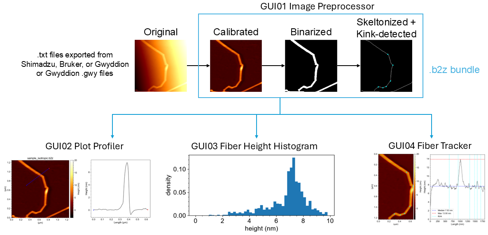

# Summary

Atomic force microscopy (AFM) resolves the height topography of individual
nanofibers, but turning raw height scans into quantitative, per-fiber
measurements is laborious and difficult to reproduce by hand. `AFM Nanofiber
Analyzer` is a Python toolkit that automates this workflow. It reads AFM height
images exported as text/CSV or stored in native Gwyddion `.gwy` files, removes
instrument background, segments and skeletonizes the fibers, detects sharp
bends ("kinks"), and reports per-fiber statistics such as length, height, and
kink geometry (\autoref{fig:pipeline}).

The same analysis is exposed through a tkinter launcher with four interactive
tools and a command-line interface for batch processing, both built on one
shared analysis library. The graphical and command-line entry points call the
same pipeline implementation, so equivalent runs produce identical numerical
outputs for the same input and parameters. Results are written as one compressed bundle
per input (`.b2z`) whose keys, shapes, units, and coordinate convention are
governed by an executable schema validated on write and on read.

# Statement of need

Researchers studying cellulose nanofibers and related nanomaterials routinely
acquire large numbers of AFM scans and need fiber-level descriptors — height,
length, branching, and kink angle distributions — to characterize how
processing conditions affect morphology. Kinks and related fiber-level defects
are of particular interest in this field because they govern the structural
quality of nanocellulose materials [@Ito2022; @Ito2025]. General-purpose
scanning-probe software such as Gwyddion [@Necas2012] is excellent for image-level
visualization, leveling, and grain analysis, but it is oriented towards surfaces
and grains rather than networks of individual fibers. Dedicated fiber-tracking
software does exist — most prominently FiberApp [@Usov2015] — but it runs on the
proprietary MATLAB platform and is built around user-guided, fiber-by-fiber
tracking, which its own documentation identifies as the bottleneck of the
analysis. As a result, laboratories that need to process many scans
end up combining these tools with one-off scripts that are hard to share,
parameterize consistently, or reproduce.

`AFM Nanofiber Analyzer` addresses this gap with a documented, reproducible
pipeline built on the scientific Python stack — NumPy [@Harris2020],
SciPy [@Virtanen2020], scikit-image [@vanderWalt2014], OpenCV [@Bradski2000],
lmfit [@Newville2014], and Matplotlib [@Hunter2007]. It packages the
background-calibration, segmentation, skeletonization, and kink-detection stages
that were previously project-specific research scripts [@Ito_afm_image] into a
maintained, tested library with both interactive and batch front ends. Those
precursor scripts produced the AFM fiber heights reported in earlier
nanocellulose studies [@Ito2022; @Ito2025] and in a recent study of the
cross-sectional dimensions of tunicate nanocelluloses [@Mayumi2026]; packaging
and hardening them is what makes such analyses reproducible beyond the
originating laboratory. It lowers the barrier to consistent, high-throughput
morphological analysis for materials-science and polymer researchers, and gives
them a scriptable batch interface and a stable, documented data format that
downstream analyses can rely on.

# State of the field

Gwyddion [@Necas2012] is the most widely used open-source scanning-probe package
and provides extensive image-level functionality — levelling, filtering,
statistical characterization, and grain analysis. These capabilities target
surfaces, grains, and roughness rather than networks of individual fibers, so we
treat Gwyddion as complementary rather than competing: this project reads its
native `.gwy` files and text exports, and images can be inspected or pre-levelled
there and then analyzed here.

FiberApp [@Usov2015] is the closest tool in scope and the most capable in
single-filament statistics: it tracks fibrous objects from microscopy images and
computes contour length, height, curvature and kink-angle distributions,
persistence length, correlation functions, and orientational order parameters,
several of which this project does not attempt to reproduce. The differences that
motivate a separate tool are ones of platform, automation, and input handling
rather than of statistical breadth. FiberApp runs on MATLAB, a proprietary
environment that many laboratories cannot use without a license, whereas this
project is pure Python on an openly licensed stack — installable from source,
scriptable, and also shipped as a standalone Windows bundle for users who
maintain no Python environment. FiberApp tracks fibers semi-automatically, one
object at a time, with the user initializing each contour by clicking its two
ends; its own documentation notes that tracking a sufficient number of objects
this way "is quite often a bottleneck" of the analysis. `AFM Nanofiber Analyzer`
instead segments and skeletonizes the whole image without per-fiber interaction
and processes folders of scans in batch, trading FiberApp's contour-level
precision and per-object control for throughput and hands-off reproducibility.
FiberApp also reads only Bruker NanoScope files and TIFF images, and for TIFF the
user must supply the spatial scale by hand through a scale-bar dialog; this
project reads instrument text and CSV exports, Gwyddion Export Text, and native
`.gwy` files, and takes the physical scan size from the file's own metadata where
the instrument records it, so calibration travels with the data instead of being
re-entered per image.

Generic skeleton analysis is available in the bio-image ecosystem — the
AnalyzeSkeleton plugin [@ArgandaCarreras2010] distributed with Fiji
[@Schindelin2012] tags branches, junctions, and endpoints of a skeletonized image
— and domain-specific tracers such as CT-FIRE [@Bredfeldt2014] extract fibers from
second-harmonic-generation images of collagen. Each solves the extraction step for
its own modality, but neither ingests calibrated AFM height data nor carries
height in nanometers through to per-fiber statistics, which is the quantity of
interest for nanocellulose morphology. The scientific-Python ecosystem supplies
the lower-level building blocks [@Harris2020; @vanderWalt2014; @Virtanen2020;
@Bradski2000], but assembling them into a consistent, validated, fiber-level
pipeline is left to each laboratory — and that assembly step is what usually goes
unpublished, as bespoke scripts. This project consolidates those fiber-centric
stages into one tested library with shared GUI and CLI front ends, a recorded
parameter file per run, and an explicit, versioned data contract, so the same
analysis can be reproduced, scripted, and audited across machines.

# Software design

The toolkit is organized so that both front ends share one implementation of the
analysis. As summarized in \autoref{fig:pipeline}, AFM height data from
Shimadzu, Bruker or Gwyddion text exports, or native Gwyddion `.gwy` files, enters the
*Image Preprocessor* (GUI01),
which produces calibrated, binarized, and skeletonized/kink-detected images and
writes them to one `.b2z` bundle per input. The resulting bundles are consumed by
the *Plot Profiler* (GUI02), the *Fiber Height Histogram* (GUI03), and the *Fiber
Tracker* (GUI04) for line-profile extraction, grouped height-distribution
comparison, and per-fiber tracking and measurement, respectively. A tkinter
launcher discovers these four tools in `guis/`.

Modules in `lib/` implement the input handling, background calibration,
segmentation, skeletonization, kink detection, and per-fiber measurement. A
command-line interface provides batch preprocessing, validation, measurement,
skeleton-height extraction, and bundle export. The GUI preprocessor and the CLI
call the same pipeline function, and the GUI measurement views and the CLI call
the same measurement routines, so equivalent runs produce identical numerical
results — keeping the analysis in `lib/` and the interfaces thin is a deliberate
choice that prevents the front ends from drifting apart.

Results are persisted as one compressed bundle per input (`.b2z`, built on
`blosc2`) with a JSON record of the analysis parameters. The bundle's required
keys, shapes, units, coordinate convention, and format version are defined by an
executable schema validated both on write and on read, so downstream tools fail
loudly on an out-of-contract bundle instead of producing silently wrong
measurements. The physical scan size travels with each bundle, read from the input
metadata where the instrument records it, so length measurements are reproducible
from the bundle alone and a folder of differently sized scans needs no batch-wide
value. Bundles export to NumPy `.npz` or CSV for use outside the project.

Background calibration offers four interchangeable methods (inpainting,
morphological top-hat, and 1D/2D spline surfaces) so line-scan artefacts of
differing severity can be addressed without changing the rest of the pipeline; it
was tuned on Shimadzu SPM-9600 height images but is not specific to that
instrument. The repository ships representative AFM text exports from Shimadzu and
Bruker instruments, Gwyddion Export Text samples, and a native `.gwy` file,
together with regression tests that run the full-size analysis on real scans and
compare against recorded baselines. These give reviewers and future users an
objective way to verify that the software installs, reads real instrument exports,
writes valid bundles, and preserves the numerical behaviour of the pipeline over
time.

# AI usage disclosure

During software development and preparation of the JOSS submission, the authors
used Codex with ChatGPT 5.5 (OpenAI), Claude Opus 4.8 (Anthropic), and Claude
Fable 5 (Anthropic). These tools assisted with drafting and refactoring code;
writing and translating docstrings and comments between English and Japanese;
and drafting and revising documentation and the JOSS manuscript. The tools were
used under author supervision; they did not design the analysis methods or
determine scientific results. All AI-assisted output was reviewed, edited, and
verified by the authors against the source code and their domain knowledge. The
authors made the core design and scientific decisions and take full
responsibility for the software, documentation, and manuscript.

# Acknowledgements

This work was supported by JST CREST, Japan (Grant Number JPMJCR22L3) and
JSPS KAKENHI grants (21H04733, 26K23040).

# References
